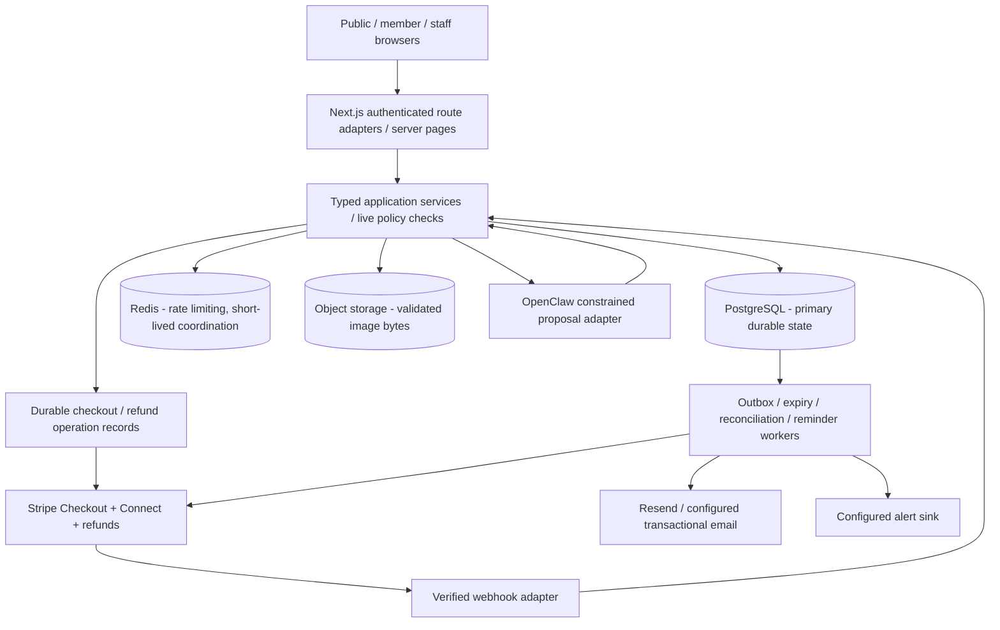
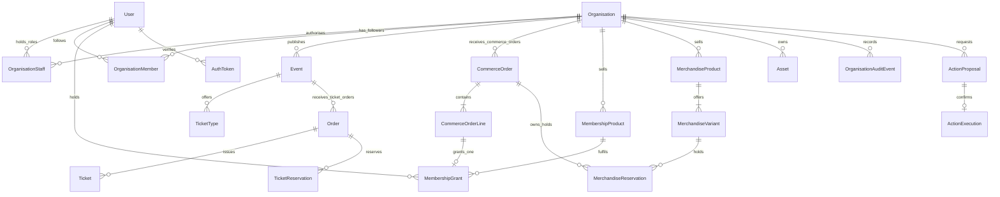

# THUNDERSTRUX

**Document authority:** Follow the [PRD authority contract](THUNDERSTRUX_PRD.md), reconciled 11 October 2026. This document governs its assigned subject within accepted product scope and readiness-plan invariants; it is not evidence of deployed features.
## Database Architecture, Relational Schema and Transaction Integrity Specification

**Version:** 1.0 | **Prepared:** 9 October 2026 | **Status:** Proposed target architecture and implementation contract, **not** an introspected `schema.prisma` or evidence of deployed functionality
**Audience:** Senior/backend engineers, database administrators, security reviewers, QA, Claude Code and Codex
**Core stack:** Existing Next.js / TypeScript / Prisma / PostgreSQL / Stripe Connect / Redis / durable workers. Preserve the installed versions and established conventions; this specification does not authorise a framework rewrite.
**Baseline:** Australian society pilot; integer AUD cents; UTC persisted instants; organisation-selected IANA display timezone, initially `Australia/Brisbane`.
**Business coverage:** Identity, societies and committees, event publishing, tickets and attendance, free and paid checkout, verified guest access, membership terms, merchandise and pickup, Connect, refunds, alerts/emails, analytics, the organisation calendar, OpenClaw and operational recovery.

> **Scope disclosure:** This target specification originated from uploaded document snapshots on 9 October 2026 and was reconciled with the repository documents on 11 October. Its proposed models/SQL are not an introspection or deployment certificate. Canonical repository links replace uploaded filename suffixes. Inspect live schema, migrations, constraints, services and tests before implementing any migration; do not apply this specification wholesale.

### Document authority and source references

| Subject | Reference | Governs |
|---|---|---|
| Product | `THUNDERSTRUX_PRD.md` (`PRD`) | Product scope, membership/merchandise/event expectations, privacy, data and audit. |
| Delivery/domain | `MVP_READINESS_PLAN.md` (`PLAN`) | Approved delivery scope, preservation rules, security, transaction invariants and task dependencies T01-T46/H01-H06. Use the current repository task ledger and linked delivery evidence; imported snapshots do not establish current task status. |
| Interaction | `THUNDERSTRUX_UX_USER_FLOW_SPEC.md` (`FLOW`) | J01-J15, 43 screen identifiers, purchase truth, visibility, user-authorised DTO and recovery expectations. |
| Presentation | `THUNDERSTRUX_COMPLETE_VISUAL_DESIGN_SPEC.md` (`DESIGN`) | Screen data needs, public/private visual states and brand assets, not new database authority. |
| Persistence | This specification (`DB`) | Proposed relational model, field-level requirements, integrity and delivery guidance. |
| Evidence | Live code, actual migration files, database catalog, tests | Authoritative on **what is already implemented**. Log differences against this target; never overwrite historical implementation facts without investigation. |

**Labels:** `[EXISTING-REPORTED]` explicitly reported by dated PLAN; `[PLAN]` required by it; `[DESIGN]` recommended here for meeting that requirement; `[VERIFY]` needs repository inspection; `[FUTURE]` not permitted to appear as an MVP feature. A table named here may be a recommended logical boundary rather than a requirement to use that exact Prisma identifier. All sample SQL is **illustrative**, and identifiers/types must be adapted to the actual migration baseline.

---

# 1. Architecture decisions and immutable rules

## 1.1 Architecture decision record (ADR)

| ADR | Decision | Rationale and implementation rule |
|---|---|---|
| DB-01 | **Keep PostgreSQL as primary source of persisted business truth** | ACID purchases, ownership, durable outboxes and audit history already exist. Do not introduce MongoDB or a second transactional database. |
| DB-02 | **Use the existing Prisma schema/migrations, with reviewed PostgreSQL-specific SQL where needed** | Extend existing tables additively. SQL constraints/indexes may supplement Prisma. Never regenerate the entire schema from this document. |
| DB-03 | **Organisation-scoped multi-tenancy** | A society is a tenant. Resolve authority from canonical organisation/event/product relationships and the logged-in actor, not from a header or client claim. |
| DB-04 | **Preserve the proven ticket order/reservation/ticket subsystem** | Existing 30-minute holds, reconciliation, compensation, outbox and ticket IDs must survive. No forced migration to a universal `Purchase` supertable. |
| DB-05 | **Add a separate, typed commerce order domain** | `CommerceOrder(kind=membership|merchandise)` and `CommerceOrderLine`; exactly one society and one product family per commerce order. Ticket orders remain in their existing family. |
| DB-06 | **Stripe is authoritative for real financial effects; PostgreSQL is the local projection** | Browser redirects, model outputs and local flags cannot declare provider settlement/refund. Webhook/recovery must reconcile first. |
| DB-07 | **Server-only, transaction-locked pricing and entitlements** | Stock, event capacity, price, terms and member access are validated inside the transaction; browser quote is advisory. |
| DB-08 | **Durable operation IDs and transactional outboxes** | External provider calls occur outside database transactions, with a stable key, recoverable uncertain states and idempotent reconciliation. |
| DB-09 | **Historical purchase snapshots are immutable business facts** | Renamed events, merchandise, societies or altered fees must not rewrite the historical receipt. |
| DB-10 | **Membership state is time-derived** | A verified grant with `[startsAt, endsAt)` and `revokedAt` determines entitlement. A reminder job never activates or extends it. |
| DB-11 | **Free joining, fixed-term free/paid membership, ownership/staff and ticket access are distinct** | `OrganisationMember` never gives a grant, and neither grants staff privileges. |
| DB-12 | **Keep catalogue, payments, holds, grants, check-in and pickup as distinct state axes** | `paid` does not imply collected, `checkedIn` does not imply current admission validity, and `published` does not imply on sale. |
| DB-13 | **No mixed cart, subscriptions, shipping or recurrence in MVP** | Do not add schema infrastructure for unapproved extensions. |
| DB-14 | **Minimum private data; append-only operational evidence** | Purchase-specific guest grants; hashed tokens; encrypted delivery payload; safe audit facts, lifecycle entries and execution receipts. |
| DB-15 | **Analytics use bounded tenant-scoped SQL aggregates** | Distinct cash/units/attendance/terms/collection metrics; do not inflate sums by joining one-to-many entities. |
| DB-16 | **Immutable release and recoverable migrations** | Apply schema with an explicit job before starting upgraded web and workers. Test restore and reconciliation before production activation. |

## 1.2 Component boundaries



**Persistence ownership:** PostgreSQL stores business metadata/state; Stripe stores authoritative charges/transfers/refunds; object storage stores decoded/re-encoded image binaries; PostgreSQL stores image ownership/key/hash. Redis must not be required to reconstruct purchases, account identity, stock, grants, outbox or provider operation history. A server restart cannot lose unsettled financial operations.

**No double write:** Never execute Stripe creation/refund or email-provider calls inside a PostgreSQL transaction. Persist an operation/intention atomically first, perform I/O with stable idempotency identity, then commit the verified projection in a second bounded transaction. Treat `timeout` as **unknown** until reconciled, not as proven failure.

## 1.3 Supported scope vs excluded scope

| Included by PRD/PLAN | Excluded unless approved separately |
|---|---|
| Public/unlisted/members-only events, ticket types and member pricing; free/paid purchases | Allocated seating, seat maps, scanner infrastructure, promo codes, waitlists, ticket resale |
| Verified guest ticket and merchandise purchases | Anonymous ownership of past purchases based only on an email string |
| Fixed-term one-off paid/free memberships and next-term renewal | Recurring card charges, autopay, lifetime/stacking tier marketplace |
| Pickup-only merchandise, variants, holds, readiness, collection, reviewed returns | Shipping labels, shipping rates, carriers, universal cross-society cart |
| Month/week/agenda **organisation** calendar from existing events | Recurrence engine, synchronisation with Google Calendar, public feeds, personal calendar API |
| Human-confirmed approved OpenClaw actions | Arbitrary SQL execution, unrestricted model tools, autonomous refunds/deletion/owner transfer |

---

# 2. Repository-first discovery protocol (mandatory for coding agents)

Before designing a migration, a coding agent MUST:

1. Read the current `prisma/schema.prisma`, `prisma/migrations/**/migration.sql`, lockfile and Prisma version; enumerate all models, relations, check constraints, partial indexes, triggers and existing enum values from the real database catalog.
2. Read `auth.ts`, `proxy.ts`, access/staff/permission helpers, event lifecycle, reservations, checkout creation, reconciliation, Stripe and Connect services, refund/manual bookkeeping, ticket issuance/check-in, outbox workers, data repair tools and seed/restore tests.
3. Read `obsidian/Database and Multi Tenancy.md`, `Architecture Overview.md`, `Payment Lifecycle.md`, `Event Lifecycle.md`, `Stripe Payments and Connect.md`, `Email Delivery Implementation.md`, `Project Handover.md` and `Engineering Delivery Workflow.md` **if present**. Read the referenced repository files before changing their domains; do not claim inspection of code/catalogue/runtime that was not performed.
4. Record the exact git SHA, schema checksum, PostgreSQL version, Prisma version, current migration count, current DB constraints and relevant flags in a short implementation ADR.
5. Diff current state against the **target contracts** in this specification and PLAN task dependencies. Mark each proposed field: *already exists / requires additive migration / existing equivalent / intentionally deferred / unresolved conflict*.
6. Reuse current naming, ID generation, enums and time representation. Never change a primary key shape, ownership authority or a production column type casually to match an illustration.
7. Implement one dependency-ready T task in its existing delivery workflow, with tests and an acceptance ledger. Never apply a multi-feature monolithic migration containing all proposals here.

### Dated baseline, not a live inspection

The original PLAN assessment was against 4 October 2026 code. The current repository ledger records T01-T04 and T05-T06 locally complete, with T05/T06 evidence dated 9 October (PRs #42-#44). T07 onward remain unchecked as of this reconciliation; hosted gates remain separate. These are documentary delivery facts, not a new runtime audit. Inspect current schema/services before extending the reported ticketing, staff, identity and notification infrastructure.

### Baseline-to-target model strategy

- **Retain in place:** current ticketing `Order`, `TicketReservation`, `Ticket`, `TicketType.quantity` semantics, `OrderStatus` compatibility, Stripe Session binding, ticket email outbox and natural/compensation recovery logic.
- **Expand additively:** identity security and staff, society profile/branding, event visibility/sales/capacity, immutable purchase snapshots, validity/refunds, guest access, quoted checkout attempts.
- **Add as required:** `Asset`; commerce orders/lines/lifecycle; membership products/grants; merchandise products/variants/reservations/pickup; broader refund/dispute state; OpenClaw proposal/execution; durable notification and change fanout where not already present.
- **Do not invent:** payment/subscription methods, carrier shipments, stored credit balances, ledger account balances or feature flags without a traceable PRD/PLAN requirement.

---

# 3. Relational modelling and physical data conventions

## 3.1 Identifiers, columns and money

| Concern | Contract |
|---|---|
| Primary keys | Preserve actual existing ID types (`String`/UUID/etc.); generated opaque, non-sequential identifiers are a sensible default for **new public-facing** entities, but matching repository conventions is more important than changing existing rows. |
| Names / slugs | Human-readable labels may change; stable organisation slug is required by PLAN T08. Unique slug with consistent normalisation; avoid repurposing slugs as finance or permission authority. |
| Timestamps | `timestamptz`-equivalent UTC instant for creation, status and terms; service/client transport uses ISO-8601 UTC. `createdAt` and `updatedAt` explicit; immutable lifecycle facts have `occurredAt` and actor. |
| Timezone | Store society IANA timezone (default `Australia/Brisbane`), not an offset or `AEST` string. Event scheduling must support explicit handling of missing/ambiguous local DST times. |
| Currency | `AUD` for pilot. Store ISO currency on every fulfilled purchase snapshot, even if organisation currency is currently fixed. |
| Amounts | Integer cents; nonnegative checks on prices/totals/fees; compute with checked integer arithmetic and maximum transaction limits. Existing Prisma `Int` fields should remain unless a separate safe promotion to `BigInt` is justified. Never store money as `Float`. |
| JSON | Restrict to versioned typed content (safe action args, entitlement policy, audit facts); important relationships, foreign keys, money, state and dates must be relational, not free-form JSON. |
| Email | Normalise and enforce uniqueness per existing account semantics; use actual verified binding for identity. Retain buyer email **snapshot** for lawful record/notice even if account later changes/closes. Never use snapshot email to confer access. |
| Record changes | `version` integer for aggregate edits and compare-and-swap; status transitions must also validate current state inside locked transaction. `updatedAt` alone is not robust concurrency control. |
| Deletion | Archive/soft-delete referenced business products/events as constrained by existing rules; never cascade-delete invoices, tickets, grants, refunds, actor histories or provider refs. |
| Naming | Prefer singular Prisma model names, database mapped names according to current conventions. Index names predictable and stable. |

**Numeric protection:** A PostgreSQL `integer` holds at most 2,147,483,647; JavaScript `number` is safe for integers only through `Number.MAX_SAFE_INTEGER`. Validate `unitPrice * quantity`, sums, fee computations and conversions **before** DB writes and provider calls. Prefer checked `BigInt` intermediates in code (with explicit range checks before mapping to existing `Int`), not floating-point multiplication of AUD values. If migrating to PostgreSQL `bigint`, coordinate DTO serialisation and Prisma `BigInt` handling, and plan a standalone tested migration.

## 3.2 Core relationship map (logical)



This diagram deliberately omits helper tables, state ledgers, payment-related association and existing one-to-one `Organisation.accountUserId` so it stays readable. See the catalogues for authoritative cardinalities.

## 3.3 Strong tenant boundaries

- `Organisation.id` is the canonical tenant. The organisation account may manage only its single primary tenant under the PRD. A named person (member account) may nevertheless hold scoped staff roles in multiple societies; it requires an explicit selected **staff context**, with live permission/MFA checks.
- For ticket orders, **derive tenant from `Event.organisationId`**. A redundant tenant column may aid indexing only if all writers enforce and audit identical value; it must never become an alternative authority.
- For membership/merchandise, **derive tenant from product and CommerceOrder relations**. No line may reference a different society, kind or currency. Use validated scoped service queries and reviewed composite keys/FKs or transaction invariants.
- `OrganisationMember` is free join/follow state only. `MembershipGrant` is a separate paid/free purchased entitlement. `OrganisationStaff` is named personnel with explicit role/capabilities. No foreign or join-derived authority.
- PII-bearing reads always scope the caller's user ID, purchase-specific verified guest grant or live staff tenant+capability. Hiding a UI element is insufficient.
- Avoid treating the presence of an arbitrary `organisationId` in JWT/browser URL/body or assistant tool output as proof of authority.

### Referential-action policy

| Relationship | Preferred action |
|---|---|
| Event -> ticket types -> sold orders/tickets | `RESTRICT`/archive once referenced, preserving historical sale facts. |
| Product/variant -> commerce line/grant/hold | Restrict hard delete when referenced; archive. |
| User -> purchased ticket/commerce/snapshot/audit | Preserve records upon account closure with retained anonymised user marker and historical necessary snapshots; do not cascade. |
| Staff -> staff history / check-in actions | Deactivate staff; retain actor ID and immutable role/action history. |
| Organisation -> any financial/attendance records | Restrict hard delete while records/obligations exist. |
| Outstanding tokens/outboxes -> user | Safe purpose-bound expiry/cleanup; account closure revokes access, with required audit retained. |

---

# 4. Identity, accounts, authority and society lifecycle

## 4.1 `User` [EXISTING-REPORTED / PLAN T03-T05]

**Purpose:** Stable person/organisation-account identity, not a source of global staff authority.

| Field or relationship | Type / rule | Meaning |
|---|---|---|
| `id` | existing PK | Never reassigned or reused. |
| `email` / `passwordHash` | existing auth fields [VERIFY] | Normalised identifier and bcrypt credentials; no plaintext. |
| `accountRole` | `member | organisation` retained | Account experience, **not** permission to control any arbitrary tenant. |
| `emailVerifiedAt` | nullable UTC instant | Verified identity gate for purchases/join/bootstrap/invites. |
| `authVersion` | integer | Session freshness; increment for security changes/closure. |
| `disabledAt` | nullable UTC instant | Live identity denial, including closed accounts. |
| profile fields | existing / optional | Private member profile; avoid mandatory attributes not demanded by flows. |
| `createdAt`/`updatedAt` | instants | Audit/account lifecycle. |

**Invariants:** old JWTs with a stale version must be rejected on reads and writes. Password reset and email change consume single-use tokens transactionally; closure anonymises editable login fields but retains essential historical business references and purchase-capture provenance. Separate `accountRole` from `OrganisationStaff.role`, and never promote a free society join to staff.

## 4.2 `AuthToken`, `AccountSecurityEvent`, `NotificationOutbox` [PLAN T02-T04; names verify]

- `AuthToken`: purpose-bound hashed token (`verification`, `password_reset`, `email_change`, closure-related purposes as existing code defines); `userId`, immutable purpose/binding info, issued/expiry/consumed/superseded timestamps, version/attempt constraints. **Only digest in DB**; never a recoverable plaintext token column. A confirmation is explicit POST and atomically consumes once.
- Email-change binding must include original user/email/auth version and requested new email, with 30-minute token validity; old email stays active until proven new address and uniqueness are checked under lock. Revoke old sessions on success.
- `AccountSecurityEvent` (verify exact name): private immutable who/what/when/status/safe facts; never exposed to tenant managers merely because the user also works at a society.
- `NotificationOutbox` (PLAN T02 reported complete): encrypted token-containing delivery payload where necessary, `eventKey`, recipient/templateVersion, status, attempts, `nextAttemptAt`, fenced lease owner/token/expiry, provider acceptance/message ID, last safe error. Unique `(eventKey,recipient,templateVersion)` and bounded retries; security notifications are not tenant-support visible.

**Retention warning:** Password-reset, verification and invitation emails expire; tokens may be cleaned after a reviewed retention period, but security events and historical order recipients follow separate retention rules. `GET`/email prefetch cannot consume ownership tokens.

## 4.3 `Organisation` [EXISTING-REPORTED; PLAN T08]

| Field | Suggested type/contract | Boundary |
|---|---|---|
| `id`, `accountUserId` | existing PK; nullable unique legacy/bootstrap account FK | T06 permanently retires the pointer on handover. Live staff rows govern current authority; follow PLAN T08 primary-organisation lifecycle. |
| `name`, `slug` | required; stable unique canonical slug | Public identity. |
| `description` | <=5,000 chars | Sanitised and safe public profile. |
| `logoAssetId`, `coverAssetId` | nullable references to ready, same-tenant `Asset` | Branding. |
| `supportEmail`, `refundPolicy`, `pickupPolicy` | private-edit/publicly selected content | Paid checkout/pickup/receipt needs. |
| `timeZone` | valid IANA string, default `Australia/Brisbane` | Event/local calendar rendering. |
| `onboardingCompletedAt`, `profileVersion` | nullable datetime and integer | Profile readiness and optimistic edits. |
| Stripe Connect identity/readiness fields | existing fields + history [VERIFY] | Provider account identity and charge/payout distinctions. |
| `createdAt`, `updatedAt` | instants | Historical events and public last update. |

**Bootstrap transaction:** Verified organisation-account + unique slug + one tenant + named active owner/staff association + audit event, in one transaction. If any part fails, no orphan organisation. Profile completion does **not** imply Stripe selling readiness. Preserve canonical business tenant ownership when changing staff. The one-primary bootstrap guard must inspect both the nullable bootstrap pointer and live active staff authority after pointer retirement, as PLAN T08 specifies (BOOT-001); a unique nullable pointer alone cannot enforce that lifecycle.

## 4.4 `OrganisationMember` vs `MembershipGrant` vs staff

| Model | Typical unique identity | Permissions produced | Meaning |
|---|---|---|---|
| `OrganisationMember` [EXISTING-REPORTED] | `(organisationId,userId)` | None | Free follow/join. Leave deletes only own free relation. |
| `MembershipGrant` [PLAN T22-T24] | Purchased commerce line plus term/overlap protections | Member-price/member-only eligibility **during the effective term** | One-time membership entitlement; not staff. |
| `OrganisationStaff` [EXISTING-REPORTED] | current membership/role binding per user+organisation [VERIFY] | Explicit `rolePermissions`, live MFA checks | Operational authority; revocable without deleting actions/history. |

`OrganisationMember` deletion must **not** delete or revoke a paid grant. Renewing or refunding a membership must not alter staff authority. `OrganisationStaff` may belong to a member account while that person remains able to use a separate personal purchase context.

## 4.5 Staff, invitations, MFA, committee transfer [PLAN T05-T06]

**Preserve** existing staff/invite/MFA model names and permission tables after inspection. Target relational facts:

- Staff: `organisationId`, `userId`, role / status, invited/accepted/deactivated times, actor, version; unique active association under current policy; cannot remove the last active owner.
- Permission mapping: role-to-capability **canonical server policy**, not arbitrary user-provided capability lists. Capability groups include `organisation:settings`, `members:read/manage`, `memberships:manage`, `merchandise:manage/fulfil`, `analytics:read`, `orders:refund`, `audit:read`, `openclaw:use`, and existing event/ticket/stripe permissions. Check actual role-capability implementation before any permission migration.
- Invitation: tenant, target normalised email, invited role, digest-only versioned token, expiry, revoked/accepted state, inviter and acceptance user. Resend invalidates older version. Accept only matching *verified* user; concurrency must not create two roles or bypass owner rules.
- MFA: enrolment/key/recovery state encrypted as existing implementation requires; separate MFA grant from staff role. Revocation/ownership transfer enforce live MFA and owner-count checks.
- Committee handover: immutable history recording outgoing/incoming owner, reason, authorised actor, state versions and audit; **no transfer of shared passwords** or historical ownership of external payments by editing buyer data.

**Lock ordering:** Preserve PLAN T06: sorted User IDs (actor, recipient/incoming owner and any legacy pointer account) -> Organisation -> invite/staff rows. Recheck identity/version, verified email, issuer authority and owner continuity under those locks. Do not acquire Organisation before the shared account locks or invert invitation/handover/closure/email-change paths. Lock placement for additional records must extend this order without weakening its account-race fencing.

## 4.6 `Asset` [PLAN T07]

**Proposed columns:** `id`, `organisationId`, `uploadedByUserId`, `storageKey` unique opaque path, `kind` (logo/cover/event/product as validated use), `contentType`, `byteSize`, `width`, `height`, `sha256`, `status` (`pending|ready|failed|deleted`), `createdAt`, `readyAt`, `deletedAt`. An asset can be associated to a society through a validated relation; no user-supplied filesystem path is authoritative.

**Rules:** Accept JPEG/PNG/WebP only; max 5 MB upload and 4096x4096 decoded dimensions; decode/re-encode, strip metadata, reject SVG/HTML/traversal/polyglot/decompression bomb; upload limits fail closed. Only `ready` assets from the same tenant may be attached; never expose storage credentials, raw internal upload paths or unprocessed bytes. Delete only unreferenced assets; recover pending/orphan objects with delayed garbage collection. For local Docker use the planned object-storage adapter; do not store image binaries in PostgreSQL or event JSON.

---
# 5. Event publishing, inventory, orders, tickets and admission

## 5.1 `Event` [EXISTING-REPORTED; PLAN T11-T12]

| Property | Storage / boundary | Rule |
|---|---|---|
| `id`, `organisationId` | existing PK and required canonical tenant FK | Organisation owner is immutable after event creation. |
| `title`, `description`, `location`/venue, cover reference | existing/extended fields [VERIFY] | Required publication readiness; sanitize rich text; display through safe DTO. |
| start/end | UTC instants [VERIFY actual column names] | End > start. Society timezone used for display/form input; do not store only a local wall time. |
| `status` | preserve existing draft/published semantics | Create **draft only**; explicit publish command and expected version. |
| `visibility` | `public | unlisted | members_only` | Public discovery includes only public; unlisted resolvable by link; members-only concealed without valid grant. |
| `saleState` | `open | closed` | Independent of publication. `salesCloseAt` defaults to start time; never claim all published events are on sale. |
| `salesCloseAt`, optional start window if existing | UTC instants | Service enforces allowed window; do not invent sale-start mechanism without product acceptance. |
| `capacity` | nullable positive integer | Null = no event-wide ceiling; do not invent capacity for legacy events. |
| `version` | monotonic integer | Compare-and-swap changes; checkout revalidates after lock. |
| `createdAt`, `updatedAt` and change history | instants / immutable events | Material schedule/location changes trigger versioned, resumable attendee notifications. |

**Publish readiness:** Use PLAN T11's separate publication and per-type checkout predicates. Complete public details, valid schedule/sales window and at least one checkout-eligible type with positive sellable supply are required. Free-only and mixed events may initially publish and continue free sales without charge readiness if a zero-standard-price type passes all other checks; paid types stay unavailable. A paid-only event needs charge readiness to publish. Block `members_only` publication until T24 entitlement enforcement exists. Publishing is an explicit, idempotent target-status transition.

**Important existing restriction:** Existing order-backed unpublish/delete rules must be retained unless a separately accepted revision changes them. No deletion of a sold event, ticket type or purchased history merely to simplify lifecycle handling.

## 5.2 `TicketType` [EXISTING-REPORTED; PLAN T10-T12/T24]

| Property | Required meaning |
|---|---|
| `id`, `eventId` | Canonical event relation. |
| `name`, optional description | Current catalogue display; once sold, receipt uses purchased snapshot. |
| `price`/`priceCents` existing field | Nonnegative integer AUD cents; do **not** rename original DB column without a separate compatibility migration. |
| `memberPrice` optional cents | Nonnegative; applicable only to proven eligible grant, not free join or guest. |
| `quantity` | **Remaining uncommitted inventory**, not original allocation. Preserve this convention. |
| availability/policy/version/status | Publish and edit eligibility; protect sold fields; archive referenced types. |

**Sellable ticket quantity (PLAN §3.2):**

```text
issued_valid_units = count(valid issued Ticket units for this Event)
active_type_holds = sum(reserved type units where status=active and expiresAt > database_current_time)
active_event_holds = sum(all active unexpired event type holds)
event_occupancy = issued_valid_units + active_event_holds
by_type = TicketType.quantity - active_type_holds
by_event = Event.capacity - event_occupancy  (if capacity is present)
sellable = max(0, min(by_type, by_event))  (or max(0, by_type) if no event capacity)
```

**Interpretation and safety:** The formula is a service-level *read-time* expression and part of the locked mutation guard, not a denormalised permanent `sellable` column. Validity and refund effects must follow the exact plan: confirmed full refund voids tickets but **does not auto-restock**; event-wide occupied/valid accounting and type remaining can diverge purposefully after voids. If the event-capacity formula would allow released capacity yet stock remains depleted, type stock still blocks purchasing until an authorised reviewed adjustment. Use the same consistent meaning in sales/readiness/analytics.

**Editing with sales/holds:** Catalogue names/prices/quantities may have tighter restrictions after sales; immutable historical snapshots always win. Reject shrink below commitments, active holds or event capacity. Validate current type, policy, price, eligibility, status and seller while locks are held. If changed from buyer quote, return `409` and require review. Never reset remaining inventory by assigning original allocation.

## 5.3 `Order` (ticket order) [EXISTING-REPORTED; PLAN T10/T13-T19]

| Field/constraint | Target contract |
|---|---|
| `id`, `eventId` | Existing ticket order PK and immutable canonical event reference. |
| `userId` | Verified registered buyer ID when present; nullable for **properly verified guest** after T16. Nullable alone is not guest authorisation. |
| `status` | Retain `pending | paid | failed | expired` for compatibility; do not replace with a new status enum in place. |
| `paymentKind` | `stripe | free`, with correct legacy provenance. Free uses compatible `status=paid`/`paidAt` but is NOT cash. |
| `fulfilledAt` | Nullable committed entitlement time, canonical for successful free/paid purchase. |
| amount/quantity/unit-price | Preserve existing `unitPrice`/`totalAmount` and safe money arithmetic; verify actual existing cardinality. |
| purchase snapshots [PLAN T10] | `purchasedTicketTypeName`, `sellerName`, `buyerEmail`, `buyerName`, `currency`, `feeAmount`, `feePolicyVersion`, `snapshotVersion`; as needed, immutable grant/policy selection. |
| `paidAt` | Preserve legacy constraint and explicitly distinguish local free completion via `paymentKind`. |
| provider references | Stripe Session/charge/Connect destination identity when paid; unique, verified and immutable when bound. |
| financial review fields | Preserve existing `requiresCompensationReview`, `fulfilmentFailedAt`, `fulfilmentFailureReason` semantics; extend via approved refund/dispute model. |
| cancellation/expiry/lifecycle timestamps | Honest projections for buyer history and recovery. |

**Cardinality caution:** The supplied plan describes existing order fields `ticketTypeId`, `quantity` and `totalAmount`; it does not authorise an unrequested universal multi-ticket-type order rewrite. Event may have multiple ticket types, but inspect real `Order` cardinality and the existing checkout contract first. For new work **do not assume** one ticket order supports a multi-line cart or convert it to one. One order may issue multiple unique `Ticket` units of its purchased type.

**Ticket order financial projection:**

```text
pending + kind=stripe + no verified fulfilment      => awaiting payment / checking
paid + kind=free + fulfilledAt + issued Ticket rows => confirmed FREE registration
paid + kind=stripe + verified + fulfilledAt + units => fulfilled paid order
failed/expired without fulfilment                   => not a valid admission
provider charged + local fulfilment impossible      => compensation review (no tickets)
provider-confirmed whole refund                     => refund confirmed, ticket validity void
```

Provider receipt, a session ID, `paidAt`, the browser return URL or outbox send time alone is insufficient to render confirmed admission.

## 5.4 `TicketReservation` [EXISTING-REPORTED; PLAN §3.2]

**Meaning:** 30-minute hold for unfulfilled **paid** ticket checkout. Stores order, ticket type, quantity, `status` (at least active/confirmed/released/expired mapping verified in repo), `expiresAt`, unique reservation identity and original creation time. Active holds reduce sellable stock but do **not** decrement `TicketType.quantity`. A successful paid webhook confirms hold, decrements stock once and creates tickets in a single transaction. Expiry releases only still-pending holds; never expires already fulfilled orders. A provider outcome remaining uncertain must be reconciled before creating a new operation; do not release an active hold early merely because a browser tab closed.

**Index strategy:** composite `(ticketTypeId, status, expiresAt)` and `(orderId, status)` (dedupe as existing indexes allow). You **cannot** create a moving partial index predicate `WHERE expiresAt > now()`; filter expiry in the query and index stable fields.

## 5.5 `Ticket` and attendance [EXISTING-REPORTED; PLAN T10/T19]

| Fact | Storage rule |
|---|---|
| `id`, `orderId`, `ticketTypeId` if present | One unique issued admission unit. Preserve existing ticket IDs and order relationships. |
| `issueSequence` | Unique `(orderId, issueSequence)` **for new units**, after careful legacy audit/backfill; don't generate duplicate historic tickets. |
| `validity` | `active | void | refund_review` with reason and timestamp (T10). |
| `checkedInAt`, `checkedInByUserId` | Existing check-in fields [VERIFY]; server-authorised actor only. |
| Check-out facts | Preserve existing conditional check-in/out and audit, including historical past check-ins. If a separate attendance-history model already exists, reuse it. |

**Eligibility:** a checked-in ticket is not automatically valid after a confirmed refund. A locally cancelled free ticket is `void` with a cancellation reason and retained attendance. A `void` or `refund_review` ticket cannot be admitted again. For retry/timeout, always re-read authoritative attendance state. If a check-in was committed and the response was lost, returning **already checked in** is correct and must not create another effect. `Ticket` validity, not payment return or QR presentation, determines admission.

**Attendance history design:** If existing actor audit does not fully meet T19/T38, add immutable `TicketAttendanceEvent` with ticket/actor/action/occurredAt/source and idempotency ID. Do not overwrite or delete historic `checkedInAt` merely because ticket became void. No QR scanner table is required for MVP; manual name/order-ID lookup remains first class.

## 5.6 Order lifecycle / event-change notice [EXISTING-REPORTED / PLAN T30]

- `OrderLifecycleEvent`: immutable `(orderId, sequence)` with event type, prior/new status, timestamp and safe metadata. Unique sequence per order; sequence allocated while order is locked. Preserve existing journal and audit fields.
- `EventChange`/`EventVersion` **[DESIGN if not already existing]**: only if needed to capture material schedule/location change old/new facts, notification fanout progress and dedupe; no separate duplicate event object. `eventId`, `version`, old/new safe summary, committedAt/actor, notification cursor/state. Notifications fan out to **valid purchase holders** using a bounded resumable worker and a dedupe keyed by event version/purchase/recipient.
- A future event calendar is derived from `Event`, not from copied calendar-event records. Do not create a separate database of appointments or recurrence objects.

---

# 6. Purchase operation identity, Stripe and payment-safe transactions

## 6.1 `CheckoutAttempt` [PLAN T14, reused by commerce T21]

**Purpose:** Durable idempotency and recovery for lost responses, duplicate clicks and provider Session uncertainty. Implement as one table with typed purchase-family identity or domain-specific equivalents if PLAN/code selects that pattern.

| Field | Contract |
|---|---|
| `id` | Opaque immutable operation PK. |
| `family` | `ticket | membership | merchandise`, validated dispatch only. |
| `actorKind`, `actorId` | Verified `user` or verified `guest` identity; never plain email as actor. |
| `operationType`, `clientIdempotencyKey` | Stable per intended checkout. Unique in `(actorKind,actorId,family,operationType,key)` scope. |
| `requestHash` | Hash of canonical **normalised** selection/identity/quote context; same key + different request -> `409`. |
| order reference | Typed binding to existing `Order` or `CommerceOrder` (nullable until safely committed); exactly one family target. |
| `providerOperationKey` | Stable server-generated Stripe idempotency key, unique. |
| `stripeSessionId` | Unique once known; never silently overwritten. |
| `state` | Proposed `created | creating_provider | provider_uncertain | provider_attached | completed | failed | expired | review`; adapt to existing contract and transitions. |
| expiry/timing | Attempt timestamps, worker reconciliation due time, last safely observed outcome. |

**Schema note:** If typed optional `ticketOrderId` and `commerceOrderId` are used, enforce at most one non-null order FK and correct family through checked service operations (and PostgreSQL check/trigger as reviewed). Do not make a polymorphic `targetId` string the **sole** ownership guarantee. Internal operation key is not an access token; owner and guest grants still gate reads.

**Idempotency semantics:** Returning the same checkout attempt must return the same already-created Session or confirmed result. If an operation is uncertain, present status and recover it, never create a different Session/order automatically with a new key. Provider error strings must not be shown raw or logged with secrets. Keep attempt rows long enough for reconciliation, refund investigations and support.

## 6.2 Stripe account binding and payment record model

The existing PLAN reports organisation Stripe `stripeAccountId`, status, charges/payouts details and destination-charge platform fee. Inspect existing models and Connect helper before introducing any ledger. **Recommended additional capture, only if absent:**

| Identity/fact | Storage recommendation |
|---|---|
| Per-order `stripeSessionId` | Unique and verifiably bound to one purchase family/owner/amount/currency. |
| Per-order `stripePaymentIntentId`/`stripeChargeId` | Unique if known, immutable provider identity, scoped by provider account/platform mode. May arrive asynchronously. |
| Connected destination account | Snapshot on each purchase and refund attempt so reconnection cannot reattribute historical payments. |
| Payment mode | Explicit `test`/`live` or equivalent per operation to reject wrong-mode webhook/correlation. Never mix environments. |
| Provider event receipt | Optional `ProviderWebhookEvent` with provider event ID unique, object identity/type, receive/process status, safe digest/error/timestamps. This is not the only idempotency layer. |
| Platform fee policy and cents | Store disclosed policy/version plus integer fee snapshot. Existing fee helper is authoritative; plan T17 specifies 10% deducted from society gross, rounded **once per order**. |
| Transfer/payout information | Display provider-observed status only; a charge and a payout are different. No invented payout or processing cost. |

**Provider event processing:** Verify Stripe webhook signature against **raw body** first; resolve known local purchase identity and family, then verify Session, charge/account, currency, amount, fee/policy and destination. Reject wrong-domain metadata rather than guessing which family to fulfil. Duplicate webhook delivery must not double issue, double decrement, double refund or double send. Out-of-order provider events trigger reconciliation to authoritative current provider state. Store only safe, bounded event metadata; raw payload need not persist to meet requirements.

## 6.3 Paid ticket checkout: exact transaction boundaries

```text
STEP A (database transaction, bounded and retryable)
  Validate actor/guest grant, event publication/visibility/sales/entitlement.
  Lock Event -> sorted TicketType(s) -> Order/attempt as applicable.
  Re-read price, ticket name, stock, active holds, capacity, policy, charge readiness.
  Reject changed quote with 409 before creating any paid provider effect.
  Create pending Order with immutable purchase snapshots and fee facts.
  Create active 30-minute TicketReservation.
  Create/reuse uniquely scoped CheckoutAttempt with stable Stripe operation key.
  Append order lifecycle entry.
  COMMIT.

STEP B (outside database transaction)
  Create/retrieve Stripe Checkout Session using the stable provider operation key.
  If timeout or response lost: mark operation uncertain, do NOT create a fresh charge.

STEP C (second bounded database transaction)
  Bind the verified Session identity/amount/currency/destination to original attempt/order.
  If webhook won race, converge on the already verified terminal state.
  Return the existing Session to authorised buyer if it remains payable.

STEP D (signed webhook or bounded authoritative reconciler)
  Validate raw signature, provider identity, paid status and all original snapshots.
  Lock inventory/order in universal consistent order; revalidate hold and capacity.
  Atomically: confirm hold, decrement remaining stock ONCE, mark paid+fulfilled,
  insert unique Ticket units, append lifecycle, enqueue automatic ticket email.
  COMMIT; provider email delivery happens afterwards.

STEP E (uncertain/unfulfillable)
  Persist durable compensation review; do not issue tickets or an ordinary receipt.
  Reconcile/refund via fenced verified provider operation, never a blind retry.
```

**Free ticket checkout:** entirely server-side synchronous *single* inventory-locked transaction: validate verified actor, quote, stock, capacity and policy; insert free `Order(paymentKind=free)`, fulfilment record/ticket units, lifecycle, decrement once, automatic ticket email intent. No Stripe request, no abandoned paid Session, no 30-minute pending hold; repeated request key is idempotent.

**Order status compatibility:** Do not infer cash revenue from `status=paid` or `paidAt` alone; free orders may deliberately have compatible `status=paid` to satisfy old constraints. Finances key on `paymentKind=stripe`, fulfilment and verified refunds.

## 6.4 Concurrency and consistent lock order

**Ticketing universal lock order from PLAN:**

```text
1. Event
2. TicketType rows in ascending stable ID order
3. Order / CheckoutAttempt in the documented shared sequence
4. Reservation / refund / outbox / lifecycle/history rows
```

PLAN explicitly establishes `Event -> TicketType IDs sorted -> Order -> reservation/refund/outbox/history`. If existing `CheckoutAttempt` needs locking, define a single lock-placement policy and update all affected paths; never create opposing orders across services. For merchandise, the documented plan specifies **variants sorted -> commerce order**; membership overlap uses **member+society locking -> commerce order/grant**. These are distinct resource trees but can intersect through refunds and shared provider identity; coordinate cross-domain helpers to avoid inversions.

- Use short, bounded SQL transactions; no Stripe/email/network/AI calls while locks held.
- Apply serializable isolation and bounded retries to known transaction serialization/deadlock conflicts *as implemented in the installed Prisma API*. Prisma version differences matter. Do **not** catch every error and retry it.
- Check current inventory and reservation expiry against **database time**. Query timestamp semantics consistently; database `now()` in PostgreSQL is transaction-start time, not continuously advancing wall clock. Avoid lengthy transactions, and choose a documented clock expression for comparing holds.
- Use deterministic IDs/lock ordering, unique constraints, optimistic `version` as relevant. A browser disabling a button is not an idempotency mechanism.
- Compensation/refund must fence paid truth and operation identities so two different workers cannot concurrently produce two refunds.
- Avoid a constraint that compares moving totals across other tables; use locked service transaction plus periodic integrity audit or carefully reviewed trigger, not a PostgreSQL `CHECK` referencing another table.

## 6.5 Payment outcomes and financial review states

| Case | Durable truth | Entitlement effect | User-facing outcome |
|---|---|---|---|
| Signed Stripe paid and safe commit | Paid purchase with `fulfilledAt`; issued/granted/stock committed | Valid | Confirmed purchase. |
| Provider Session created but response lost | Attempt uncertain; original hold/order still recorded | None until verified | Checking payment status. |
| Checkout cancelled without settled payment | Confirmed cancelled/expired or still pending until resolved | None | Checkout not completed once verified. |
| Signed payment after expired reservation | Compensation review and verified charge identity | No fresh tickets from invalid reservation | Payment under review; support path. |
| Paid but outbox insert fails before commit | Local transaction rolls back; provider paid remains true, retry/review | No half-commit | Processing/recovery. |
| Email provider fails after commit | Fulfilled purchase; failed/pending durable mail job | Valid purchase unaffected | Confirmation remains, email delayed. |
| Signed verified whole refund | Refund recorded and ticket validity void/grant revoked | Invalid for future access; history retained | Refunded. |
| Dispute notification | Separate verified dispute/review state | Hold validity by reviewed policy | Under review, **not** refunded. |
| Provider refund outcome lost | Refund operation uncertain; original charge identity retained | Do not assert fully refunded | Refund processing/checking. |

---

# 7. Commerce foundation: separate membership and merchandise purchases

## 7.1 `CommerceOrder` [PLAN T20-T21]

**Purpose:** Seller-scoped purchase header for exactly **one** non-ticket family (`membership` OR `merchandise`), with no unapproved mixing across kinds/societies.

| Column | Contract |
|---|---|
| `id`, `organisationId` | Immutable order PK and canonical society tenant, validated from every line's product. |
| `kind` | `membership | merchandise`; immutable after first line. |
| `userId`, `guestIdentityId` | Exactly one verified buyer authority: membership **requires user**, merchandise can accept verified guest. Use DB check if safely compatible. |
| buyer/seller snapshots | Display name, verified contact, society/name/support/fee policy at purchase time. |
| `currency`, `subtotalCents`, `feeCents`, `totalCents` | Integer snapshot with checked arithmetic and explicit buyer-vs-seller fee treatment. |
| `paymentKind` | `stripe | free`; never use `total=0` as sole free status if the recorded projection disagrees. |
| status, `fulfilledAt`, created/updated times | Compatible pending/paid/failed/expired, plus exact fulfilment facts and separate review/refund state. |
| provider identity/operation | Stable CheckoutAttempt/Session/charge/destination snapshot, uniqueness and safe modes. |
| financial-review/compensation | Explicit flag and review reason/time, separated from financial status. |
| optimistic version | Prevent stale editor/worker transitions when required. |

**Invariant:** Checkout/reconciliation validates all commerce lines belong to the same organisation, match the order's `kind`, use the same currency and resolve to ready/published products and valid prices. Server quotes create immutable snapshots at lock time; later catalogue edits cannot change them. A commerce order with mixed product kinds is a database integrity defect, never something the UI is allowed to hide.

## 7.2 `CommerceOrderLine` [PLAN T20]

| Property | Required meaning |
|---|---|
| `id`, `orderId`, `lineNumber` | Unique stable line identity per order; sorted and deterministic for receipts. |
| `kind` | Correlates to parent family (or derived under strong invariant); `membership | merchandise`. |
| product and variant relations | Validated FK to MembershipProduct or MerchandiseVariant/parent; exactly one appropriate type. |
| `quantity` | Strictly positive; **membership = 1**; merchandise <=10 units per line, max 10 lines per basket. |
| `unitPriceCents`, `lineTotalCents` | Immutable monetary purchase facts; checked `quantity × unit` and order sum. |
| name/variant/policy snapshots | Purchased labels, SKU/size/colour, membership start/end/entitlement-version or merchandise pickup policy. |
| currency and fee snapshot | Include if existing order needs line-level allocation; never recalculate historical fees from current policy. |
| `createdAt` | Immutable line creation. |

**Integrity detail:** A single `CHECK` can assert a line has one of two nullable product references, but a cross-table assertion that a referenced product belongs to the same organisation **cannot** be expressed in a normal PostgreSQL `CHECK`. Use tenant-scoped composite FKs where suitable and service-level locked validation plus the PLAN T41 integrity audit. A sound design can store `(organisationId,productId)` and reference a composite `(organisationId,id)` unique key on products, after reviewing costs and Prisma support. Do not create duplicate product truth accidentally.

## 7.3 `CommerceLifecycleEvent` [PLAN T20]

`id`, `commerceOrderId`, immutable `sequence`, `type`, `priorStatus`, `newStatus`, actor/system provenance, safe event facts, `occurredAt`. Unique `(commerceOrderId,sequence)`; append under order lock and never rewrite settled history. Source of order timeline and audit/recovery. Distinguish provider-observed facts and local service decisions.

## 7.4 Unified **read** model, not universal **write** model

The member `/purchases` and organiser `/dashboard/orders` screens require a typed union with `family: ticket|membership|merchandise`, stable sorting `(createdAt,id,family)` and capability-scoped DTOs. Implement as bounded `UNION ALL` query or separate typed pagination that merges correctly; **do not** rewrite ticket writes to fit CommerceOrder. Always include family in an external route discriminator and recheck ownership; a commerce ID and ticket ID must never accidentally resolve across families.

```ts
// Design-level view model; not a declaration of existing Prisma schema.
type PurchaseSummary = {
  family: 'ticket' | 'membership' | 'merchandise';
  id: string;                         // non-bearer identifier
  sellerName: string;                 // snapshotted at purchase
  currency: 'AUD';
  totalCents: number;
  paymentKind: 'stripe' | 'free';
  state: 'pending' | 'fulfilled' | 'failed' | 'expired' | 'review';
  createdAt: string;
  fulfilledAt: string | null;
  cancelledAt: string | null;          // local free cancellation; keep original fulfilment
};
```

This DTO cannot confer access; underlying ticket events, buyer ID/verified guest grant and tenant/capability must be checked first. Never expose raw Prisma relations containing buyer PII to non-finance organisers.

---

# 8. Fixed-term society memberships [PLAN T22-T24]

## 8.1 `MembershipProduct`

| Field | Required contract |
|---|---|
| `id`, `organisationId` | Strong tenant FK; society offers must belong to their public society profile. |
| `name`, `description` | Human-meaningful semester/year offer, safe text. |
| `priceCents`, `currency` | Nonnegative; a zero-price term uses locally fulfilled free commerce purchase. |
| `startsAt`, `endsAt` | UTC half-open term `[start,end)`; strictly `endsAt > startsAt`. |
| `entitlements`, `entitlementVersion` | Versioned whitelist of supported access/price rights, with stable purchased snapshot. Avoid arbitrary executable JSON conditions. |
| `publicationStatus`, `archivedAt` | Draft/published/archive; only published current/upcoming terms with server `now < endsAt` are purchasable. |
| `version`, `createdAt`, `updatedAt` | CAS and historical publication trace. |

**MVP model:** one society-wide tier per term, no simultaneous stacked tier marketplace. A subsequent semester is a new term/product version, not a destructive rewrite of a sold product. Sold terms and purchased entitlement policies are immutable. Prohibit disallowed member+society term overlap even if two browser sessions purchase at once.

## 8.2 `MembershipGrant`

| Field | Required contract |
|---|---|
| `id`, `userId`, `organisationId` | Verified registered individual and granting society. No guest grant. |
| `membershipProductId` | Catalogue reference for history; archived products remain referentially valid. |
| `commerceOrderLineId` | **Unique** source fulfilled line; exactly one grant per purchase line. |
| `startsAt`, `endsAt` snapshots | Persist immutably on grant; do not infer historical term from mutable product. |
| `entitlementVersion`/policy snapshot | Permission to member pricing/member-only event access. |
| `grantedAt`, `revokedAt`, `revokedBy`, reason | Grant only after provider-verified paid or atomic free fulfilment; revoke on confirmed full refund or exceptional audited administrative action. |

**Effective membership state (computed using trusted server time):**

```text
if revokedAt != null            -> revoked
else if now < startsAt          -> upcoming
else if startsAt <= now < endsAt -> active
else                            -> expired
```

No membership `active` boolean, expired-by-email flag or worker-driven status is needed as the authoritative grant state. Reminder/expiry email jobs may be late, and that must not change eligibility. Full verified refund revokes grant; leaving the free join must not. Renewal purchases next **non-overlapping** term under member+society locking; do not auto-charge.

### Overlap protection: candidate PostgreSQL exclusion constraint [DESIGN, optional review]

Where actual schema types and PostgreSQL extension permissions support it, an exclusion constraint over `(userId,organisationId,tstzrange(startsAt,endsAt,'[)'))` can reinforce concurrency-tested service checks for **unrevoked** grants. The code below is a template only; inspect identifier case, existing duplicates and upgrade provider compatibility before adopting it:

```sql
-- TEMPLATE ONLY: validate against real schema, ownership and extension support.
CREATE EXTENSION IF NOT EXISTS btree_gist;
ALTER TABLE "MembershipGrant"
  ADD CONSTRAINT membership_grant_no_overlap_unrevoked
  EXCLUDE USING gist (
    "userId" WITH =,
    "organisationId" WITH =,
    tstzrange("startsAt", "endsAt", '[)') WITH &&
  ) WHERE ("revokedAt" IS NULL);
```

**Caveat:** Exclusion on unrevoked ranges prevents overlapping **historically unrevoked** grants as well as future overlap. That fits immutable purchased terms; an exceptional revoked grant is excluded to permit an approved new purchase, but this must be reconciled with the policy on refunds, restoring old eligibility and support. If the current DB/Prisma supports a different proven constraint, prefer it. Product catalogue availability and uniqueness of a source line are still separate constraints. Never use the exclusion constraint as the **only** business guard: test seller ownership, term visibility, verified user and payment proof in service.

## 8.3 Member price and member-only event gates

- Public ticket listing may show standard/member price; eligible **verified** actor must have an effective, active `MembershipGrant` for the host society carrying the required entitlement, whether its source product was free or paid as of the **locked hold/purchase policy time**.
- A free `OrganisationMember` join does not qualify. Staff status does not qualify by itself. Guests cannot buy a membership or a member-price ticket.
- At paid checkout, check the **live grant when the hold starts**, then snapshot chosen grant ID/entitlement policy and quoted member price under inventory/order locks. **Ordinary term expiry during a still-valid 30-minute reservation preserves that quoted eligibility** (PLAN T24). By contrast, a grant **refunded or revoked before fulfilment** requires reviewed failure/compensation handling, not unauthorised ticket issuance. Revalidate the remaining required event/stock/payment conditions under lock, and do not silently reprice already issued tickets.
- `members_only` event reads are concealed from unauthorised people, including generic public listing and server-rendered metadata. No public DTO reveals restricted title/description by accident.
- If membership is refunded later, current grant is revoked; historical ticket purchased legitimately at member price retains its purchase snapshot. Whether previously issued event tickets are independently revoked requires a separately verified, explicit entitlement policy; do **not** silently void historical ticket purchases merely due to a later membership cancellation.

---

# 9. Merchandise, catalogue, holds, pickup and returns [PLAN T25-T29]

## 9.1 `MerchandiseProduct`

`id`, `organisationId`, `name`, `description`, ready same-tenant images (`Asset` relation), `publicationStatus`, `archivedAt`, `createdAt`, `updatedAt`, `version`. A product belongs to exactly one society. Public catalogue is only published, valid, tenant-owned listings. Archive sold items rather than breaking order history. The public shop remains part of the society profile, not an independent cross-society marketplace.

## 9.2 `MerchandiseVariant`

| Field | Contract |
|---|---|
| `id`, `productId` | Product/tenant relation. |
| `sku` | Unique in appropriate seller scope (PLAN says tenant-unique); normalize and prevent collisions. |
| `size`, `colour` | Optional variant labels; immutable purchased snapshot once sold. |
| `priceCents`, `currency` | Nonnegative current catalogue price, revalidated under lock. |
| `remaining` | Nonnegative uncommitted stock (not original stock and not net sold). |
| `version`, `archivedAt` | Compare-and-swap for edited catalogue and published visibility. |

**Cart constraints:** at most 10 distinct lines, at most 10 units/line, one society, merchandise only. Duplicate identical variants merge before quoting. Server rejects forged price, stock or pickup rules. A quoted cart stores/checks canonical version and current seller policy; `409` after reprice requires explicit review, not silent price change.

## 9.3 `MerchandiseReservation`

`id`, `commerceOrderId`, `merchandiseVariantId`, `quantity`, `status`, `expiresAt`, `createdAt`, `confirmedAt`/`releasedAt`; unique `(commerceOrderId,merchandiseVariantId)`. Active 30-minute holds subtract sellable units, **without decrementing remaining**. Fulfilment decrements all variants exactly once, confirms all holds, updates order, records lifecycle and durable receipt atomically. If *any line* fails, the multi-line fulfilment transaction rolls back; no partially shipped/collected goods and no half-decrement.

**Sellable merchandise:**

```text
sellable_variant = max(0,
  variant.remaining - sum(active unexpired reservation quantities for variant))
```

Lock **variant IDs in ascending stable order** before commerce order and reservation changes as required by PLAN T27. Stock edits must not drop remaining below outstanding active holds, and there must never be negative remaining. Expired/failing paid orders release only active unfulfilled holds; uncertain provider outcomes use reconciliation/compensation, not blind new orders. Free total completes in a synchronous local transaction with no Stripe Session.

## 9.4 Pickup fulfilment (`MerchandisePickup` or order collection state)

Do **not** create a second payment status to represent pickup. Store collection as an independent part of the commerce order or a one-to-one fulfilment record:

| Field | Meaning |
|---|---|
| `commerceOrderId` | Must be a fulfilled, non-review merchandise order. |
| `status` | `pending | ready | collected`; not money-related. |
| `pickupLocation`/instructions snapshot | Seller-provided pickup information displayed **before checkout**; historical version retained on order. |
| `readyAt`/`readyByUserId` | Only authorised `merchandise:fulfil` actor. |
| `collectedAt`/`collectedByUserId` | Authorised confirmation. |
| `version` and immutable collection-history events | Concurrent retries produce one transition and auditable record. |

A seller can mark ready/collected only after the purchase is legitimately fulfilled and not blocked by review. Paid does not mean collected. Refunded does not mean returned. When displaying a collected-and-refunded order, show both facts and historical collection time.

## 9.5 Returns / stock adjustments [PLAN T28]

**Proposed relational pattern:** `MerchandiseReturn`/`StockAdjustment` with `id`, tenant/variant/commerceLine, `quantity`, actor, reason, approvedAt, original operation key, and `createdAt`. Use a unique business-operation key to ensure the same reviewed returned line does **not** restock twice. Only a reviewed physical return may produce a stock increase. A confirmed provider refund by itself must not auto-restock, because the buyer may still possess the item.

For stock audits, also use an append-only `StockMovement` if existing stock history lacks coverage: `variantId`, `delta` (signed int), `movementKind` (`sale|return|manual_adjustment`), `sourceOperationId`, `actorId`, timestamp; unique source identity. **This is supporting audit infrastructure [DESIGN]**, not a new alternate stock authority: `MerchandiseVariant.remaining` remains the locked current stock projection. If adding a ledger, enforce the projection and ledger are updated in the **same** transaction and reconcile them in T41.

---
# 10. Refunds, disputes, payment adjustments and compensation [PLAN T18/T28]

## 10.1 `RefundRequest` (cross-family purchase identity)

**Principle:** A refund is an external financial operation, not an editable `Order.isManuallyRefunded` boolean. The existing manual refund marker remains **bookkeeping only** and must be visibly labelled as such until a provider-verified refund is recorded.

| Field | Contract |
|---|---|
| `id` | Stable unique refund operation identifier. |
| `family` and typed purchase reference | Exactly one ticket `Order` or `CommerceOrder`; tenant and ownership checked from canonical relations. |
| `stripeChargeId`/intent/destination | Verified original provider identity. No plain arbitrary charge ID from client may control refund routing. |
| `amountCents`, `currency` | Positive; initial **initiated** refund is whole-order only (minus any already-verified refund as explicitly reviewed by service). |
| `reason`, requestedBy, approvalActor | Required auditable context and live `orders:refund`/MFA permission. |
| `operationKey` | Unique stable provider idempotency key and purchase-level financial fence. |
| `status` | Suggested `requested | processing | provider_uncertain | succeeded | failed | requires_review`. Actual mapping must follow payment services. |
| `providerRefundId`, provider observed status | Unique once known; reconciliation should handle external/dashboard-created refunds. |
| `leaseOwner`, `leaseToken`, `leaseExpiresAt`, retry schedule | Prevent two workers/refund paths from acting concurrently. |
| `createdAt`, `verifiedAt`, `providerEffectiveAt` | Distinguish local action from provider-confirmed financial event. |

**Requirements:** Ordinary whole-order refunds and existing **paid-but-unfulfilled compensation** share one per-purchase financial exclusion/fence. Once compensation has started, the same charge cannot be simultaneously refunded again from the ordinary flow. Call Stripe outside the DB transaction, and use the original `operationKey` upon retry. A provider timeout never proves failure. Keep exact amount/currency/destination/application fee reversal facts as provider-observed history. No automatic reissue of tickets, renewal, or merchandise restock follows success.

**Free-purchase cancellation:** Implement PLAN section 3.3 as a separate local cancellation fact (purchase family/reference, unique operation key, actor/reason/time). It is not a positive-amount `RefundRequest`, requires no provider identity and contributes zero to refund metrics. In the owning locked transaction, cancel the whole free purchase, void tickets/revoke the membership grant or fence future pickup, and append lifecycle/audit/notification intent. Retain original fulfilment and historical attendance/collection; reviewed stock adjustment is separate. Expose `Cancelled - free purchase` in DTOs.

## 10.2 Verified provider refund journal [DESIGN]

Store enough provider truth to project a user-friendly state and accurate analytics without overwriting previous refunds. Depending on existing models, this can be a verified `RefundRequest` plus `ProviderRefundEvent`/unique webhook journal, or a separate `VerifiedRefund` fact:

```text
sourcePurchaseFamily + sourcePurchaseId
providerRefundId UNIQUE
providerChargeId
amountCents
currency
verifiedProviderStatus (succeeded/other)
providerEffectiveAt
reversedApplicationFeeCents (nullable until provider confirmed)
source (api_initiated / external_dashboard / provider_webhook_reconciled)
observedAt
```

A verified external partial refund must be represented in totals and flagged for manual resolution; it must **not** be projected as a successful whole-order refund. The financial analytics query sums unique, successful provider refund identities, not `RefundRequest` rows in a merely `requested` or `processing` state. One provider refund should never be double counted because an API response and webhook report it separately.

## 10.3 Disputes and admission review

`PurchaseDispute` or equivalent [PLAN T18]: typed purchase reference; unique provider dispute ID; verified charge ID/account/currency; external status and timeline; observed provider event ID; `createdAt`, `updatedAt`, `resolvedAt`; local review/audit state. Handle verified `charge.dispute.created/updated/closed` without treating a dispute as a refund. A dispute may trigger ticket `validity=refund_review` and block new merchandise collection by explicit audited policy; it **does not** erase historical admission or pickup facts. Unknown charge/dispute identities must never mutate any local purchase.

## 10.4 Purchase-level financial fence

**Recommended invariant:** For a given purchase, there may be at most one active provider-changing refund/compensation operation at a time. Implement with an order-owned `financialOperationVersion`/current-operation pointer, partial unique operation index or an existing tested lease, always under the locked purchase row. Do not assume a simple uniqueness on `(purchaseId,status)` covers all race conditions because completed refunds and external refunds may coexist in history. The fence must also prevent late fulfilment after refund processing begins.

**Historical preservation:** Provider-confirmed whole refund voids ticket admission or revokes membership grant; retains ticket row/check-in, membership purchase source and merchandise collected state. Restock/reissue must be distinct approved transactions. Refund amount/currency and snapshot fee policy remain durable after account/organisation name changes.

---

# 11. Guest identity, purchase recovery and privacy [PLAN T16]

## 11.1 `GuestIdentity`

**Purpose:** A verified email owner can make eligible public/unlisted ticket or merchandise purchases without being forced to register. Suggested columns: `id`, normalised contact email, `verifiedAt`, verification binding/version, `createdAt`, `expiresAt`/revocation as applicable, and safe attempt counters *only if durable storage is needed*. Do not treat an unverified input email as a login. Paid membership, member-priced tickets and `members_only` event access are not guest capabilities.

**Personal-data policy:** Use necessary contact as order snapshot; do not publish a search index of guest identities, nor merge unauthenticated identical email strings into an existing user's purchase history. Explicit, verified member claim uses a locked audited ownership transfer/association transaction.

## 11.2 `GuestAccessGrant`

| Field | Contract |
|---|---|
| `id`, `guestIdentityId` | Bound to verified identity. |
| `purchaseFamily` + typed reference | Scope to **one** specific ticket or merchandise purchase, not the entire buyer email inbox. |
| `purpose` | Retrieval/receipt recovery, with specific allowed operations and expiry. |
| `tokenDigest` | Hash only; raw token never stored in plaintext, log, query string or analytics. |
| `expiresAt`, `consumedAt`, `revokedAt`, session binding | Time-limited single-use redemption into secure purchase-scoped access session. |
| `createdAt` / safe audit | Recovery and brute-force investigation. |

**Flow:** email request -> bounded, generic response -> signed/hashed purpose token via encrypted outbox -> browser opens non-mutating route (fragment or reviewed equivalent) -> explicit POST redemption -> HttpOnly, Secure, SameSite access session -> clean redirect to **one** purchase. GET/prefetch never redeems. CSRF/origin and fail-closed Redis acquisition limits must be applied to write actions; private purchase screens use `no-store`.

**Threat cases:** guessed purchase reference, stolen/replayed/expired token, changing requested email, account email reuse, link prefetch, race between two redemptions, guest session expiry, staff context confusion, a buyer claiming a colleague's purchase. Tests must verify that a plain order ID, Stripe Session ID or a typed email string grants **no** access.

## 11.3 `MemberClaim` [DESIGN only if needed]

An explicit account claim flow may need an immutable record of `guestIdentityId`, purchase family/ID, claimant `userId`, verified evidence, effective time, actor and operation id. If existing order already captures immutable `buyerCapturedUserId`/capture provenance (PLAN T04c), preserve that fact; do not rewrite it merely to attach a current account view. Choose a single domain-specific audited approach after repository inspection. **Never** automatically claim old purchases upon signup just because the email matches.

---

# 12. Durable notifications, jobs, fanout and operator alerts

## 12.1 Outbox principle

In an ACID business transaction, insert a **durable notification intent** with a unique business event identity. A worker owns a time-limited fenced lease and sends through Resend/configured provider after commit. If provider delivery fails, the purchase **remains committed**; the job retries within bounds and eventually reaches a visible exhausted state. Accepted by provider != inbox delivered.

- **Existing ticket outbox:** `EmailOutbox` [EXISTING-REPORTED] with required ticket order relation; preserve its automatic-order partial unique index and established retry/lease algorithm.
- **General non-ticket outbox:** `NotificationOutbox` [PLAN T02 reported complete] for auth/security/invites/membership/merchandise/refund/change notices. Never break ticket email semantics by altering its FK to optional arbitrarily.
- **Worker concurrency:** `status`, `attempts`, `nextAttemptAt`, `leaseToken`, `leaseExpiresAt`, provider message ID and safe error. Use claim query with suitable locking or existing tested helper, and a conditional update fencing stale workers.
- **Encryption:** encrypted token/PII-bearing payload; key backed up and rotation/recovery rehearsed. No raw tokens, HTML payload or full buyer data in generic worker logs.
- **Unique dedupe:** `(eventKey, recipient, templateVersion)` for general notices; event-specific keys include stable original purchase/term/version, not a regenerated attempt ID unless the operation is intentionally a separately audited manual resend.

## 12.2 Required event mapping (PLAN §5)

| Durable trigger | Recipient / dedupe identity | Minimum underlying rows |
|---|---|---|
| Signup/verification request or resend | verified account request version | User + AuthToken + NotificationOutbox |
| Password reset | token version | AuthToken + NotificationOutbox |
| Security/email/password change | user authVersion / security event | User + AccountSecurityEvent + NotificationOutbox |
| Staff invite/resend | invitation version | StaffInvite + NotificationOutbox |
| Free/paid ticket fulfilment | automatic ticket order identity | Order + Tickets + OrderLifecycle + EmailOutbox |
| Manual ticket resend | audited unique resend operation | Order + ticket outbox/manual event |
| Paid/free membership fulfilment | grant / fulfilled line | CommerceOrderLine + MembershipGrant + NotificationOutbox |
| Seven-day term reminder | grant / reminder date / version, opt-out applicable | MembershipGrant + optional preference + NotificationOutbox |
| Membership expiry or revoke | grant state transition / version | MembershipGrant + NotificationOutbox |
| Merchandise fulfilment | fulfilled commerce order | CommerceOrder + Lines + NotificationOutbox |
| Mark ready / collected | collection version | Pickup history + NotificationOutbox |
| Verified refund | provider refund ID / confirmed state | RefundRequest/VerifiedRefund + NotificationOutbox |
| Paid but unfulfilled | compensation state | Order/CommerceOrder + compensation job + support alert |
| Material event time/place change | `(eventVersion,purchase,recipient)` | EventChange + resumable fanout cursor + outbox |
| Exhausted mail/financial job | job/exhaustion transition | Outbox/job + operator incident/alert |

Optional renewal/engagement notices respect account preferences. Security, receipts, confirmed refunds and material event change emails are transactional, not opt-out marketing. Event-change fanout must be resumable and cursor-bounded, with retries that never duplicate recipients.

## 12.3 `WorkerExecution` / `OperationLease` [DESIGN, only if existing primitives insufficient]

If a shared worker lease registry is necessary, use unique `(jobType, aggregateKey)`, `state`, `leaseOwner`, monotonically changing `leaseToken`, `leaseExpiresAt`, `attemptCount`, `nextRunAt`, `lastErrorCode`, timestamps. Actual business operation tables remain authoritative. **Do not create a global generic `Job` table for every action** if dedicated outboxes/attempts already provide durable and tested scheduling. Prefer the existing fenced utilities in the plan.

## 12.4 Recovery runbook database contracts

Persist unresolved provider/compensation/refund status across restarts. Recover original Checkout Session using stable provider key and verified bounded lookup. Resume mail/event fanout from its cursor; never insert new business effects for retries. Lease expiration transfers ownership but cannot allow a stale worker's completion update to override the new owner's result. Operators require a scoped read/requeue view with reason/audit, not arbitrary SQL mutation buttons. One-minute scheduled worker runs and non-overlap are planned; actual hosted scheduler/alert receipt is H04, not proven by local tests.

---

# 13. OpenClaw typed actions, authorisation and durable confirmations [PLAN T35-T37]

## 13.1 AI is never direct database authority

The model may *propose* a known action, but only the normal application service mutates PostgreSQL. Any OpenClaw argument (tenant, event ID, amount, role, product) is **untrusted input**. The proposed registry of allowed actions is:

```text
find_society_information      read
list_events                   read
summarize_event_sales         read, scope/finance dependent
summarize_orders              read, finance dependent
explain_readiness             read
create_event_draft            mutate with explicit confirmation
update_event_draft            mutate with explicit confirmation
publish_event                 mutate with explicit confirmation
mark_merchandise_ready        mutate with explicit confirmation
```

Sensitive operations **not allowed** as model-executable tools: refunds, staff/owner authority transfers, Stripe disconnect, deletion, direct payment/grant changes, direct SQL/code/network/secret access. Provide approved *human workflow links* instead. For every read, enforce scoped identity and minimal PII, with no separate unrestricted AI admin account.

## 13.2 `ActionProposal`

| Field | Rule |
|---|---|
| `id`, `actorUserId`, `organisationId` | Exact caller and tenant; confirmed user/staff context cannot be changed after proposal. |
| `actionName`, `actionSchemaVersion` | Registry-validated known action. |
| `normalisedArguments` / `argumentHash` | Validated and canonical; avoid storing raw prompts or unrelated personal data. Protect stored args as sensitive. |
| `targetAggregateId`, `expectedVersion` | Snapshot of intended target; prevent stale changes between preview and confirm. |
| `preview` | Sanitised change summary shown to user; source-linked for read summaries where feasible. |
| `status` | Suggested `proposed | confirmed | cancelled | expired | rejected` with controlled transitions. |
| `expiresAt` | Ten minutes from creation (PLAN T36); server-authoritative. |
| `createdAt`, `updatedAt`, cancellation fields | Traceable safe history. |

## 13.3 `ActionExecution`

`id`, **unique `proposalId`**, `operationKey` unique, actor/tenant, action/type, transaction receipt, executed state, `executedAt`, safe changed-resource IDs/versions, and audited result/error code. Confirmation re-checks token/session/authVersion/MFA, live staff capabilities, tenant, normalized args, preview expiry and expected target version.

**Atomicity:** transaction that performs an approved local mutation must also persist the audit event and execution receipt. A network timeout after commit returns the **same** stored receipt on retry, never re-executes a new event draft/publish/collection operation. Provider I/O, if any, uses a durable operation/job outside that transaction. Model response alone must **never** say action executed.

## 13.4 Suggested storage not to create

No `AIHasSuperAdminRole`, raw unrestricted `sqlQuery` table, free-form automated transaction executor, token-bearing prompt log or payment-rewriting model memory. No semantic vector database is required by the approved OpenClaw feature. If model provider/cost/retention is undecided, registry and deterministic action UI can be implemented while real adapter acceptance is honestly marked blocked, as PLAN T37 directs.

---

# 14. Organisation calendar and scheduling [PLAN T33]

**No calendar event duplication.** Event rows are the calendar source; authorised staff see draft+published events, attendance-only staff see published operational event information. `MembershipGrant` term boundaries can appear in calendar only for actors with roster permission; do not leak memberships in event results by default.

- `organisationId` derived from active staff context and canonical Event owner.
- Query range maximum 93 days. Implement overlapping event predicate `event.startAt < rangeEnd AND event.endAt > rangeStart` (adapt actual field names); this includes multi-day events crossing month boundaries.
- Store event start/end UTC. Render to `Organisation.timeZone`. Month/week/agenda are projections of one event source, not separately maintained columns.
- DST ambiguous or nonexistent local input must be rejected/clarified at form validation in society timezone; do not silently change calendar times on an offset assumption.
- Calendar links resolve to the **existing** event edit/detail route, preserving old stable public event IDs. No recurrence series, `rrule`, Google sync tokens or public `.ics` tables.
- Recommended read index: `(organisationId, startsAt)` plus investigation of overlapping interval query on representative data; `EXPLAIN ANALYZE` before selecting more expensive range/GiST indexes.

---

# 15. Analytics data model, definitions and bounded read contracts [PLAN T31-T32]

## 15.1 Query strategy

All analytics use **authoritative source tables**, integer cents, tenant-scoped SQL/Prisma `groupBy`, fixed UTC data windows with organisation timezone bucket boundaries. Limit input window to <=366 days; day/week/month buckets, zero-filled for charts and underlying accessible tables. Permission `analytics:read` is **not enough** for financial data without finance capability. Event managers see authorised attendance/inventory analytics only.

Avoid loading all `Order` objects into application memory to calculate long series. Prefer PostgreSQL bounded aggregation with parameterised queries. A SQL `UNION ALL` of separate family aggregates is safer than joining ticket units, commerce lines and membership grants directly into one big rowset. Filters must derive tenant from canonical event/order/product relations.

## 15.2 Metric contracts

| Metric | Definition / denominator | Exclusions and caveats |
|---|---|---|
| Gross paid ticket revenue | Sum positive `Order.totalAmount` where `paymentKind=stripe`, actual committed fulfilment, within fulfilled-date window | Exclude free, pending, failed, expired and paid-but-unfulfilled compensation. |
| Gross paid membership/merch revenue | Sum fulfilled `CommerceOrder.totalCents` per family | No ticket join multiplication; exclude free/unfulfilled. |
| Refund amount | Sum **unique** provider-confirmed successful refund cents, by provider-effective date | Exclude request/pending/manual flag; partial refunds still count their confirmed amount. |
| Net ticket sales | Gross ticket paid - verified refund amount with explicitly labelled period basis | Do not subtract all-time refunds from a narrow current-month gross without a stated cohort definition. |
| Platform fee and seller net | Disclosed per-order fee snapshots minus verified application-fee reversals | Payment processing cost/payout is unknown until provider verified. No invented `profit` column. |
| Issued tickets | Actual `Ticket` units on fulfilled orders | Distinct ticket IDs, not order quantity if issuance incomplete. |
| Valid tickets | Issued `Ticket` units with current `validity=active` | Exclude void/review; retained issued total still shown separately. |
| Free tickets | Fulfilled ticket units linked to `Order.paymentKind=free` | Never count as cash revenue. |
| Attendance | Valid currently checked-in units / valid issued units | If denominator zero, show N/A; retain historic refunded check-ins in separate fact view. |
| Remaining / held / sellable | Current type/variant remaining minus active unexpired holds, plus event ceiling for tickets | Advisory snapshot; checkout revalidates under locks. |
| Order trends | Distinct orders by family, state and created/fulfilled timestamps as labelled | No invented payment success from CheckoutAttempt or Session return. |
| Free joins | `OrganisationMember` membership rows | Not paid membership, not staff. |
| Membership current/upcoming/expired/revoked | Time-derived effective states of valid `MembershipGrant`s | Exclude unpaid commerce attempts, use distinct user for current member count. |
| Renewals | Consecutive nonoverlapping fulfilled grants of same society/person | Do not infer auto-renewal. |
| Member engagement | Observed purchases/attendance and overlap with free joins/grants | No visits/clicks unless real separate telemetry is approved. |
| Merchandise sold/collected | Fulfilled commerce line units, independent pickup facts, reviewed returns | Do not equate collected and paid. |
| Society performance | Carefully combine **separate** family aggregates | Mixed periods, UTC vs society boundary, refund-date attribution are labelled. |

## 15.3 Temporal consistency

**Storage time vs reporting time:** purchase moment/fulfilled moment/refund provider-effective moment/checked-in moment are different facts. Use `fulfilledAt` for purchase-success series; `createdAt` for checkout attempts/trends; provider time for refunds; ticket check-in for attendance; membership `asOf` for effective grants. Material changes to event date/venue do not rewrite historical purchased amount. UI shows actual society timezone and report `asOf` stamp.

### Example of safe no-multiplication approach [DESIGN]

```sql
-- Illustrative: adapt actual tables/column names and tenant/authorisation services.
-- Count each issued Ticket once rather than summing joined Order totals.
SELECT
  t."ticketTypeId",
  COUNT(*) FILTER (WHERE t."validity" = 'active') AS valid_units,
  COUNT(*) FILTER (
    WHERE t."validity" = 'active' AND t."checkedInAt" IS NOT NULL
  ) AS valid_checked_in_units
FROM "Ticket" t
JOIN "Order" o ON o.id = t."orderId"
JOIN "Event" e ON e.id = o."eventId"
WHERE e."organisationId" = $1
  AND o."fulfilledAt" IS NOT NULL
GROUP BY t."ticketTypeId";
```

**Do not concatenate SQL identifiers/tenant inputs** into raw SQL. Use parameterised APIs for values and audited finite mapping for identifiers. If legacy tickets lack validity fields, this example is not runnable until PLAN T10 is migrated and backfilled conservatively.

---
# 16. Complete logical entity and persistence catalogue

This catalogue is **the cross-domain schema inventory for the full PRD-complete MVP**. `Existing` is reported by the dated implementation plan, not individually verified against code. Proposed models with alternatives (`A / B`) are a logical requirement to meet, **not instructions to create two duplicate physical tables**.

| Domain | Logical model / persisted entity | Existing or target | Critical keys / invariants | PLAN task |
|---|---|---|---|---|
| Identity | `User` | Existing/review | Stable account ID, accountRole, email uniqueness, authVersion, disabled/verified | T03-T05 |
| Identity | `AuthToken` | PLAN reported done | Purpose/digest/expiry/consumed; no plaintext | T03-T04 |
| Identity | `AccountSecurityEvent` | PLAN reported done, name verify | Actor, user, immutable private security facts | T04 |
| Identity | `NotificationOutbox` | PLAN reported done | Unique event/recipient/template, encrypted payload, fenced lease | T02/T30 |
| Identity | `UserNotificationPreference` or scoped user columns | Planned if needed | Optional reminder/engagement opt-out only | T30 |
| Organisation | `Organisation` | Existing/expand | Unique slug and primary account binding; branding, support, IANA timezone | T08 |
| Organisation | `OrganisationMember` | Existing | Unique free join `(org,user)`; no paid/staff privileges | T09 |
| Organisation | `OrganisationStaff` | Existing, name verify | Named actor and live role/tenant revocation | T05-T06 |
| Organisation | `StaffInvite` | Existing, name verify | Hashed invite token/version, unique consumption, expiry | T06 |
| Organisation | `StaffMfa` / `MfaGrant` | Existing, names verify | Encrypted credentials, active enrolment and live authority | T05-T06 |
| Organisation | Role/capability mapping | Existing service/policy [VERIFY] | Server-only rolePermissions; do not accept browser permissions | T05 |
| Organisation | `OrganisationAuditEvent` | Existing partial/new extensions | Immutable action, actor, tenant, version and safe facts | T38 |
| Media | `Asset` | New | Tenant, opaque key, ready/sanitised bytes, safe object storage | T07 |
| Event | `Event` | Existing/expand | Canonical `organisationId`, time, visibility, saleState, capacity, version | T11 |
| Event | `TicketType` | Existing/expand | `quantity` = remaining; member price/policy | T10/T12/T24 |
| Event | `EventChange` / event version history | New if not present | Material change version, old/new safe schedule facts | T30/T38 |
| Ticket | `Order` | Existing/expand | Canonical `eventId`, snapshots, paymentKind, fulfilledAt, provider identity | T10-T19 |
| Ticket | `TicketReservation` | Existing | Active 30-minute hold, confirmed exactly once | T12-T14 |
| Ticket | `Ticket` | Existing/expand | Unique issued unit, validity, check-in actor and date | T10/T19 |
| Ticket | `TicketAttendanceEvent` / existing audit | Existing partial/target | Immutable check-in/check-out facts and actor | T19/T38 |
| Ticket | `OrderLifecycleEvent` | Existing | Unique `(order,seq)`, append-only | T10/T18 |
| Checkout | `CheckoutAttempt` | New | Unique actor+kind+operation+key; original Session recovery | T14/T21 |
| Checkout | Payment/Connect account identity snapshots | Existing partial/target | Provider mode/destination/fee amount and history | T17 |
| Checkout | `ProviderWebhookEvent` / dedupe storage | Existing partial/new if needed | Unique Stripe event, verified provenance and safe projection | T18/T21 |
| Checkout | Compensation operation / worker state | Existing for tickets/extend | Financial fence, provider uncertainty, no unpaid entitlement | T18/T21 |
| Guest | `GuestIdentity` | New | Verified email access, no auto-account claim | T16 |
| Guest | `GuestAccessGrant` | New | Purchase-specific purpose/digest/expiry/session | T16/T29 |
| Guest | Claim audit record (if required) | Optional | Explicit verified claim, original buyer capture preserved | T16/T29 |
| Commerce | `CommerceOrder` | New | One society, one family, immutable buyer/seller/money snapshot | T20 |
| Commerce | `CommerceOrderLine` | New | One correct product kind and owner, positive qty, line snapshot | T20 |
| Commerce | `CommerceLifecycleEvent` | New | Unique `(commerceOrder,seq)`, safe immutable history | T20 |
| Membership | `MembershipProduct` | New | Fixed `[start,end)`, versioned entitlements, archive | T22 |
| Membership | `MembershipGrant` | New | Unique source line, verified member, non-overlap, revocation | T22-T24 |
| Merchandise | `MerchandiseProduct` | New | Same-society image refs, published/archive | T25 |
| Merchandise | `MerchandiseVariant` | New | Tenant-unique SKU, price, size/colour, remaining stock | T25 |
| Merchandise | `MerchandiseReservation` | New | Unique `(order,variant)`, active holds and expiry | T27 |
| Merchandise | Pickup/collection state and event history | New or order columns | Independent pending/ready/collected and actor | T28 |
| Merchandise | Return/restock operation / stock movement | New if not present | Unique reviewed restock operation; not triggered by refund alone | T28 |
| Finance | `RefundRequest` | New | One typed purchase, stable provider key/lease, verified outcome | T18/T28 |
| Finance | Provider refund journal/projection | Existing partial/new | Unique provider refund, exact successful cents/timestamp | T18/T31 |
| Finance | Purchase dispute/review state | New | Unique provider dispute, independently reviewed ticket validity | T18 |
| Notifications | `EmailOutbox` | Existing | Existing ticket order relation, partial unique, leases | T10/T30 |
| Notifications | Event material-change fanout cursor | New if needed | Resume scan by event version, buyer, recipient | T30 |
| AI | `ActionProposal` | New | Exact actor/tenant/action/args hash/state version, 10-minute TTL | T36 |
| AI | `ActionExecution` | New | Unique proposal, durable commit receipt and audit | T36 |
| Operations | Schema migration history / deployment manifest | Existing + extend | Verifiable schema checksum, immutable image pair | T41-T43 |
| Operations | Worker lease/backlog/alerts | Existing helpers + extend | Stale-worker fencing, retry budgets, observable review queue | T42 |

### No database table required for these **views**

- Public home, event filters, society discovery and category tabs are projections over `Event`, `Organisation`, `TicketType`, `MembershipProduct`, `MerchandiseProduct` and active grants.
- Ticket/member/purchase wallets are **authorised read models** over purchases, not an independent `WalletBalance` table.
- Organisation calendar is a read projection over `Event` and appropriate protected membership information, not duplicated `CalendarAppointment` rows.
- Analytics charts are aggregates over source facts; persist materialised aggregates **only after** real query/scale evidence and reconciliation design, not because a UI chart exists.
- OpenClaw chat presentation and starter prompts do not warrant storing raw transcripts with buyer PII as permanent records.

---

# 17. Database-enforced invariants, indexes and query design

## 17.1 Constraint classification

| Invariant | Preferred enforcement | Why |
|---|---|---|
| Price/stock/fee/quantity nonnegative | `CHECK` plus service validation | Local row property; prevent malicious direct writes. |
| Event/term start < end | `CHECK` when in one row | Row-local time interval validity. |
| User + society free join unique | composite `UNIQUE` | One relationship; idempotent join/leave. |
| At most one active primary society per organisation account | bootstrap association plus live staff checks under shared locks | PLAN T08 lifecycle; nullable legacy FK alone is insufficient (BOOT-001). |
| Unique CheckoutAttempt actor/key | composite `UNIQUE`, canonical payload hash in service | Double-click/replay correctness. |
| Unique provider session/refund/charge event | `UNIQUE` where appropriate, scoped by mode/account | Provider identity never attributed twice. |
| Ticket issue unique | `(orderId,issueSequence)` unique for new units | No double fulfilment on webhook replay. |
| One membership grant per line | unique `commerceOrderLineId` | No repeated grant from webhook. |
| Membership term non-overlap | locked transaction; optionally reviewed exclusion constraint | Cross-row race protection. |
| Merchandise reservation per order+variant unique | composite `UNIQUE` | No duplicate holds for one line. |
| Outbox duplicate notification | unique business event+recipient+template | Transactional delivery dedupe. |
| Action execution once | unique proposal ID | Confirm/retry exactly one effect. |
| Product line kind and tenant equal order | composite FK where feasible + service and integrity audit | Cross-table invariant, cannot be plain `CHECK`. |
| Stock never negative or oversold | locked transaction + stock `CHECK` + integrity audit | Aggregate active holds involve other rows. |
| At least one owner always present | locked owner-set transition + audit | Cross-row owner count; not a plain `CHECK`. |
| No cross-tenant reads | server-authorised scoped queries + DTO boundary | Database constraint does not replace live actor/MFA checks. |
| Refund value cannot exceed successful charge | verified provider correlation + service financial fence + audit | Multiple external events and partial outcomes. |

### Example check/index migrations [ILLUSTRATIVE ONLY]

Use generated Prisma migration SQL as the starting point and **add constraints only after auditing existing values and naming**. These examples assume new tables have the shown column names; they are NOT intended to execute unedited against Thunderstrux today.

```sql
-- Invariant examples, not a complete migration.
ALTER TABLE "CommerceOrderLine"
  ADD CONSTRAINT commerce_line_qty_positive CHECK ("quantity" > 0),
  ADD CONSTRAINT commerce_line_price_nonnegative CHECK ("unitPriceCents" >= 0),
  ADD CONSTRAINT commerce_line_total_nonnegative CHECK ("lineTotalCents" >= 0);

ALTER TABLE "MembershipGrant"
  ADD CONSTRAINT membership_grant_valid_range CHECK ("endsAt" > "startsAt");

ALTER TABLE "MerchandiseVariant"
  ADD CONSTRAINT merchandise_remaining_nonnegative CHECK ("remaining" >= 0);

-- Stable status predicate, not a moving expiresAt > now() predicate.
CREATE INDEX commerce_pending_due_idx
  ON "CommerceOrder" ("createdAt", "id")
  WHERE "status" = 'pending';

-- Use this only when it agrees with the inspected schema and provider identity scope.
CREATE UNIQUE INDEX commerce_session_unique_idx
  ON "CommerceOrder" ("stripeSessionId")
  WHERE "stripeSessionId" IS NOT NULL;
```

**Index compatibility:** Recent Prisma versions can represent some PostgreSQL partial indexes with a preview feature; other installed versions may need customised SQL. Determine the *actual lockfile version* before choosing syntax. Prisma schema representation of PostgreSQL exclusion constraints and triggers may still require migration SQL and drift review. Keep migrations as the source of reproducible database structure, never manually alter production ad hoc.

## 17.2 Suggested indexes by access pattern

Only add an index after checking whether the repository already has an equivalent. Measure `EXPLAIN (ANALYZE, BUFFERS)` on **synthetic `_test` data** and compare expected read benefit with write overhead.

| Query path | Candidate index (adapt names, predicates) |
|---|---|
| Public listed published events, ordered by start | `Event(status,visibility,startAt,id)` and organisation filter as needed. |
| Society events / organiser calendar range | `Event(organisationId,startAt,id)`; inspect overlap query performance separately. |
| Ticket type stock by event | `TicketType(eventId,id)`. |
| Active reservations and expiry sweeper | `TicketReservation(ticketTypeId,status,expiresAt)` and `(status,expiresAt,id)` if justified. |
| Ticket history by owner and event | Existing `Order(eventId,createdAt,id)` plus buyer `(userId,createdAt,id)` where relevant. |
| Unique issue sequence | `UNIQUE Ticket(orderId,issueSequence)` after audited backfill. |
| Check-in search by event/order/ticket | Tenant-resolving joins with existing order/event indexes; email lookup appropriately scoped, never global public. |
| Checkout idempotency | `UNIQUE CheckoutAttempt(actorKind,actorId,family,operationType,clientKey)`. |
| Uncertain operations due | `(state,nextAttemptAt,id)` for bounded recoverer. |
| Membership public catalogue | `(organisationId,publicationStatus,startsAt,id)`. |
| Active grant checks | `MembershipGrant(userId,organisationId,startsAt,endsAt)` with revocation filter; review exclusion costs. |
| Merchandise catalogue | `MerchandiseProduct(organisationId,publicationStatus,id)`. |
| Variant uniqueness and stock | `UNIQUE(organisationId,normalisedSku)` if tenant FK exists; `(productId,id)` plus hold index. |
| Commerce orders | `(organisationId,kind,createdAt,id)` and `(userId,createdAt,id)` for private history. |
| Merchandise holds expiry | `(merchandiseVariantId,status,expiresAt)` and sweep `(status,expiresAt,id)`. |
| Pickup fulfilment | `(organisationId,pickupStatus,updatedAt,id)` using scoped order relation. |
| Refund reconciliation | `UNIQUE(providerRefundId)`; `(state,nextRetryAt,id)`; purchase fence lookup. |
| Outbox jobs | `(status,nextAttemptAt,id)` and recipient/event dedupe. |
| Scoped audits | `(organisationId,occurredAt,id)` with only permission-authorised readers. |
| AI proposal expiration | `(status,expiresAt,id)` and unique ActionExecution(proposalId). |

**Design warning:** Index columns like `organisationId` on ticket `Order` or merchandise variant may be *denormalisations*. If absent, do not add them blindly; derive owner through the canonical parent and assess whether a composite FK/trigger would be required for consistency. Design indexes around actual joins. Neither full table scans at low pilot volume nor many speculative indexes are automatically problematic; profile first.

## 17.3 Defaults, nullability and historic uncertainty

- Defaults are safe only for **new records**. Do not backfill old sale-state/member entitlement/fee/capacity/type names with invented values.
- Nullable legacy snapshot fields are intentional at first. Show `Historical label unavailable` where purchased value genuinely unknown; current catalogue label may be separately identified as current, not used as historical fact.
- Never use a default `paymentKind='stripe'` indiscriminately for legacy rows unless old source evidence proves it; backfill only proven history with migration provenance.
- Use generated DB defaults for timestamps where they match existing code. Document precision (milliseconds/microseconds) and deterministic cursor tie-breakers.
- Avoid implicit `onDelete: Cascade` on business-critical relations. Add foreign key constraints gradually after checking historical orphan data and migration order.

---

# 18. Data-access architecture, services, DTOs and isolation

## 18.1 Layer responsibilities

```text
app/route.ts / server page:
    transport/body validation, trusted Origin/Referer/CSRF,
    session/authVersion, rate limit, tenant resolver, MFA and capabilities
              |
              v
lib/<domain>/<service>:
    authorisation recheck, state machine, quote/lock/purchase policy,
    Prisma transaction, lifecycle, outbox, external operation record
              |
              v
Prisma/PostgreSQL:
    FK/unique/check indexes, row locks, atomic changes, persisted truth
```

Server pages call shared **read services**, not private API self-fetch. Services return purpose-specific selected DTOs, never raw database records with password hashes, MFA material, token digests, secret payloads, full buyer contacts or private provider data. Every list has stable cursor ordering; plan defaults: 25 rows, maximum 100; bounded filter/query lengths. `401` unauthenticated, `403` lacks broad capability, **identical concealed 404** for absent/foreign target, `409` conflict, `400` invalid input, `429` retry semantics, safe `503` required dependency failure.

## 18.2 Policy-aware read model boundaries

| Read service | Scope and fields |
|---|---|
| Public organisation | Public slug/name/description/ready image URLs, support/policy and safe published products/events only. |
| Public event | Only visible events for actor class; title/start/end/venue/host/public ticket types/advisory sale status. |
| Member tickets | Own issued ticket units and validity/check-in facts; snapshots and current public schedule; no other buyer records. |
| Guest ticket/receipt | Exactly one purchase scoped by redeemed grant; no broader buyer history. |
| Member memberships | Own grants/terms/status, seller snapshot and purchases; not the society roster. |
| Merchandise basket | Scoped published variants with server quote; no stock edit fields. |
| Member merchandise orders | Only own/guest-scoped lines, pickup status, support and refund. |
| Event manager workspace | Own society events, types, attendance totals; no financial buyer data without permission. |
| Check-in console | Minimum ticket lookup/contact necessary for door operation; no gross sales or society Stripe identity. |
| Merchandise fulfiller | Minimum pickup identity, variant and collection data; no refund credentials/payment details. |
| Finance | Scoped seller money snapshots, order/refund/fee/payout status, with `orders:refund` separately checked. |
| Society members/roster | Free join and effective free/paid membership grant separate; least-privilege PII, permission-scoped. |
| Organisation calendar | Event identifiers/time/status for authorised staff; member terms only with roster permission. |
| OpenClaw read | Same permission-filtered application service DTO, further PII minimisation and source-linked facts. |

## 18.3 Optimistic concurrency and client recovery

Return `version`, `updatedAt`, `quoteHash`/expiry as appropriate to UI. These are **conflict aids**, not proof of a payment. Compare-and-swap updates under transaction and return `409` when stale. Do not let client-supplied `totalCents`, `paymentKind`, `organisationId`, `verified`, `grantId`, `ready`, `alreadyPaid`, `role` or provider charge/status override locked service facts.

Status screens only poll safe reads and must not perform checkout, Stripe fulfilment, refund or grant writes as a side effect of GET. A retry of a write uses a stable operation key, with original result lookup first. A network timeout may indicate a committed operation whose response was lost.

## 18.4 Caching and search

- Public event/society content may use carefully invalidated caches only if publication/visibility rules cannot leak private data. Never cache member-only or unlisted content as globally public.
- Private order/guest/grant/security/staff/payment reads use no-store and appropriate headers; tenant-specific server caches must include verified actor and live authority if any cache is considered.
- Redis cache/rate-limit failure behaviour follows fail-closed on sensitive guest/auth/upload/AI token issuance, as the PLAN requires. Redis must not create an alternate entitlement source.
- PostgreSQL indexed bounded search suffices for MVP. Do not add Elasticsearch/vector search/warehouse without measured need.

---

# 19. Screen-by-screen database traceability (all 43 screens)

Screen identifiers come **exactly from** the uploaded FLOW/DESIGN documents. A page may be a route, tab, component, modal or state rather than a new table. All values are delivered via authorised services, not direct client database connections.

| Screen | Product surface | Primary persisted facts | Essential trust/access rule |
|---|---|---|---|
| `PUB-01` | Home | Published public Event, Organisation | No draft/unlisted/restricted leak. |
| `PUB-02` | Explore events | Event, TicketType, public sale-state projection | Bounded filters, public visibility and advisory stock. |
| `PUB-03` | Event detail | Event, TicketType, Organisation, membership entitlement if authorised | Stock/price refreshed at checkout; no private PII. |
| `PUB-04` | Society discovery | Public Organisation profile | Anonymous-safe search. |
| `PUB-05` | Society home | Organisation, Event, MembershipProduct, MerchandiseProduct, public Asset | Society is one seller identity; free join distinct from paid membership. |
| `PUB-06` | Society membership offers | MembershipProduct, authorised active grant summary | Future fixed term/price; no subscription promise. |
| `PUB-07` | Merchandise catalogue | MerchandiseProduct, Variant, Asset | Only published same-tenant products, pickup only. |
| `PUB-08` | Product detail | Variant, product, ready images, stock advisory | Server quote authoritative; no arbitrary remote assets. |
| `AUTH-01` | Signup/sign in | User, AuthToken/security events | Secure role-specific signup and no privilege by role choice. |
| `AUTH-02` | Verify email | User, AuthToken, NotificationOutbox | POST consume-once; no GET token mutation. |
| `AUTH-03` | Recovery / email changes / account closure | AuthToken, User, AccountSecurityEvent, owner obligations | Live authVersion/MFA, no premature closure. |
| `AUTH-04` | Profile/security settings | User, private security event/verification | Own data only; no staff/Stripe authority. |
| `BUY-01` | Ticket picker | Event, TicketType, active grant, current inventory | Final locked quote; no timer before hold. |
| `BUY-02` | Guest email verification | GuestIdentity, guest tokens/outbox | Verified before hold; no member entitlement. |
| `BUY-03` | Ticket order review | Order snapshots, CheckoutAttempt, reservation if paid | Server totals/10% seller fee, changed quote -> 409. |
| `BUY-04` | Ticket status/receipt | Order, Ticket, lifecycle/refund, authorised guest grant | URL != success; actual valid units or review. |
| `BUY-05` | Membership review/result | MembershipProduct, CommerceOrder/Line, Grant | Verified member only; one fixed term. |
| `BUY-06` | Merchandise basket | Variant, quote, product, pickup policy | One society; <=10 lines, <=10 qty each. |
| `BUY-07` | Merchandise checkout/result/tracking | CommerceOrder/Line, reservations, pickup, refund | Payment and collection status separate. |
| `BUY-08` | Guest receipt recovery | GuestIdentity/AccessGrant, purchase snapshot | Single purchase scoped POST redemption. |
| `PER-01` | Personal home | Ticket, grants, joins, purchases, public upcoming events | Own personal context not organisation role. |
| `PER-02` | My tickets `/tickets` | Ticket validity/check-in, Order snapshots | Preserve stable route/IDs, no foreign tickets. |
| `PER-03` | My memberships | MembershipGrant, Product snapshots | Active/upcoming/expired/revoked computed at trusted time. |
| `PER-04` | Joined societies | OrganisationMember and public Organisation | Free join is not paid term. |
| `PER-05` | All purchases | Order + CommerceOrder typed read model, refunds | Authorised family+ID scope, honest pending/processing states. |
| `ORG-01` | Society overview | Event/readiness, scoped orders, published products, analytics aggregates | Live staff tenant/capabilities; no fabricated KPI cash. |
| `ORG-02` | Society onboarding | Organisation, Staff, Asset, profile version, Connect identity | Atomic one-tenant/owner bootstrap; verified account. |
| `ORG-03` | Events index | Scoped Event, TicketType, metrics | Do not display other societies or protected drafts. |
| `ORG-04` | Event builder | Event/Type, Asset, publication version, readiness | Always draft first; sold/held edit guards. |
| `ORG-05` | Event workspace | Event/Type, Order/Ticket, lifecycle, attendance, finance-permitted aggregates | Distinct finance/attendance capabilities. |
| `ORG-06` | Door check-in | Ticket, Order, event owner, attendance history | Valid ticket + conditional server commit; no offline success. |
| `ORG-07` | Organisation calendar | Event time/status and authorised grants where needed | <=93-day query, UTC/IANA conversion, drafts by role. |
| `ORG-08` | Seller orders | Ticket Order and CommerceOrder/Line, provider/refund history | Typed family+tenant+finance capability; no guess from ID. |
| `ORG-09` | Membership products | MembershipProduct and sales snapshots | Archive sold terms; enforce versioned terms. |
| `ORG-10` | Membership roster / free society members | MembershipGrant, OrganisationMember, verified users | Financial grant vs join vs staff always separate. |
| `ORG-11` | Merchandise catalogue/stock | MerchandiseProduct/Variant/Asset, stock adjustments | Stock under locks, same-tenant images. |
| `ORG-12` | Merchandise pickup/returns | CommerceOrder, pickup/return records | Only legitimate fulfilled orders collect; refund != return. |
| `ORG-13` | Analytics | Scoped aggregate sources from §15 | Financial capability for money; charts/table parity. |
| `ORG-14` | Connect/readiness | Organisation provider account/safe status; provider snapshots | Charges vs payouts shown separately; finance/Stripe authority. |
| `ORG-15` | Staff/invites/handover | Staff roles, invite, MFA, audits | Live owner count and permission; token digest only. |
| `ORG-16` | Society settings/branding | Organisation, Asset, policy, timezone, version | Settings role; owner asset; optimistic CAS. |
| `ORG-17` | Audit/history | OrganisationAuditEvent/lifecycles/stock/AI receipts | Permission-scoped, append-only, no raw secrets. |
| `ORG-18` | OpenClaw | ActionProposal, Execution, source-safe read services | Confirm bound to actor/tenant/action/version before mutation. |

**Email:** Ticket/commerce/security/collection/event-change email bodies draw from immutable purchase snapshots and authorised current event details, not from raw database dumps. The visual design's purple palette has **no impact** on persisted purchase/domain statuses: visual purple `confirmed` is never a database truth.

---
# 20. Additive migrations, compatibility, backfill and rollout

## 20.1 Fundamental migration policy

1. **The existing 2026 production-capable ticket data and migration chain must remain intact.** Never reset a persistent database to build new features, and never delete/change old migration files already applied.
2. Split work into dependency-ordered T tasks from PLAN, not a single schema rewrite. Keep one high-risk model change within one focused PR where feasible.
3. For existing non-null rows, use **expand -> backfill known facts -> add new-write constraints -> validate -> enforce -> contract later**. On old unknown price/name/fee/stock history, record uncertainty and provenance rather than inventing data.
4. Deploy **one-shot migration before updated web/workers**. New code should tolerate temporarily nullable fields and old rows during rollout. Workers should not race against incompatible schema.
5. Review destructive/locking DDL, indexes, PK/FK cascades, referential constraints and provider secrets. Test both fresh DB migrations and **populated baseline upgrades**.
6. Preserve rollback compatibility by retaining columns/tables and secrets. If a code rollback occurs after schema expansion, do not drop newly written business rows or destroy provider correlation.
7. Extend schema contracts, seeding, reset helpers, audit/reconciliation and restore tests whenever a model lands.

## 20.2 Dependency-aligned target schema work packages

The names below mirror PLAN. These are **implementation mapping**, not claims each model needs an individual migration.

| Package | Implement relational change only if needed | Dependencies / verification |
|---|---|---|
| T02-T04 (historically accepted per PLAN) | General outbox, email verification/AuthToken, security event, account settings/closure | Inspect current schema before touching. Verify completed fields, session revocation and encryption key backup. |
| T05-T06 | Role/capability consistency, invited staff ownership audit, handover/last-owner guards | T05 and T06 are locally complete in the current readiness ledger; hosted activation remains separate. Avoid unnecessary schema changes if existing role model suffices. |
| T07-T09 | `Asset` and organisation profile/timezone/version, public society join/discovery queries | Same-tenant ready assets; stable slug; no paid grant confusion. |
| T10-T12 | Order snapshots/ticket validity/issue identity, event capacity/visibility/sales/version, locked type policy | Backfill old values with evidence only; capacity cannot be guessed. |
| T13-T16 | Free paymentKind/fulfilment path, `CheckoutAttempt`, guest identities/access tokens | Preserve ticket Order enum semantics; no Stripe for free; verified guest before hold. |
| T17-T19 | Connected account safety/snapshots, verified refund/dispute model, wallet/attendance reads/history | Provider charge/destination verification; compensation fence; no automatic restock. |
| T20-T21 | `CommerceOrder`, lines, lifecycle, typed operation/provider reconciliation | One society/kind; provider-attributed payouts and refunds; no ticket refactor. |
| T22-T24 | MembershipProduct, Grant, non-overlap/term snapshots; ticket member-price policy | Verified member only; effective time-derived grant; member-only visibility. |
| T25-T29 | Merchandise catalogue, variants, 30-minute stock holds, collection/returns, typed unified order reads | Pickup only, no mixed checkout; prevent negative stock/double restock. |
| T30 | Notification triggers/possibly event-change fanout cursor, preferences | Deduped resumable notices; security and receipts mandatory. |
| T31-T34 | Index/read-query tuning, organisation calendar, dashboard DTOs | **No** separate calendar/analytics fact tables unless proven necessary. |
| T35-T37 | Typed action proposal + unique execution receipts | Actor/tenant/state bound; confirm once, never arbitrary model writes. |
| T38-T42 | Audit coverage, integrity checks, review queues, recurring jobs/alerts, recovery tests | Test failure/restart/delay, restore with writes paused, no duplicate provider effects. |
| T43-T46 | Schema digest/image manifests, release migration guard, full local and provider qualification | Exact release artifacts, provider test-mode campaign and security review. |
| H01-H06 | Hosted deployment, live schedules/alerts/backup/real-user pilot | Only execute after pre-hosting task and provider/approval gates. |

## 20.3 Non-destructive backfill examples

| Existing data | Safe approach | Unsafe approach |
|---|---|---|
| Legacy ticket name unknown | Keep `purchasedTicketTypeName=NULL`, show historical label unavailable; optionally annotate current label separately. | Copy current renamed type name and call it the original purchase. |
| Legacy fee missing | Leave historical fee unknown unless Stripe/provider/order evidence verifies original policy. | Infer all past fees using today's 10% helper. |
| Legacy paymentKind absent | Determine from existing verified provider/session/order facts; record provenance; unresolved rows remain identifiable. | Mark every `status=paid` as a cash charge or every `total=0` as free automatically. |
| Legacy capacity absent | `capacity=NULL` meaning no configured global ceiling; publication/readiness rules only for new edits. | Infer capacity from remaining quantity without knowing issued or held units. |
| Historical buyer email changed/closed | Retain immutable buyer capture and original user ID as supported by T04c. | Re-link records to a different current user on matching email. |
| Unknown fulfilled timestamp | Keep provenance/null where necessary and use known lifecycle/provider events for verified cases. | Stamp all historic paid rows with migration execution time. |
| Prior check-ins/refunds | Audit before adding new validity/FK/index constraints; preserve old actor facts. | Delete conflicting attendance or provider records to satisfy a new constraint. |

## 20.4 Safe migration review checklist

```text
[ ] Current schema/catalogue/Prisma lockfile compared and documented.
[ ] All proposed new columns are nullable or safely defaulted for historic data.
[ ] All existing writes/reads continue to work during expansion.
[ ] Existing paid order, Stripe Session, ticket and staff IDs remain stable.
[ ] New FKs cannot cascade-delete money/attendance/audit records.
[ ] New uniqueness constraints tested against current duplicated legacy data.
[ ] SQL trigger/exclusion/partial-index support verified for actual PostgreSQL/Prisma.
[ ] Backfill uses only provenance-backed values; unknowns labelled.
[ ] Current + old code compatibility/rollback plan documented.
[ ] Full fresh migration chain and populated baseline upgrade pass on _test.
[ ] Test fixtures/reset helpers/data-integrity auditor extended.
[ ] Backup/restore reproduces constraints and safe decryption of needed keys.
[ ] Worker release ordering documented; no implicit startup migrate.
[ ] Schema checksum and executable git revision entered in handover evidence.
```

---

# 21. Security, storage, backups and operational reliability

## 21.1 Database security

- PostgreSQL application role should have least privilege and must not be used for superuser migrations or unbounded external read endpoints. Separately scoped migration/operations credentials are recommended; match deployment architecture in T43.
- Use TLS for non-local DB connections, secret files/env and rotation appropriate to host. Never commit DB URLs, Stripe keys, MFA encryption keys, signing secrets or provider raw payloads.
- Private PII: member profile, buyer contact, guest grant, recipient list, payment history, staff role and any auth/AI context. Avoid sensitive fields in public API serializers, server metadata, CDN cache, error messages, query telemetry or model prompts.
- Protect token digests, MFA secrets and encrypted outbox payloads as restricted. A hashed guest token alone is not an authentication grant without verified purpose/session/expiry/ownership check.
- Rate limits and CSRF/origin/MFA protections apply at the adapter/service boundary; DB FK/unique/check constraints complement, not replace, application authorisation.
- Production event/audit history should record safe identifiers, business state changes, old/new amounts/versions and actor roles, not raw email HTML, access tokens or passwords.
- Treat organisation-provided descriptions, images and OpenClaw input as untrusted. Assets must be decoded/re-encoded and served with safe content headers.

## 21.2 Integrity audit queries and invariants

PLAN T41 extends existing integrity/drift tooling. Minimum auditable checks (run against authorised full DB or disposable validation fixture; never dump raw PII to logs):

| ID | Integrity query / reconciliation goal | Failure means |
|---|---|---|
| IN-01 | Every ticket `Order` tenant derives unambiguously from its `Event`. | Foreign ownership drift. |
| IN-02 | Every issued Ticket relates to committed fulfilled order and valid unique issue identity. | Double/missing issuance or orphan. |
| IN-03 | Every active ticket hold belongs to pending order and unexpired intended operation. | Leaked reservation or unsafe expiry. |
| IN-04 | `TicketType.quantity >= 0`, valid issued+active holds do not breach effective event capacity. | Oversell/capacity race. |
| IN-05 | Every completed Stripe ticket order has verified provider identity and expected fulfilment facts. | Charge/issuance mismatch. |
| IN-06 | Every free fulfilled ticket order has `paymentKind=free` and no fabricated Stripe charge. | Revenue misclassification. |
| IN-07 | Every CommerceOrder line matches same seller and family with checked sum. | Cross-tenant/mixed-cart/total corruption. |
| IN-08 | Every MembershipGrant is sourced from one verified fulfilled line, proper owner/user, valid interval, and no prohibited overlap. | Fraudulent/duplicate membership entitlement. |
| IN-09 | Every merchandise active hold has correct variant and pending order; variants never negative. | Stock oversell or leaked holds. |
| IN-10 | Every full confirmed provider refund matches a unique successful provider refund and proper validity/grant effects. | Incorrect cash/entitlement projection. |
| IN-11 | Each purchase financial fence prevents ordinary and compensation double-refund. | Duplicate provider action risk. |
| IN-12 | Every provider Session/refund/event ID maps to a unique intended family/mode/account. | Wrong-order fulfilment risk. |
| IN-13 | Outbox jobs can be resumed without stale lease overwrites or duplicate mandatory receipts. | Lost/duplicate communications. |
| IN-14 | Every pickup state change has a legitimate order and valid actor/history; returns restock at most once. | False collection/stock inflation. |
| IN-21 | Every free cancellation has one local operation/audit/notice, correct validity or pickup fencing, no provider refund and no automatic restock. | Incorrect local cancellation or false financial projection. |
| IN-15 | Account closure has revoked identity/session/grants while retaining required finance and attendance history. | Privilege retention or unlawful deletion. |
| IN-16 | Every confirmed OpenClaw mutation has a unique proposal, receipt, same actor/tenant/target version and audit. | Unauthorised/duplicate AI action. |
| IN-17 | Every society with retained active operations has required owner/staff permissions and safe last-owner policy. | Orphan tenant governance. |
| IN-18 | New images referenced by products/events are ready and same-owner; missing object bytes are detectable. | Broken/foreign assets. |
| IN-19 | Financial dashboard aggregates reconcile to unique fulfilled orders and verified refunds, not inflated joins. | Misleading financial report. |
| IN-20 | Event notification fanout cursor/keys cover material changes without over-notifying unrelated buyers. | Missing/duplicate customer notices. |

**Do not silently 'repair' conflicting historic money facts by writing guessed values.** Drift audit should identify severity, ownership, a traceable proposed action and confirmable supporting evidence. Repairs require reviewed scripts, backup, dry run and audit.

## 21.3 Transaction/worker observability

Track with non-secret metrics and bounded tags: pending age by family; unfulfilled paid charge count; uncertain CheckoutAttempt count/oldest age; refunds processing/review age; reservation expiries; stock/grant integrity failures; outbox due/exhausted counts/oldest age; provider webhook correlation lag; compensation queue; staff authority violations; ActionProposal expiry/rejection; audit write failure; backup age/restore test result. Do **not** label `Stripe.chargesEnabled=true` as payout readiness. Alert transport and actual paging receipt must be observed in H04.

## 21.4 Backups, disaster recovery and replay safety

Pilot targets specified by PLAN H05: **RPO <=24 hours; RTO <=4 hours**, to be *measured in the hosted rehearsal*, not declared achieved from local scripts. Back up PostgreSQL, object-storage assets, migration/schema manifest, and necessary encryption/signing/MFA/provider identity material in a secure, separate, encrypted location. Secret values and raw backup archives must never be committed to Git.

```text
RESTORE PROCEDURE (must be rehearsed before hosted activation)
1. Stop writes and all scheduled workers; preserve external provider state.
2. Restore to a separate disposable _restore_test database/storage target.
3. Verify schema migration chain, checksum, auth/notification decryption and assets.
4. Audit ticket stock, holds, grants, paid order/provider refs, refunds, lifecycle.
5. While provider writes remain disabled, reconcile original Stripe state and all
   uncertain external operations against restored projections.
6. Verify outbox leases and action receipts cannot re-execute old effects.
7. Review and explicitly authorise resumptions before enabling payments/worker sends.
8. Test access, event tickets, membership eligibility and collection queries.
9. Record actual data loss interval, time to restore and exceptions.
```

**Risk:** A database snapshot and external Stripe state will not necessarily be from the same instant. A naive restore plus retry may duplicate provider operations, receipts or stock changes. Stable provider keys, unique provider identity, idempotent fulfilment, reconciled outbox and paused writers are essential.

---

# 22. Testing and acceptance matrix for coding agents

## 22.1 Required test tiers

| Tier | Mandatory evidence |
|---|---|
| Schema contract | Actual migration history, constraints/FKs/partial indexes, Prisma schema mapping, fresh and upgrade migration. |
| Service unit | Validation, price arithmetic, date/time boundaries, DTO privacy, guarded status mappings. |
| PostgreSQL integration | Real SQL transactions, isolation/locks, retries, last-unit races, error atomicity, family/tenant constraints. |
| Signed webhook integration | Raw-body signature, duplicate/out-of-order/mismatched charge/mode/metadata, idempotent fulfilment. |
| Browser E2E | J01-J15 and 43 page truth states; buyer/guest/member/admin/event/check-in/finance/merch roles. |
| Worker/operations | Mail lease fencing, recovery, refunds, pending sweeps, local captured mail, backups/restore/migrations. |
| Provider test-mode campaign | Observed Stripe Checkout paid/free branching, decline/cancel, account/destination/fee, refund and compensation. |
| Hosted gate | Actual edge, staff MFA, mail inbox, provider callbacks, external alert, encrypted restore, real pilot decisions. |

**Runner rules from PLAN:** Docker-first, isolated test resources, run-owned disposable PostgreSQL DBs with simple names ending in `_test` and correct extra exact guards for E2E, task-owned cleanup only. Do not truncate real development or production database, delete unrelated Docker volumes or run destructive reset on any database not explicitly disposable. Reuse `pnpm typecheck`, `pnpm build`, `pnpm test:integration`, `pnpm test:e2e`, `pnpm test:e2e:guards`, `pnpm security:audit`, `pnpm ops:test`, `pnpm db:integrity:audit` and documentation checks as applicable to the changed task and repository scripts. Verify the currently supported commands before execution. Protected-main PR workflow and accepted risk tiers in PLAN govern merge evidence.

## 22.2 Concurrency/red-team test scenarios (minimum)

| # | Setup / attack | Expected invariant |
|---|---|---|
| DB-T01 | Two simultaneous buyers request last ticket type seat. | Exactly one safe sale; no negative stock. |
| DB-T02 | Two types compete for final event capacity seat. | Event-wide valid units+holds stay <= capacity. |
| DB-T03 | Organiser closes sales/reprices while buyer creates checkout. | Locked revalidation, 409 review or old valid immutable committed quote per accepted transition. |
| DB-T04 | Two clients post same paid checkout key. | One order/Session/hold; same response or one uncertain operation. |
| DB-T05 | Same key, different quantity/price payload. | 409; no mutated Session association. |
| DB-T06 | Stripe Session created but response/DB attachment lost. | Recovered original provider operation; no blind second charge. |
| DB-T07 | Webhook arrives before Session binding/HTTP redirect. | Safe reconciliation, at most one fulfilment. |
| DB-T08 | Duplicate webhook concurrent workers. | Exactly one set of issued tickets, stock decrement and receipt intent. |
| DB-T09 | Paid webhook after reservation expiry. | Compensation review, not fictitious admission. |
| DB-T10 | Free ticket submission races with sale/publish change. | Atomic no-Stripe branch, no oversell, stable idempotency. |
| DB-T11 | Guest email verified but another buyer guesses order ID. | No receipt/ticket leakage. |
| DB-T12 | Email security scanner GETs token before actual buyer. | No token redemption until explicit POST. |
| DB-T13 | Account email changes/closes while order pending. | Captured buyer history retained; stale account authority blocked. |
| DB-T14 | Two membership sessions buy overlapping terms. | At most one effective conflicting grant, correctly reconciled money. |
| DB-T15 | Membership ends exactly at term boundary. | Active for `start <= now < end`, expired exactly at end. |
| DB-T16 | Free society join without an active entitled grant buys member-only ticket. | Denied. |
| DB-T17 | Three-basket carts reserve final merchandise unit in opposite orders. | Sorted locks; no deadlock leak or negative stock. |
| DB-T18 | Multi-line merch fulfilment fails on one line. | No partial stock/order/receipt commit. |
| DB-T19 | Ready/collect button double submitted after response loss. | One collection state transition and audit. |
| DB-T20 | Refund granted while check-in/collection request in flight. | Reviewed validity/collection policy applies; history remains. |
| DB-T21 | Ordinary refund and compensation job concurrently target same charge. | At most one actual provider refund operation. |
| DB-T22 | Stripe refund webhook duplicates or reports partial refund. | Unique verified cents, no false whole-order refunded projection. |
| DB-T23 | Dispute event with unrelated charge ID. | No purchase altered; safe review/error recorded. |
| DB-T24 | Archived product, renamed society or repriced ticket. | Historical snapshot still accurate. |
| DB-T25 | Tenant A submits Tenant B product/asset/line/grant ID. | Concealed or denied, no cross-tenant FK violation. |
| DB-T26 | Staff is revoked while editor/AI preview open. | Confirmation and every protected read/write denied after revocation. |
| DB-T27 | AI confirm twice, or response lost post-commit. | Exactly one approved mutation/receipt. |
| DB-T28 | Outbox worker lease expires while provider response arrives. | Stale completion cannot overwrite new claim; dedupe maintained. |
| DB-T29 | Restore backup predating observed Stripe refund. | Reconcile actual external state before writes resume; no double refund. |
| DB-T30 | Financial aggregation joins one order to 5 tickets and 3 emails. | Revenue counted once, issued units counted correctly. |
| DB-T31 | Calendar event crosses midnight or timezone DST boundary. | Correct event overlap and local display, no phantom recurrence. |
| DB-T32 | 429/Redis outage on guest token issuance. | Fail closed without issuing new access tokens. |
| DB-T33 | Parallel staff owner removal/revocation. | At least one eligible active owner remains. |
| DB-T34 | Refunded or locally cancelled free collected merchandise item not physically returned. | Show provider refund or local free cancellation accurately; retain collection history and never auto-restock. |
| DB-T35 | Two expiry workers race with webhook. | Never expire already fulfilled purchase; safe deterministic terminal state. |

## 22.3 Data-quality test fixtures

Maintain small deterministic fixtures covering two organisations, owner/admin/event/finance/check-in/merch fulfilment staff, revoked staff, verified member, unverified member, verified guest, public/unlisted/members-only events, free/paid/mixed ticket types, last-capacity conflicts, membership now/future/expired/revoked, zero-price membership, merchandise with 2+ variants, one cart with 2+ lines, ticket/commerce provider Sessions, successful/partial/uncertain refunds, prior attended refunded tickets, prior collected refunded merchandise, old unknown purchase snapshots, and DST-sensitive time zones. Explicitly test a seller change / Stripe reconnection with historical refund identities.

No tests may rely on a fake Stripe success route to issue tickets in production mode. Use signed webhook fixtures, captured notifications and deterministic provider test adapter for local assertions, then independent actual Stripe test-mode campaigns in T45.

## 22.4 Definition of done for each schema PR

```text
[ ] Reviewed current schema and existing service/API conventions at exact revision.
[ ] Migration strictly additive with nullability/backfill, documented rollback.
[ ] Every new table has clear PK/FK, tenant/actor, status/expiry and indexes.
[ ] New required cross-table invariant checked in service transaction and audit.
[ ] Relevant CHECK, UNIQUE, FK and SQL-only constraints applied and inspected.
[ ] Every privilege/tenant/guest/PII negative case included in tests.
[ ] Locked money/inventory/term changes survive concurrency and replay.
[ ] Immutable snapshots + lifecycle/audit/outbox written in one transaction.
[ ] External provider writes occur outside DB transaction with stable keys.
[ ] Unknown provider outcomes persisted and recoverable without duplication.
[ ] Old ticket Order and live URL/service behaviours remain compatible.
[ ] Metrics and DTOs reflect exact free/paid/refund/validity states.
[ ] Full fresh and populated-legacy migration plus integrity audit passed.
[ ] Relevant browser/accessibility/service/worker coverage passed in Docker.
[ ] Actual evidence (run IDs, test commands, image/schema digest) recorded.
[ ] PR risks, incomplete dependencies, hosted-only evidence noted honestly.
```

---

# 23. Cross-document consistency audit and high-risk ambiguities

## 23.1 Explicitly reconciled requirements

| Potential contradiction | Authoritative resolution |
|---|---|
| PRD talks about joined members and paid memberships | `OrganisationMember` remains free join; `MembershipGrant` is a purchased term, separate from staff. PLAN §3.3/T22-T24 and FLOW §1/§10. |
| PRD generic checkout vs multiple product categories | Keep existing ticket `Order` and separate typed `CommerceOrder` for membership/merch; no mixed cart. PLAN §3.3/T20. |
| Existing `Order.status=paid` but free tickets | Preserve enum/paidAt compatibility, add `paymentKind=free` and real `fulfilledAt`/tickets. PLAN §3.2/T13. |
| Public checkout vs guest verification | Guest may purchase public/unlisted ticket and merchandise only **after** email verification, before hold creation; paid memberships remain registered member only. PLAN §3.4/T16. |
| Stripe charge vs seller payout | Record charges/destination/fee and payout-readiness separately. Fee 10% of society gross, not a buyer surcharge. PLAN T17. |
| Tickets on browser success URL | Only signed provider/local free transaction and valid unit issuance establish fulfilment. PLAN §3.2; FLOW §9. |
| Membership expiry vs reminder worker | Effective eligibility from `startsAt <= now < endsAt` and `revokedAt`, no scheduled-grant mutation. PLAN §3.3. |
| Merchandise refund vs stock | Refund != return; no auto-restock; pickup state separate. PLAN §3.3/T28. |
| Organisation calendar vs personal calendar | Only organisation month/week/agenda over Event records is required; personal upcoming event list is a separate read view. PLAN T33; FLOW §0. |
| OpenClaw action vs human approval | Durable proposal/10-minute expiry, explicit confirm, live policy and unique execution receipt; no provider writes by model. PLAN T35-T37. |
| Design's purple status styling vs authoritative payment | Styling is presentation only. Financial/entitlement truth from server records and provider verification, not colours or screenshots. DESIGN §11, FLOW §9. |
| Imported task-status snapshots vs current ledger | T05/T06 are locally complete in the repository ledger (9 October); preserve dated evidence and inspect current code before further work. Local evidence does not establish hosted activation. |

## 23.2 Decisions not safely answerable from the uploaded documents alone

These are deliberately marked **[VERIFY/DECIDE]**, not silently filled from generic architecture advice:

1. **Actual Prisma model shapes and relation/cardinality.** Inspect `schema.prisma` before specifying executable migrations, enum names or first-party FK columns. In particular, whether one current ticket Order is single-type, the identity of `TicketReservation`, and how order/Stripe ids are currently stored.
2. **Prisma and PostgreSQL versions.** Different supported Prisma releases use different transaction and migration APIs, and partial-index support differs. Match the installed lockfile and database version.
3. **Provider WebhookEvent table vs existing idempotency.** Keep existing verified webhook dedupe if already reliable; don't introduce redundant journalling that weakens exactly-once projections.
4. **Current staff/MFA/last-owner implementation names.** PLAN records implemented T05/T06 roles, invitation role preservation and handover; inspect and preserve the accepted guards rather than rebuilding from the older snapshot.
5. **Membership edge policies beyond the defined hold rule.** T24 explicitly says normal grant expiry during a valid 30-minute hold preserves the quote, while refund/revocation before fulfilment requires reviewed failure/compensation; verify the existing implementation and define any remaining exceptional policies without inventing retroactive invalidation.
6. **Whether event title/time/venue fields already exist and which are editable after sales.** Use existing lifecycle rules, accepted changes and notification contracts; don't assume public SEO title is historical receipt label.
7. **Who pays processing fees and refund reversals in every Stripe mode.** PLAN T17 defines platform fee deduction from seller gross; do not invent provider processing cost, customer surcharge or payout availability.
8. **Retention/legal periods.** PRD requires durable business and audit history, but no legal retention schedule is specified. Define an approved lawful retention/data-minimisation policy before deleting or exporting PII; do not treat this document as legal advice.
9. **Whether audited stock movement and attendance history tables already exist.** Add only gaps; avoid two conflicting sources of truth.
10. **Provider/model privacy settings and hosted provider selection.** T37/T43 require product-owner approval/credentials before real adapter and deployment acceptance. DB design must not imply hosted confirmation.
11. **Brand content/asset policy beyond validated logo/event/product images.** DESIGN proposes rich imagery but cannot authorise unsafe remote fetch, user-upload video processing or a media CDN contract not defined by T07.
12. **Chosen public ID encoding and existing indexes.** Follow stable URLs/repo contracts; don't migrate all keys just to prefer a pattern from this design.

When blocked, coding agents must document the precise missing code/proof/decision and proceed only with independent, dependency-ready work. Do not silently alter the PRD or implementation plan to make a schema appear complete.

---

# 24. Source register and technical verification notes

## 24.1 Original source provenance and repository references

1. `THUNDERSTRUX_PRD.md`: product purpose, personas, events, ticketing, connected payments, memberships, merchandise, analytics, safe OpenClaw, dashboard, permissions, audit and support.
2. `MVP_READINESS_PLAN.md`: authoritative technical scope and task definitions, ticket/commerce locking, checkout attempts and reconciliation, fixed-term membership, pickup-only merchandise, refund/compensation, notification matrix, finance metrics, staged rollout and hosted gates.
3. `THUNDERSTRUX_UX_USER_FLOW_SPEC.md`: all 43 screen IDs; J01-J15, typed purchase families, pending/review statuses, guest flow, timeline, privacy, calendar and test journeys.
4. `THUNDERSTRUX_COMPLETE_VISUAL_DESIGN_SPEC.md`: public vs checkout vs personal vs staff screen data, table/form/asset treatment, explicit no-fabricated-state constraints. Purple brand is a presentation decision, not schema.

**Source hierarchy reminder:** This DB design never supersedes user-provided PRD/PLAN, and no uploaded source supplies direct live database DDL. Sections marked `[DESIGN]` are engineering recommendations requiring inspection and, where a real scope or invariant changes, review.

## 24.2 Independently verified technical foundations (official documentation)

- [PostgreSQL: explicit row locks, lock ordering and deadlocks](https://www.postgresql.org/docs/current/explicit-locking.html). Supports deterministic lock sequencing, short transactions and tested retry paths.
- [PostgreSQL: constraints and cross-row limits](https://www.postgresql.org/docs/16/ddl-constraints.html). A standard `CHECK` cannot safely express conditions depending on another table's rows; prefer FK/UNIQUE/EXCLUDE or explicit transactional enforcement.
- [PostgreSQL: range types and non-overlap exclusion constraints](https://www.postgresql.org/docs/current/rangetypes.html). Validates optional `tstzrange('[)')` proposal for membership intervals, subject to actual schema/version.
- [PostgreSQL: partial indexes](https://www.postgresql.org/docs/16/indexes-partial.html). Static predicates can aid pending queues; moving expiration requires time-filtered queries.
- [Prisma: interactive transactions, isolation and retry guidance](https://www.prisma.io/docs/orm/v6/prisma-client/queries/transactions). Check installed Prisma version before applying API syntax; serializable conflicts must be retried selectively.
- [Prisma: partial indexes and supported syntax](https://docs.prisma.io/docs/orm/prisma-schema/data-model/indexes). Availability and preview flag depend on installed ORM version.
- [Prisma Migrate: customise migrations for database constraints](https://docs.prisma.io/docs/orm/prisma-migrate/workflows/customizing-migrations). Generated migrations can be reviewed/extended with SQL, respecting the repository's version and workflow.

**Research provenance:** These references corroborate database engineering techniques, not the current contents of the Thunderstrux repository. Do not use them to override PLAN-specific business decisions.

---

# 25. Final agent implementation handoff

> **Your assignment:** Implement the next dependency-ready Thunderstrux backend/database task while preserving all existing payments, sessions, tickets, historical amounts, named staff permissions and customer access. Read `THUNDERSTRUX_PRD`, the latest `MVP_READINESS_PLAN`, the UX user-flow spec, the visual design and this database specification. Inspect current `schema.prisma`, migrations, actual DB constraints, service code and tests at a recorded commit before producing any SQL. Implement only required schema deltas, with tenant/actor rules, additive migrations, concurrency-safe transactions, historical snapshots, signed provider reconciliation, durable outbox and safe read DTOs. Do not invent universal mixed carts, subscriptions, carrier shipping, QR scanners, calendar recurrence or model-direct SQL actions. Record all deviations, unknowns, tests, checksum, rollback and hosted requirements. An implementation is done only when domain invariants, denial cases, crash/replay tests, data upgrade/restore and scoped UI journey requirements are evidenced.

### Final non-negotiable checklist

- [ ] Database remains one authoritative PostgreSQL transactional core with normalised domain relationships.
- [ ] Existing ticket Order, reservation, fulfilment, compensation and outbox semantics remain compatible.
- [ ] Ticket, membership and merchandise purchases are **separate typed families** with no mixed carts.
- [ ] Free purchases are server-fulfilled, never fake Stripe payments or financial revenue.
- [ ] Stripe charges/refunds/destination identities are verified and idempotently projected.
- [ ] Original checkout/refund operations recover after timeouts without duplicate provider effects.
- [ ] Tenant isolation and live capability/MFA checks protect each private query/mutation.
- [ ] Guest purchase access is verified, purchase-specific, expiring and non-bearer by plain ID.
- [ ] Remaining stock, holds and event capacity are concurrency-safe; no negative stock.
- [ ] Issued tickets, validity and check-in history are distinct, retained business facts.
- [ ] Society joins, staff roles and fixed-term paid membership grants are distinct.
- [ ] Merchandise payment, pickup, return and restock are independent audited transitions.
- [ ] Refunds and disputes use provider truth; partial refunds do not masquerade as whole.
- [ ] Purchased names, prices, fees, terms, seller and buyer capture stay historically meaningful.
- [ ] Notifications, event changes, AI confirmations and financial operations are durable/replay-safe.
- [ ] Organisation calendar and dashboards read authorised source facts, not duplicate truth.
- [ ] New migrations are additive, tested on populated legacy data and restorable.
- [ ] All 43 screen contracts/J01-J15 can be satisfied by scoped typed DTOs with honest UI states.
- [ ] Test-mode and hosted acceptance statuses remain separated and factually documented.

**End of specification.**
