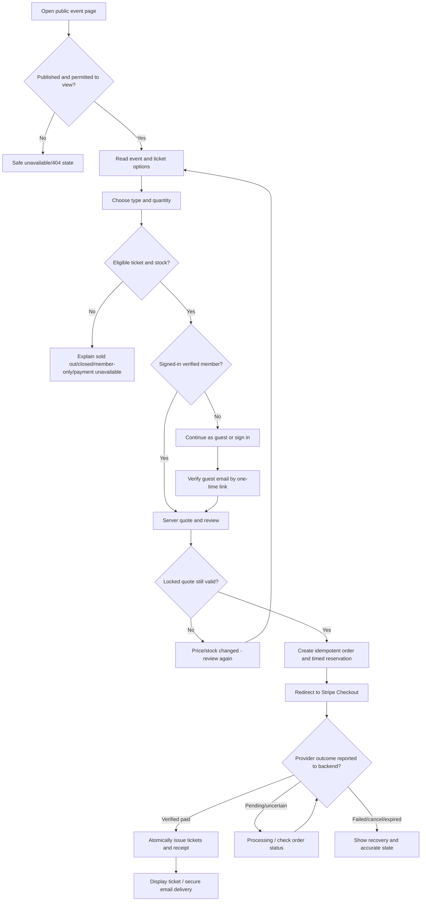
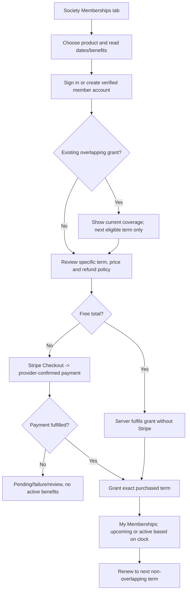
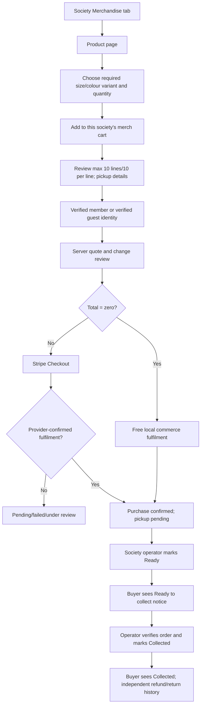

# Thunderstrux - Complete User Flows, Information Architecture and UX/UI Specification

**Document authority:** Follow the [PRD authority contract](THUNDERSTRUX_PRD.md), reconciled 11 October 2026. This document governs its assigned subject within accepted product scope and readiness-plan invariants; it is not evidence of deployed features.

**Version:** 1.0
**Date:** 9 October 2026
**Status:** Proposed product experience and implementation specification, not evidence that screens or services exist
**Audience:** Product designer, frontend engineer, backend engineer, QA engineer, Codex/Claude coding agent
**Markets and defaults:** Australian student societies; English (UK spelling); AUD; society-configured IANA timezone (initial default `Australia/Brisbane`)
**Source of truth:** Use the subject-specific document authority above; this specification governs interactions, not competing presentation tokens or domain invariants.
**Research date:** 9 October 2026. Sources and the inference/adoption decisions appear in sections 2 and 22.

---

## Contents

0. [Implementation rules, authority and scope](#0-how-coding-agents-must-use-this-document)
1. [Product mental model, users and goals](#1-product-mental-model-personas-and-ux-objectives)
2. [Research and competitive UX synthesis](#2-competitor-research-observed-patterns-and-design-synthesis)
3. [Global information architecture](#3-global-information-architecture)
4. [15 end-to-end user journeys](#4-detailed-end-to-end-user-journey-maps)
5. [Design system and interaction grammar](#5-design-system-and-interaction-grammar)
6. [Screen inventory and routes](#6-screen-inventory-and-route-ownership)
7. [Public, checkout and member screens](#7-public-buyer-and-personal-screen-specifications)
8. [Organisation and staff screens](#8-organisation-staff-and-operations-screen-specifications)
9. [Canonical states and transitions](#9-source-of-truth-states-visibility-and-transitions)
10. [Checkout and recovery UX](#10-checkout-payment-and-recovery-ux-contract)
11. [Permissions and privacy](#11-access-privacy-and-permission-matrix)
12. [Email and notification touchpoints](#12-notification-status-and-recovery-touchpoints)
13. [Analytics vocabulary](#13-analytics-vocabulary-and-information-design)
14. [Mobile and accessibility acceptance](#14-responsive-behaviour-and-accessibility-acceptance)
15. [DTOs, APIs and UI-state contracts](#15-data-api-and-ui-state-contracts-for-implementation)
16. [Edge cases and unresolved boundaries](#16-failure-modes-edge-cases-and-ux-design-decisions)
17. [50 end-to-end QA scenarios](#17-end-to-end-test-scenarios-and-acceptance-requirements)
18. [Dependency-aligned delivery](#18-implementation-sequence-aligned-with-the-supplied-plan)
19. [Decision log and out-of-scope features](#19-scope-decision-log-and-enhancement-backlog)
20. [Traceability matrix](#20-product-to-page-traceability-index)
21. [Glossary](#21-glossary-for-designers-and-coding-agents)
22. [Researched references](#22-research-source-register)
23. [Final implementation handoff](#23-final-ux-quality-gate-and-agent-handoff)

---

## 0. How coding agents must use this document

This is an **implementation-facing UX contract**, not a new technical PRD. Deliver the journeys described here while satisfying the uploaded PRD and the dependency-gated implementation plan. Do not silently implement a proposed UI capability that requires an unapproved domain/model/payment expansion. A page URL below marked **proposed** is an information-architecture target, not proof of an existing Next.js route. Preserve existing stable public event/ticket links and use redirects or aliases where necessary.

**Priority and evidence legend:**

- **[P] Product requirement:** The uploaded PRD explicitly requests the underlying capability.
- **[I] Implementation-plan requirement:** The plan specifies the actual supported implementation, including domain limitations.
- **[D] Design decision:** This document recommends an interaction or page structure to deliver a [P]/[I] capability; review it during implementation.
- **[E] Enhancement:** Competitor-inspired, not part of the current PRD-complete MVP. Do not quietly introduce schema/provider commitments for these.
- **[V] Verify:** Actual repository status must be checked before assuming a capability is deployed, especially after 4 October 2026.

**Non-negotiable handoff rules:**

1. Implement the complete happy path, loading/empty/denied/error/recovery paths, keyboard/mobile states, and role-aware navigation for each screen.
2. Never infer a paid order, issued ticket, active membership or collected product from a success URL or optimistic frontend state. Display canonical server projections.
3. All organisation writes and privileged reads require live tenant and capability checks; hiding buttons is not authorisation.
4. Use a single, clear conversion path per purchase. Tickets, membership terms and merchandise have **separate checkout/order domains** under the implementation plan; do not create one mixed cart.
5. Reuse application services, permissions, currency formatting and status semantics. Do not reimplement payment/availability logic in React.
6. Features described as **[E]** may be displayed as future design notes but must not appear as clickable dead controls or claims that Thunderstrux supports them.
7. Write UI copy that distinguishes **Free**, **Paid**, **Pending**, **Processing**, **Refunded**, **Unavailable** and **Expired** accurately.
8. If the codebase and this specification conflict, stop the affected implementation decision, log the conflict and prefer the PRD/plan and audited code behaviour. Never silently weaken payment/security semantics.

### 0.1 Current implementation baseline from the supplied plan [V]

The original supplied-plan baseline was assessed on 4 October 2026 with T01-T04 evidence dated 5 October. That historical snapshot is superseded for delivery status: the repository readiness ledger records T05 and T06 locally complete on 9 October (PRs #42-#44); T07 onward remain unchecked as of this reconciliation. Local completion does not establish hosted activation. Re-read Project Handover, the task ledger and current implementation before creating work.

### 0.2 Product boundaries that override competitor patterns

| Area | MVP contract | Explicitly not required / do not imply |
|---|---|---|
| Ticketing | Paid and free, multiple ticket types, member-price eligibility, public/unlisted/member-only visibility, guest access for eligible events, capacity and safe fulfilment | Reserved seating, automated waiting lists, discount/promo-code engine, multi-date recurrence, seat maps, QR scanner |
| Membership | One-off, fixed-term paid or free product, verified account, current/upcoming/expired/revoked grant, next non-overlapping term renewal | Stripe subscriptions, autorenewal, lifetime membership, multiple simultaneously stacked society-wide tiers |
| Merchandise | Society-scoped product catalogue, variations, bounded cart, stock, pickup-only, status/returns/refund review | Shipping rates/carriers, dropshipping, mixed carts with tickets or memberships |
| Calendar | **Organisation** month/week/agenda view of real events, drafts for authorised staff, timezone-safe schedule | Recurrence engine, Google Calendar synchronisation, consumer personal calendar API, public-calendar feed |
| Checkout | Stripe Checkout for payable orders; entirely server-side free fulfilment for zero-total orders; pre-payment email verification for guests | Client-side payment success, forced registration for eligible guest tickets, manual bank-transfer settlement |
| Refunds | Provider-verified whole-order refunds in initial increment, dispute/uncertainty review, historical attendance retained | Self-service instant partial refunds, auto-restocking refunded tickets or merchandise |
| AI | OpenClaw controlled, permission-filtered read/action proposals with human confirmation | Unrestricted SQL, autonomous refunds, live account transfers or unsupervised destructive writes |

The member-facing **"My upcoming events" list** is [P/I] and is a sensible companion to the organiser calendar. An interactive personal calendar and downloadable `.ics` files are [E] unless separately approved; design their placement but do not present them as delivered.

---

## 1. Product mental model, personas and UX objectives

### 1.1 Model the platform around four questions

1. **What is happening?** Browse events and society pages, with clear location/date/availability.
2. **What can I get?** Buy tickets, join free, purchase a fixed-term membership or order society merchandise.
3. **What do I own?** View valid tickets, membership periods, orders, collection statuses, receipts and support.
4. **What do I run?** In authorised society context, create events, manage sales/staff, admit attendees, fulfil merchandise, monitor finances and hand over ownership.

Avoid forcing users to understand database concepts. "Follow society" or "Join society" means a free association, not a paid membership. A ticket is an admission entitlement, a membership is a time-limited society entitlement, and a merchandise order is a physical collection obligation. A financial order can be pending while all three entitlements are absent.

### 1.2 Personas and primary jobs

| Persona | Entry point and intent | Primary success | Typical failure to prevent |
|---|---|---|---|
| Guest prospective attendee | Shared Instagram/Discord link | Find details; checkout without mandatory signup; get private ticket | Forced account creation, unclear ticket state, inaccessible receipt |
| Verified student member | Homepage, organisation page, own dashboard | Find events, buy member-priced ticket, see membership and ticket | Confusing free join with paid access |
| Returning buyer | Email link, purchases hub | Recover ticket, review receipt, contact society | Login loop, treating pending payment as completed |
| Organisation owner | New-society onboarding | Set profile, payment account, products, staff and first event | Publishing incomplete checkout or losing sole-owner access |
| Events executive | Staff event list/calendar | Publish, manage ticket types and handle changes | Cross-tenant information, irreversible edit after sales |
| Door volunteer | Direct event check-in route | Find ticket, check in once, confirm outcome | Accidental duplicate admission on connection loss |
| Finance officer | Orders/payments/analytics | Understand gross/refunds/fees and perform controlled refunds | Mistaking payout balance for sales or local refund marker for refund |
| Merchandise volunteer | Collection work queue | Mark ready, verify collection and document returns | Assuming paid = collected or refund = returned |
| Membership secretary | Membership roster | See actual active terms and verified people | Granting staff privileges to membership holders |

### 1.3 Measurable UX acceptance indicators [D]

Measure pilot outcomes without claiming industry benchmark targets as actual results. Suggested usability goals: a new guest locates the buy action on a mobile event page; a verified member can distinguish full/member price; a new event organiser understands every publish blocker; a volunteer can identify a duplicate check-in; a buyer can tell pending versus successful payment; a merchandise buyer sees pickup location before payment. Capture task completion, time-on-task, error rate, support requests and accessible-navigation findings during H06 actual user testing. Do not invent conversion improvements before running the study.

---

## 2. Competitor research, observed patterns and design synthesis

The following is a synthesis of **official feature/flow documentation**, not an independent usability study or claim that every competitor uses the same current interface. Cross-platform implementation choices are marked as Thunderstrux decisions. All citations point to primary pages in section 22.

### 2.1 Platform-by-platform research

| Platform | Evidence-based experience observed | Useful for Thunderstrux | Do not copy blindly |
|---|---|---|---|
| **Humanitix** | Published event landing page -> ticket/date selection -> checkout questions -> payment -> email/digital ticket; event builder saves draft, adds tickets, preview then publish. No account required for its basic buyer journey. Manual name/order-ID check-in exists alongside QR. [R-H1], [R-H2], [R-H3] | Direct event-to-ticket funnel, compelling event information, predictable receipt, manual event-day attendee search | Optional waitlists, bundles, discount codes, seating and scanner are outside current implementation plan |
| **Eventbrite** | Discovery/detail -> choose tickets -> buyer and optional attendee information -> checkout -> confirmation -> Tickets/email. Organiser builder covers event page, tickets/add-ons, forms, preview and publication. Buyer/order refund requests and organiser support are visible. [R-E1], [R-E2], [R-E3] | Familiar event details and status vocabulary, post-order ticket wallet, organiser preview/readiness, explicit support/refund policy | Eventbrite's after-checkout data collection, add-ons, reserved seats and auto-account behaviour are not automatically Thunderstrux requirements |
| **Rubric** | Society-first product combines club profiles, membership products, event ticketing, merchandise and purchase history. Memberships have validity periods and can enable member benefits; store listings have product variants, inventory and collection management. [R-R1], [R-R2], [R-R3], [R-R4], [R-R5] | **Closest information architecture analogue:** one branded society destination with Events, Memberships and Merchandise; linked organiser workflows; member entitlement messaging | Rubric supports additional arrangements (e.g. bundled merchandise, shipping, recurring events, marketplace resale) that current Thunderstrux does not |
| **Luma** | Short event-registration funnel; event/calendar ownership and public/private/member-only visibility; ticket-type and membership-aware access; time and place surfaced clearly. [R-L1], [R-L2], [R-L3] | Clean single-purpose event pages, belonging of events to a society calendar, clear restricted-access language | Luma approval/waitlist payment-authorisation and subscription models are not included in the current Thunderstrux plan |
| **Ticket Tailor** | Event/ticket setup with clear type and capacity controls, configurable buyer questions and check-in by search or scanning. Separate staff access supports event-day operations. [R-T1], [R-T2], [R-T3] | Accurate capacity messaging, role-scoped attendee tools, manual search fallback, restrained forms | No reason to add bundled ticket rules, offline scanning, POS or all membership pass features to MVP |
| **TryBooking** | Five-step organiser event wizard; dates, venue, ticket types and images; organiser preview covers the actual customer booking flow. [R-Y1] | Simple first-event onboarding and review-before-publish mechanics | Session/allocated-seating and in-person box office capabilities exceed this MVP |

### 2.2 The common ticketing journey

**Strongest common flow to adopt:**

`Marketing/discovery link -> Public event detail -> Ticket-type/quantity selection -> Buyer identity/required fields -> Confirm total and policies -> Free issuance OR secure payment -> Authoritative status -> Receipt + tickets -> Event-day check-in`

Key synthesis:

- **Event details before purchase:** date, local timezone, location, host identity, inclusions, ticket choices, availability and refund policy must be visible before asking for identity.
- **Ticket selector is the conversion centre:** show type/price/quantity and CTA early, especially on mobile. Do not hide choices in a long multi-page wizard.
- **Avoid account friction:** favour a labelled guest route for eligible purchases [R-B1]. Thunderstrux deliberately verifies guest email **before a hold** to protect access and prevent unauthorised claims [I]; explain the verification step instead of pretending checkout is instantaneous.
- **Ask for minimum information:** buyer name and email; per-attendee questions only if genuinely supported. Competitors offer extensive custom questions, but this plan does **not** specify a full question builder. Do not claim it is there.
- **Keep money and admission states separate:** a Stripe return URL is not proof of fulfilment [R-S1]; order status and tickets must reflect verified backend state.
- **Make refunds and event-day servicing findable:** a durable purchase history and staff check-in are as important as the initial purchase.

### 2.3 Society-first differentiation

Rubric and Luma show that **belonging to an organisation**, **being entitled to member benefits**, and **attending an event** must be discoverable together but understood separately. Thunderstrux should make the public society profile the shared hub: visitors can browse upcoming events, explore fixed-term membership offers, see merchandise and learn about pickup. A member's home aggregates upcoming admissions and paid terms. A society's back office aggregates events, calendar, membership roster, merchandise fulfilment, finance and handover.

### 2.4 Deliberate choices and trade-offs

| Decision | Why | UX safeguard | Status |
|---|---|---|---|
| Public guest checkout, where eligible | Reduce forced-registration friction | Verify guest email before creating reservation; purchase-specific access | [I] |
| Ticket checkout without cross-sells | Keep ticket reservation/fulfilment exact | Related membership/merch may appear on society profile and **after** success, not in mixed checkout | [I/D] |
| Member price shown next to standard price | Explains value of membership | Clearly label eligible/locked; never assume free join confers discount | [I/D] |
| Fixed-term membership not recurring charge | Fits semester/year society management | Explicit `start-end`, renewal is a new purchase, never claim auto-renewal | [I] |
| Pickup-only merchandise | Avoid premature shipping requirements | Pickup site/times/instructions before payment; independent `ready/collected` states | [I] |
| One event-edit flow with publish checklist | Supports volunteer organisers | Draft/autosave indicator; blocking conditions and preview | [I/D] |
| Calendar inside society management | Supports scheduling without recurrence | Month/week/agenda with consistent timezone and event details link | [I] |
| Manual name/order-ID check-in is first-class | Browser-capable MVP, supports busy doors | Server-confirmed check-in outcome; avoid fake/offline success | [I/D] |

---

## 3. Global information architecture

### 3.1 Public and buyer tree

```text
Thunderstrux
├── Home / (public discovery and platform value)
│   ├── Explore events /events                        [proposed discovery URL]
│   │   ├── Search and filters
│   │   └── Event details /events/[eventId]           [existing public pattern]
│   │       └── Ticket picker -> order flow
│   └── Explore societies /societies                 [proposed]
│       └── Society /societies/[orgSlug]              [proposed canonical]
│           ├── Overview
│           ├── Events (list; calendar view only if separately approved)
│           ├── Memberships
│           │   └── Membership offer -> checkout
│           └── Merchandise
│               └── Product -> cart -> checkout
├── Sign up / login / email verification / password recovery
├── Guest verify email / guest receipt recovery       [proposed, scoped private]
├── Order review / provider redirect / status         [proposed, domain-specific]
├── Personal /dashboard or /me                         [proposed destination]
│   ├── Overview
│   ├── My tickets (preserve /tickets)
│   ├── My memberships
│   ├── Joined societies
│   ├── My purchases /purchases
│   │   ├── Tickets
│   │   ├── Memberships
│   │   └── Merchandise
│   └── Profile /account/settings
└── Help / policies / contact organiser
```

**Routing decision [D]:** Treat `/tickets` as a stable compatibility route to the ticket wallet even if navigation uses "My tickets" in a personal `/dashboard` shell. Preserve `/events/[eventId]` existing links. Proposed public aliases should redirect to one canonical URL and must not introduce privileged data into SEO output.

### 3.2 Organisation management tree

```text
Organisation context: active authorised society (not a globally elevated session)
/dashboard [existing shell; make role-specific]
├── Overview + readiness tasks
├── Events /dashboard/events
│   ├── All events (draft/published/closed/history)
│   ├── Create /dashboard/events/new
│   └── Event detail /dashboard/events/[eventId]
│       ├── Overview/readiness
│       ├── Edit content/tickets/sales/access
│       ├── Orders/attendees
│       ├── Check-in
│       └── Event analytics
├── Calendar /dashboard/calendar
├── Orders /dashboard/orders             (Tickets | Memberships | Merchandise)
├── Members /dashboard/members           [roster capability]
├── Memberships /dashboard/memberships
│   ├── Products/terms
│   ├── Current/upcoming/expired roster
│   └── Purchase history
├── Merchandise /dashboard/merchandise
│   ├── Catalogue and variants
│   ├── Orders and pickup queue
│   └── Stock adjustments/returns
├── Analytics /dashboard/analytics
├── Payments /dashboard/payments          (Stripe readiness; restricted finance)
├── Staff /dashboard/staff                (invites, permissions, handover)
├── OpenClaw /dashboard/openclaw          (controlled assistant)
├── History /dashboard/history            (audit ledger)
└── Settings /dashboard/settings          (public profile, support/policies, timezone)
```

The tree is conceptual. Some live routes in the repository may differ; inspect existing links and adapt them rather than needlessly rewriting working routes. Owners and managers see only authorised navigation items. A member who is also society staff has **Personal / Society: [name]** as distinct contexts, not an invisible role switch.

### 3.3 Primary navigation rules

**Public desktop:** logo -> Explore events -> Explore societies -> context-dependent `My tickets` or `Sign in` / `Create a society`. Search is accessible from Explore, not a mandatory modal. Society cards link to branded profile. Keep the header compact during payment checkout.

**Public mobile:** logo, search entry, menu; bottom sticky purchase bar only on event/product detail when content is ready. Never overlay payment fields or keyboard. Prefer "Get tickets" over a floating shopping-cart icon for ticketing.

**Member shell:** Overview, Tickets, Memberships, Societies, Purchases, Account. Purchases includes ticket, membership and merchandise orders; Tickets includes **issued valid/void ticket units**. Avoid two routes both called "Orders" on the personal side.

**Society desktop shell:** collapsible sidebar with Overview / Events / Calendar / Orders / Members / Memberships / Merchandise / Analytics / Payments / Staff / OpenClaw / Settings; group low-frequency History and settings. Active society is visible at all times. Permission-filtered nav and route-level denial are both mandatory.

**Society mobile shell:** top society selector and labelled menu drawer; frequent actions (New event, Check-in, Mark ready) on context pages. Do not show 12 bottom-navigation items. Show back-to-event links and preserve filter/search state.

### 3.4 Global cross-linking

- Every event card links its **hosting society**.
- Every society event list links to the **same canonical event details** route.
- Event member-price explanations link to the **correct society membership offer**; buying a membership does not itself issue the event ticket.
- Ticket receipt links to **My tickets** (member) or secure **View ticket** (guest).
- Merchandise receipt links to **pickup information** and order tracking.
- Organisation calendar blocks link to existing event detail/edit, not duplicate event data.
- The named buyer is not automatically a staff member, paid member or check-in attendee.

---

## 4. Detailed end-to-end user journey maps

### 4.1 J01 - Anonymous visitor discovers and buys a paid ticket

**Entry:** event link, search result or society Events tab. **Success:** server-verified paid order, issued ticket units, receipt, email intent; may appear later while provider confirmation is processing.



**Step-by-step screen contract:**

1. **Event detail** shows date, venue, organiser, summary, availability, full **AUD** pricing, refund/support, and sticky **Get tickets** when eligible. Do not require login merely to read a public event.
2. **Ticket selection** shows each type, plain-language inclusions, price, maximum selectable, `+/-` controls and live subtotal. A free ticket must read **Free**, not `$0` alone. Sold-out rows may remain visible but unavailable.
3. **Buyer route choice** appears only if identity is needed. Show **Continue as guest** as a primary choice for eligible public/unlisted tickets; **Sign in** is equally findable. Explain verification: "We'll email a link to confirm where to send your tickets." Offer no guest path for member-only or member-discount tickets.
4. **Guest email verification** requests the verification link, presents resend and change-address actions, generic privacy-safe responses, and an expiry/retry path. A verified member may continue directly. No stock reservation is promised before guest verification.
5. **Review** shows selected ticket types, quantities, full buyer total, policy, buyer email and return to edit. Check availability/price server-side when creating the purchase; a stale quote returns to this step with a clear comparison.
6. **Payment** uses Stripe hosted Checkout. Display an order reference and discreet "Secure checkout" explanation without pretending to collect card numbers inside Thunderstrux. Only commit a hold according to the backend reservation contract.
7. **Return/status** may show **Processing payment**, **Confirmed - tickets ready**, **Payment not completed**, **Order expired** or **We're reviewing your payment**. Never infer success from query-string parameters. Refresh/poll a scoped status endpoint, subject to sensible backoff.
8. **Completion** shows order reference, ticket quantity and secure ticket link, time/location and contact organiser. Member path appears in Tickets/Purchases; guest path uses a purchase-scoped verified grant and email.

**Critical branches:** double-click pay -> reuse same checkout attempt; refreshed success page -> zero duplicate tickets; expired hold -> show recoverable expiry without a "paid" claim; Stripe paid but local fulfilment impossible -> show "Payment received, ticket fulfilment needs review" and support, not admission; email delay -> show ticket on authenticated/guest-authorised page; purchased price changes later -> preserve historical price/name snapshot; wrong society event -> never show foreign private data.

### 4.2 J02 - Free ticket acquisition

`Event -> choose Free ticket(s) -> sign in/guest verify as eligible -> confirm registration -> server transaction fulfils without Stripe -> receipt and tickets.`

Button label: **Get free tickets**, **Confirm free registration**, **View tickets**. Do not display a card field, Stripe logo or 30-minute payment timer. The server still locks inventory, enforces maximum 10 units per request and idempotency. Under a last-seat race, one buyer succeeds; the other receives "No tickets remaining" with a link back to event options. The success state is *Free registration confirmed*, not *Payment successful*.

### 4.3 J03 - Member buys a discounted or restricted ticket

`Member signed in -> event -> eligible/standard ticket prices visible -> check live society grant -> show actual eligible price -> hold locked grant + policy snapshot -> payment/free issuance -> ticket.`

A free **Join society** relationship is **not** proof of a paid membership. The display must distinguish: **Public price A$25** and **Member price A$15 - available with an active membership**. If not eligible, either show the locked member-type with **Membership required** and link to offer, or offer standard price if the event has one. Do **not** automatically add membership to the event ticket checkout. If a term starts next week or has expired, say when it does/does not apply. If membership is revoked before fulfilment, use the backend's review/compensation path rather than issue an unauthorised ticket.

### 4.4 J04 - Member-only event view

- Anonymous/non-entitled access to a genuinely `members_only` event must be **concealed** per T15/T24, not publicly indexed with revealing title/location and a disabled "Buy" button.
- A verified member with an **active grant carrying the required entitlement** may view and purchase as permitted, whether the membership product was free or paid. Free join alone is insufficient.
- A verified user with another society's grant cannot read protected details. A direct guessed URL or stale cached card must not expose them.
- Unlisted events are **not searchable/listed** but can be opened by direct link (subject to their separate purchase/identity controls). Do not conflate unlisted with member-only.

### 4.5 J05 - Returning buyer accesses tickets and purchase history

`Sign in -> Personal overview -> My tickets -> choose event -> individual ticket status/details -> event info/check-in state` OR `Guest email access link -> POST redemption -> scoped receipt/tickets`.

- Ticket wallet: upcoming first; Past and Invalid/refunded secondary tabs. Card exposes event date/local time, venue, ticket type, valid/check-in status, ticket identifier and **View**.
- Purchases: pending, paid/fulfilled, failed/expired, refund under review, refunded and compensation requiring support. Tabs **Tickets / Memberships / Merchandise** are domains, not statuses.
- One order may contain multiple ticket units; order detail lists each and its separate check-in state.
- Guest recovery: request link to original verified email -> generic confirmation -> purpose-bound link -> private scope; never allow lookup solely by order ID, email string or Stripe Session ID.
- A member attempting to claim a guest order requires explicit verified claim, never automatic email equality.

### 4.6 J06 - Join society for free

`Society public page -> Join society -> login/sign up + verify -> confirm -> Joined state -> personal Joined societies.`

Join is a relationship, not a paid term. The society homepage may separately say **Become a paid member**. A second click should not create duplicate joins; **Leave society** removes only the free relationship, not any free/paid membership grant, purchase or staff authority. Show distinct badges **Following/Joined** and **Active membership through [date]**.

### 4.7 J07 - Buy or renew fixed-term membership



The offer card must show **Society**, **Membership name**, **A$ price or Free**, **Starts**, **Ends**, **Benefits (e.g. member event pricing)**, **Renewal: manual**, and **Refund policy**. A term starting in the future displays **Purchased - starts [date]**, not **Active now**. A person whose term ends at `endsAt` is expired exactly at that time. Membership order is quantity 1 for the verified person; no guest checkout. When a refund is verified, show **Revoked due to refund** (and preserve purchase history). Do not imply membership pass QR or subscription billing exists.

### 4.8 J08 - Merchandise selection, bounded cart, purchase and collection



**Hard limits:** one cart = one organisation + merchandise only, no mixed ticket or membership lines, at most 10 different lines and 10 units each; merge duplicate variants; never guess variant availability or total in the client. Product page displays original listing name, variants, stock status, clear **Pickup only** banner, location/instructions, society support and refund policy. After payment buyer sees **Confirmed - awaiting collection readiness**, not "Shipped". Operator **Ready** and **Collected** are independent of provider charge/refund outcomes. A full refund does not automatically restock collected goods; route the return/stock adjustment through audited review.

### 4.9 J09 - Organisation account onboarding

`Choose Create a society -> registered verified organisation account -> society name/slug -> profile description/contact -> branding -> timezone/policies -> staff/ownership orientation -> payment setup if selling paid items -> readiness overview -> create first draft event/membership/merch.`

One organisation account bootstraps one primary society and has **at most one active primary organisation** under the baseline. Handover may leave it with no active authority; follow PLAN T08's primary-organisation lifecycle, including the post-retirement active-staff bootstrap guard. Keep profile completion separate from *ready to charge*. A society may create drafts and offer free tickets without Stripe charging capability. Onboarding supports resume and links to missing tasks. Owner and admin access is explicit; do not create a second tenant from an existing owner's accidental double submission.

### 4.10 J10 - Organiser creates an event

`Society context -> Events -> Create -> Basics -> Schedule/location -> Tickets/capacity -> Access/sales -> Preview/readiness -> Save draft -> Publish -> Manage.`

**Important:** all create calls initially create **draft**. Publishing is explicit and blocks invalid setup. See section 8.2 for field-level screen contracts and section 11 for readiness states. Even if the UI looks like a stepper, each step should save validated draft data with a visible Saved/Unsaved/Error state. Avoid republishing through a boolean toggle on retries. After publishing, route to event overview with **View public event**, **Copy link**, **Orders**, **Attendees**, **Analytics** and **Calendar** links. Event with historical orders cannot be unlisted/unpublished/deleted merely to make it disappear; obey event service restrictions.

### 4.11 J11 - Operator works from organisation calendar

`Society Dashboard -> Calendar -> Month/Week/Agenda -> select event -> event overview/edit/check-in.`

In contrast with marketplace discovery, this is an **operational** calendar. Events spanning two days appear in each relevant day. Drafts are visible to authorised managers but never leaked to public readers or attendance-only staff. Staff with attendance-only access see permitted published event operations without financial details. Society timezone determines labels, not the visitor's OS timezone alone. Browser navigation across months uses bounded server queries, and Agenda is mobile's default accessible fallback. Calendar does not create recurrences.

### 4.12 J12 - Door volunteer checks in attendee

`Staff context -> Events -> event -> Check-in -> search name/email/order/ticket -> inspect valid state -> Check in -> server confirms -> show confirmation or exact denial.`

A checked-in ticket can be checked out only with the permitted existing action. On timeout, **Reload ticket status** instead of displaying a green success merely because the button was clicked. Duplicate check-in should say **Already checked in at [time]**, not generic failure. Refunded/void/reviewed tickets cannot be newly admitted. Browser/manual check-in is required; scanner/offline mode is a future enhancement only.

### 4.13 J13 - Finance officer refunds or reviews compensation

`Finance capability -> Orders -> purchase detail -> verify status/charge -> Refund whole order -> read consequences -> reason + MFA/confirmation -> processing -> provider-verified full refund -> ticket void/membership revoke or merch financial state update + notice.`

A provider-uncertain result displays **Refund processing - verifying result**, not "Refunded". A **manual refund flag** is not proof a refund happened. For disputes, partial external refunds and paid-but-unfulfilled cases, show review/support workflow and suspend conflicting actions. Preserve historical check-in facts and provider transaction references. Buyer support page states current real status and applicable policy; a "Request refund" customer contact route is [D] unless the corresponding service is added.

### 4.14 J14 - Society ownership handover

`Owner -> Staff -> Invite named person/role -> recipient email -> verified account accepts -> updated role/MFA checks -> new owner assigned -> outgoing owner's authority revised/revoked -> History shows trail.`

Never present a raw invitation token in management UI. Prevent removal of the last owner, including concurrent operations. Access changes must affect existing sessions immediately via live checks. A paid member or joined society user does not gain admin access merely by relationship.

### 4.15 J15 - OpenClaw assists without bypassing normal controls

`Authorised staff -> OpenClaw -> guided prompt/action -> citations/preview of proposed changes -> Confirm or Cancel -> reauthorise -> service action -> durable receipt.`

The assistant may summarise allowed data, explain readiness, draft/edit/publish events or mark merchandise ready using the action registry. A refund, Stripe disconnect, staff authority change, deletion or settlement alteration opens a conventional privileged UI workflow instead of being executed autonomously. Provider error -> guided deterministic UI remains usable. Every mutation shows **what will change**, **who is acting**, **which society**, **expiration of preview**, and a second **Confirm** step.

---
## 5. Design system and interaction grammar

### 5.1 Visual direction [D]

**Desired impression:** confident, trustworthy, energetic but not chaotic; designed for university club volunteers and student attendees, rather than enterprise finance teams or a generic shopping mall. Emphasise the hosting society's identity while maintaining consistent Thunderstrux transaction/security UI.

**Presentation source:** Use the purple semantic tokens, typography, radii and container dimensions in [Visual Design sections 2-3](THUNDERSTRUX_COMPLETE_VISUAL_DESIGN_SPEC.md). The original indigo/system-font token table is superseded; do not maintain a second theme. Layout descriptions below specify hierarchy and interaction, with exact sizing owned by Visual Design.

**Accessibility constraint:** The visual specification's palette is a design proposal, not a conformance certificate. Check every colour combination against WCAG 2.2 AA targets: 4.5:1 for ordinary text and 3:1 for large text and essential non-text components. Society-selected hero images and logo colours must not destroy purchase button contrast. Apply focus outlines independently of hover and colour.

### 5.2 Layout templates [D]

**Public discovery:** 2-4 responsive cards per row; title and filter/search above results; event cards lead with date/location before marketing description. Search results should be accessible in a normal document flow and linkable by URL query parameters.

**Public event details:** desktop two columns, main content approximately 65%, sticky ticket panel approximately 35%; mobile one column with hero cropped sensibly, metadata visible high on page, and a bottom bar containing minimum price/Free plus **Get tickets**. Ensure bar can be dismissed or repositioned at 200% zoom and does not cover cookie/keyboard/dialog content.

**Public society profile:** prominent branded cover and logo, about section, short navigation tabs **Overview | Events | Memberships | Merchandise**, all within the same canonical society. Mobile tabs horizontally scroll with visible overflow/focus affordances; tab contents use proper links if route changes rather than synthetic hover-only controls.

**Checkout:** distraction-free shell, society name/secure context, main step content, persistent but non-obstructive order summary. On mobile, summary is expandable but total and what is being bought remain visible. Clear back navigation, full subtotal and honest fee disclosure before external payment. Never hide support/refund terms.

**Organiser dashboard:** sidebar + header with society context, page title, top action, meaningful filters, main table/cards and contextual detail drawer only where keyboard/focus management is correct. On mobile replace wide tables with labelled row cards; preserve filter functionality.

**Action confirmation:** always use an explicit confirmation modal/page for refund, role revocation, permanent closure, irreversible stock/manual transitions and OpenClaw changes. Title names the operation; body identifies target/consequences; primary button is specific ("Refund whole order", not "OK").

### 5.3 Shared components [D]

| Component | Inputs and required states | Semantics |
|---|---|---|
| `AppHeader` | Context public/personal/society; logged in/out; selected society | Brand, navigation, context, login; semantic `nav` |
| `SocietySwitcher` | Active society and only live-authorised alternatives | Show role; avoid making free join a switchable staff tenant |
| `EventCard` | title, hero, dates/tz, venue, society, lowest available price, sale state | Entire card has one descriptive link; no nested conflicting button |
| `MembershipCard` | product, fixed-term range, price, benefits, eligibility/status | Distinguish **Free join** from **Get membership** |
| `MerchCard` | photo, price, stock/variants, pickup only, society | Sold-out state; safe alt text |
| `TicketTypeRow` | name, inclusion, public/member price, sale state, quantity limit | `+/-` with labels; disabled state includes reason |
| `MoneySummary` | items, AUD totals, seller/platform fee interpretation, quote version | Never create totals from stale client values |
| `StatusBadge` | typed backend enum -> accessible visible label | Never signal state solely by colour |
| `ReadinessChecklist` | required checks and CTA fixing each issue | No generic "Please fix the form" errors |
| `EmptyState` | audience, why empty, one next action | No fake example orders/metrics |
| `ErrorSummary` | form-level error and links/focus to affected fields | Proper `role=alert` with non-repeating announcement |
| `PrivateAccessGate` | identity and eligibility reasons without disclosure | Exact reason only after authentication/authorisation |
| `ActionResult` | saved/processing/failed/confirmed/unknown | Correlate server request/operation ID where safe |
| `AuditTimeline` | event/time/actor/safe facts | Read-only, paginated and capability scoped |
| `DateTimeDisplay` | UTC + society IANA timezone | Show timezone abbreviation or city, clarify DST where present |
| `PickupInstructions` | location, directions, hours/contact, ready status | Visible before payment and again after purchase |

### 5.4 Copy and button vocabulary

| Intent | Use | Avoid |
|---|---|---|
| Buy paid ticket | "Get tickets"; final "Pay A$XX.XX" before Stripe redirect | "Register" with surprise payment |
| Get free ticket | "Get free tickets"; final "Confirm free registration" | "Pay A$0" |
| Guest identity | "Continue as guest"; "Verify email to receive your tickets" | "Create account to continue" where guest supported |
| Buy membership | "Buy membership" or "Get free membership" | "Subscribe" or "Auto-renew" |
| Renew next term | "Buy 2027 membership" / "Renew for next term" | "Extend current membership" if product is next non-overlapping term |
| Free society association | "Join society" / "Leave society" | "Become a member" without distinguishing paid benefit |
| Merchandise | "Add to merch basket" / "Checkout merchandise" | "Ship now" |
| Payment return | "Checking payment status" | "Payment successful" before provider confirmation |
| Refund | "Refund requested" / "Refund processing" / "Refund confirmed" | Treating bookkeeping mark as provider-confirmed |
| Check-in | "Check in" / "Checked in" / "Already checked in" | "Saved" when admission state is uncertain |
| Draft readiness | "Publish event" and linked blockers | Boolean "Live" toggle without validation |
| AI | "Review suggested changes" / "Confirm action" / "Action completed" | "Done" before execution receipt |

### 5.5 Basic form behaviour

Every required field has an always-visible label and help text where needed; do not rely on placeholder-only labels. Validate on submit and, where helpful, on blur; avoid interrupting users on each keystroke. Preserve user-entered values on server errors, lost network and login callbacks when safe. Show summary error at top and inline field errors with `aria-describedby`. Success announcements must be accessible but not repeatedly spoken on every poll. Page titles and heading structure remain logical after client-side navigation.

---

## 6. Screen inventory and route ownership

**Route marker:** `existing` means referenced in the uploaded implementation plan as already present or expected existing shape, **planned** means specified in its T tasks, **proposed** means URL/name decision for implementation. Routes are illustrative until confirmed against current `app/` filesystem.

| Screen ID | Area | Proposed/canonical route | Primary audience | Owning capability / task |
|---|---|---|---|---|
| PUB-01 | Landing | `/` (existing) | all | PRD discovery; T09, T15 |
| PUB-02 | Event discovery | `/events` (proposed) | public | T15 |
| PUB-03 | Event detail | `/events/[eventId]` (existing) | public/eligible | T11-T16, T24 |
| PUB-04 | Society discovery | `/societies` (proposed) | public | T09 |
| PUB-05 | Society profile | `/societies/[orgSlug]` (proposed) | public | T08-T09, T24-T26 |
| PUB-06 | Society membership offers | `/societies/[orgSlug]/memberships` (proposed) | public/verified | T22-T24 |
| PUB-07 | Society merchandise | `/societies/[orgSlug]/merchandise` (proposed) | public | T25-T26 |
| PUB-08 | Product detail | `/societies/[orgSlug]/merchandise/[productId]` (proposed) | public | T26 |
| AUTH-01 | Register/login | reuse live auth routes | all | T03-T04, T16 |
| AUTH-02 | Verify email | reuse live verification routes | signed in | T03 |
| AUTH-03 | Password recovery | `/forgot-password`, `/reset-password` (planned/existing) | all | T04 |
| AUTH-04 | Account/settings | `/account/settings` (planned/existing) | signed in | T04 |
| BUY-01 | Ticket picker | embedded on PUB-03 or route/drawer | member/guest | T12-T16, T24 |
| BUY-02 | Guest verify | route implementation to be selected | guest | T16 |
| BUY-03 | Ticket review | route implementation to be selected | buyer | T12-T16 |
| BUY-04 | Ticket status/receipt | server-scoped existing success/cancel + `/purchases` | buyer | T19 |
| BUY-05 | Membership review/status | route implementation to be selected | verified member | T21-T24 |
| BUY-06 | Merchandise basket | society-bound route/session | buyer | T26-T28 |
| BUY-07 | Merchandise review/status | route implementation to be selected | member/guest | T26-T29 |
| BUY-08 | Guest recovery | route implementation to be selected | verified guest | T16, T29 |
| PER-01 | Personal overview | `/dashboard` in personal context (proposed behaviour) | member | T05, T34 |
| PER-02 | My tickets | `/tickets` (existing) | member | T19, T34 |
| PER-03 | My memberships | `/memberships` or personal nested route (proposed) | member | T23-T24 |
| PER-04 | Joined societies | existing joined societies page/pattern | member | T09, T34 |
| PER-05 | Purchases/order detail | `/purchases`, `/purchases/[kind]/[id]` (planned + proposed detail) | member | T19, T29 |
| ORG-01 | Society overview | `/dashboard` in staff context (existing shell) | authorised staff | T34 |
| ORG-02 | Society create/onboarding | existing organisation creation + proposed wizard | organisation owner | T08 |
| ORG-03 | Events index | `/dashboard/events` (existing pattern) | events staff | T11-T15 |
| ORG-04 | Event builder/edit | `/dashboard/events/new`, event edit route (existing pattern) | event managers | T11-T12 |
| ORG-05 | Event workspace | `/dashboard/events/[eventId]` (proposed grouping) | authorised staff | T11-T19 |
| ORG-06 | Event check-in | nested event page/route | check-in staff | T19 |
| ORG-07 | Calendar | `/dashboard/calendar` (planned explicit) | managers/check-in staff | T33 |
| ORG-08 | Orders list/detail | `/dashboard/orders` (existing tickets, planned family tabs) | staff capability | T19, T29 |
| ORG-09 | Membership management | `/dashboard/memberships` (planned) | memberships staff | T22-T24 |
| ORG-10 | Membership roster | nested `memberships`/`members` (proposed) | roster-authorised staff | T23 |
| ORG-11 | Merchandise management | `/dashboard/merchandise` (planned) | merchandise staff | T25-T28 |
| ORG-12 | Pickup/collection queue | nested merchandise orders (proposed) | fulfilment staff | T28 |
| ORG-13 | Analytics | `/dashboard/analytics` (planned) | scoped roles | T31-T32 |
| ORG-14 | Payments/Connect | current settings Connect + optional payment nav (proposed) | finance/owner | T17 |
| ORG-15 | Staff/invites/handover | existing staff routes + improved UI | owner/admin | T05-T06 |
| ORG-16 | Settings/branding | `/dashboard/settings` (existing pattern) | owner/admin | T07-T08 |
| ORG-17 | History | `/dashboard/history` (planned) | audit-authorised | T38 |
| ORG-18 | OpenClaw | `/dashboard/openclaw` (planned) | authorised | T35-T37 |

**Agent instruction:** Do not create `app` pages by copying this route table without inspecting Next.js route groups, middleware/proxy authorisation and existing link contracts. Use the actual route hierarchy that honours existing application architecture. The **screen IDs and behaviours** are the durable acceptance requirements.

---

## 7. Public, buyer and personal screen specifications

Use each specification as an explicit checklist. Unless otherwise noted, every page supports skeleton/loading, empty, recoverable error, offline/failed request feedback, responsive mobile and desktop presentation, keyboard-only interaction, meaningful document title and no private server payload leakage.

### PUB-01 - Home / landing

- **Purpose:** explain the society-first platform and make discovery effortless. One primary discovery action and clear path for society organisers.
- **Hierarchy:** header; headline **Events, clubs and experiences at your campus** (example); search; Featured/Upcoming events; Discover societies; lightweight organiser value section; footer (support/privacy/terms).
- **Event cards:** artwork/placeholder, date, venue, society, lowest available price or Free, sold out/closed label if applicable.
- **CTAs:** Browse events, Discover societies, Create a society. Authenticated member gets **My tickets**; staff sees **Manage [society]** without losing personal navigation.
- **Data:** only published publicly discoverable event/society DTOs. Do not render fixture/sample paid prices as if real.
- **States:** no upcoming public events -> supportive empty state with society discovery; index/API unavailable -> retry without leaking technical traces.

### PUB-02 - Explore events

- **Purpose:** filter public events, scanning by date and society rather than forcing keyword-only discovery.
- **Controls:** search with labelled button, date range (upcoming/this month/custom within supported range), society filter, order by soonest, clear all. Optional category only if underlying data/index is implemented.
- **Cards:** use `EventCard`; indicate starting price based on actually available ticket types, not lowest historical sold-out ticket.
- **URL:** keep shareable safe filter params and pagination cursor (or user-friendly page links mapped to cursor). Preserve focus and scroll when loading more.
- **Concealment:** exclude draft, unlisted, restricted member-only and invalid event details from public results; no blur/placeholder revealing protected title.
- **States:** no results -> "No events match these filters" with Reset filters; sold-out events may be shown if still legitimate public listings but cannot be displayed as purchasable; invalid filter -> safe fallback and correct focus.

### PUB-03 - Public event detail

**Above fold:** society brand and event title, readable start/end with timezone, venue + accessible directions, concise summary, current sale badge, price range/Free and Get tickets. Show organiser identity with link. Keep terms/policy easy to find.

**Main content:** hero image with meaningful alt text; About; When/Where; What to expect; Ticket types or anchor to picker; About organiser; Refund policy and Contact organiser. Optional FAQ/content sections only when represented by a safe published model. If a venue is not yet announced but the domain allows it, show truthful `To be announced` rather than invent an address; publication rules may block missing required venue information.

**Ticket panel:** per-type rows, quantity selector, public/member pricing, remaining labels (advisory), subtotal and CTA. If member-only, do not leak page to unauthorised readers. Availability can change while the page is open.

**Important variants:**

| Variant | Public display | Action |
|---|---|---|
| Public and open | Ticket types and clear prices | Get tickets |
| Published, free only | Free badge and free selector | Get free tickets |
| Published, mixed; Connect unavailable | Free types purchasable; paid types unavailable with reason | Get free tickets only for free selection |
| Published, all sold | Sold out with contact organiser; no buy button | None; no fake waitlist |
| Sales not yet available / closed | Correct date and availability message | Disabled buy; view details |
| Unlisted | Direct link accessible if valid; not in search/list pages | Eligible checkout only |
| Member-only without verified entitlement | Concealed resource for unauthorised users | No public protected details |
| Draft/unpublished/nonexistent | Safe not-found/unavailable response | No purchase |
| Payment provider down/organisation charges disabled | Explicit paid checkout unavailable, no card or false checkout button | Retain available free paths |
| Attendee was refunded | Old receipt indicates refunded/void; public event remains unaffected | No old-ticket admission |

**Buy CTA requirements:** only eligible selections lead to identity/quote, selection persists through sign-in/verification safely, and the final authoritative price is rechecked. Event owner can preview unpublished drafts in an authorised owner-only preview that does **not** expose a public route or allow real purchase.

### PUB-04 - Society discovery

- **Heading:** Discover societies; search by name and description; cards with logo, description teaser, public events count when safely available.
- **Card actions:** View society; no staff-role inference from being joined.
- **Filters:** only those supported by the public society search model. Do not invent campus affiliation verification badges.
- **Empty:** no societies -> clear reset/search guidance; no public listing of private administrative emails or staff roster.

### PUB-05 - Society public profile

- **Hero:** owner-controlled, safely served cover/logo; society name and public description; public support/contact information; Joined status (for logged-in member); **Join society** CTA if eligible.
- **Navigation:** Overview / Events / Memberships / Merchandise. Make existing, published offers visible and hide truly empty sections or offer explanatory states.
- **Overview content:** next two to four events; membership summary (not free-join badge); curated merchandise cards; about/support. A link in social bio should lead to this one page, rather than unrelated checkout brands.
- **Join area:** one-off **Join society** is explicitly different from buying fixed-term membership. A paid member who has left free join still retains their grant; display correctly.
- **Membership tab:** fixed-term product cards and the visitor's genuine entitlement state where authorised; one society-wide tier per period.
- **Merch tab:** pickup-only catalogue, variant/stock badges and details.
- **Privacy:** public DTO only; no private member names, society finance, staff/security settings, pending purchase data or hidden member-only events.

### PUB-06 - Society membership offers

- **Card:** product name, A$ price or Free, fixed start/end dates, benefits, available/upcoming period, policy, society identity.
- **Primary CTA:** Buy membership / Get free membership; unauthenticated path -> sign in then verify.
- **Eligibility:** if overlapping active/upcoming grant, show "You already have this period" and available **next term** when configured, rather than processing duplicate purchase.
- **After return:** stay on original society/offer context; success takes user to My memberships and receipt.
- **Empty:** "This society has no membership plans available" and display free Join society separately if supported.

### PUB-07 - Society merchandise catalogue

- **Layout:** image grid with filters only for real fields (e.g. availability); product tiles list price and pickup-only.
- **Basket indicator:** scoped to this society's merch order; switching society must not mix baskets. Offer to finish/clear current basket instead of silently merging stock.
- **Empty:** no live listings, no checkout CTA; links back to Events/Memberships.
- **Cards:** Sold out visible with disabled product purchase action where useful; archive means cannot create new purchases.

### PUB-08 - Merchandise product detail

- **Information:** large safe image(s) with alt text, society seller, price in AUD, description, options such as Size/Colour, availability, pickup location/instructions, support/refund.
- **Selection:** structured variant controls, required attributes, quantity bounded by 10 units per line and availability; no generic free text pretending to represent SKU.
- **CTA:** Add to merch basket; validation error for missing combination or sold-out variant. Basket toast offers View basket and Keep browsing.
- **Read-after-change:** server quote refresh at basket, not false local stock authority.

### AUTH-01 - Sign up / sign in

- **Sign up choice:** personal member vs organisation owner intent; keep underlying account-role constraints from the PRD, and route existing named member staff into authorised society context after login. Do not invent multi-organisation bootstrap for organisation accounts.
- **Fields:** existing credential and identity validations from code; password helper; accessible field validation and generic signup responses for both new and duplicate addresses. Signup, verification issuance and recovery must not disclose account existence; never show anonymous "email already registered" feedback.
- **Return path:** preserve a validated safe first-party callback to pending event, membership offer or basket after authentication. Never redirect to arbitrary URLs.
- **Unverified:** login/profile allowed where service permits; purchasing/join/bootstrap/invite acceptance must go through verification pending.
- **Session invalidated:** show sign-in again with reason, never silently retain privileged dashboard content.

### AUTH-02 - Email verification pending and confirmation

- **Pending:** masked recipient as permitted, reason verification is needed, resend button with rate-limited state, change/correct email route.
- **Link:** GET navigation displays prompt; explicit POST redemption consumes once, survives mail scanners/prefetchers; clean browser location afterwards; no raw token in logs/history/query.
- **Success:** clear verified confirmation and safe return to original task. Expired/consumed/mismatched link -> secure, actionable resend or signed-in workflow.

### AUTH-03 - Account recovery and closure

- **Recovery:** generic reset-request response, expiring token, new password confirmation, forced fresh login. Password change and email change require current password plus enrolled MFA as specified.
- **Email change:** distinguish **Pending new email verification** from committed email; cancellation path; notify old and new email as supported.
- **Closure:** separate danger area showing real blockers (ownership handover, pending purchase, unresolved compensation, upcoming paid tickets), current password/MFA/acknowledgement and permanent effect. Do not claim deleted audit or order records. No one-click account closure.

### AUTH-04 - Private account and security settings

- **Structure:** Profile, Password and security, Email address, Notification preferences, Close account. Profile shows name and the live verified-email state; internal account role and staff permissions are read-only derived facts, not editable profile values.
- **Profile:** update permitted personal details with existing scoped service; Save feedback is tied to server confirmation. Changes cannot directly modify society staff grants or historic order buyer identities.
- **Password:** current-password verification plus enrolled MFA where required; explain fresh sign-in after security changes; reject outdated sessions rather than silently refreshing them.
- **Email address:** show registered email and separately **Pending new email**; new email is not active until link confirmation. Offer cancel/resend, prevent old/stale link acceptance, and explain security notices to original address.
- **Notifications:** optional membership reminder/engagement preferences may be toggled; essential purchase/security/refund/change emails remain mandatory.
- **Close account:** permanent irreversible action in the danger section; request current password, MFA and explicit acknowledgement. Show current ownership/pending-payment/upcoming-paid-ticket blockers from the server. On closure, private account access ends while required payment/audit history remains.
- **Validation:** all changes enforce current session version, tenant/staff separation, origin/CSRF/rate rules and safe error messages. Do not display or embed password reset tokens in settings UI.

### BUY-01 - Ticket picker (component or focused drawer)

- **Information:** type, description, per-unit public price, eligible member price, remaining/sold-out label, quantity and subtotal.
- **Controls:** plus/minus with real button labels and disabled explanations; quantity zero for unselected; at most 10 total tickets per free issue as plan; if paid flow has different server limits, derive them from validated API rather than assuming unlimited.
- **Mixed free and paid selections:** **Decision required:** the existing ticket order model/checkout supports a paid total but `paymentKind=free` only when zero total. If multi-type selection totals positive, **one paid ticket order** can contain both zero-price and paid ticket lines only if the existing ticket schema/service genuinely supports it. The supplied plan retains a `TicketType`-linked ticket order and does not explicitly guarantee multi-type ticket orders. **Default for this spec: one ticket type per ticket purchase until the repository/service supports a safe multi-type order.** Multi-type controls can be shown as separate purchase actions, never a false composite cart. Do not silently change the order schema to imitate Eventbrite. [D requiring verification]
- **Quote mismatch:** show "Tickets changed since you selected them" and new totals; never auto-accept more expensive purchase.
- **Empty:** no available options -> no checkout; contact organiser link.

### BUY-02 - Guest verification

- **Selection:** Continue as guest + Sign in presented clearly. Guest is for eligible tickets/merchandise, not memberships/member-only perks.
- **Form:** email, request-link button, delivery instructions, resend after cooldown, "Use another email" and return to event/basket.
- **Security:** generic outward responses when a verified address is not in a known guest record; purpose-bound, hashed, short-lived tokens; HttpOnly/Secure/SameSite scoped sessions; POST redemption; tokens not in analytics.
- **Transition:** when verification succeeds, re-quote the original ticket/basket and proceed. Do not create long-lived holds during email-delivery latency.

### BUY-03 - Ticket order review

- **Page header:** Confirm your tickets; clear step labels `Tickets -> Details -> Review -> Payment` for paid, or `Tickets -> Details -> Confirm` for free.
- **Summary:** event/date/location/tz, item/ticket type, quantity, buyer name/email, ticket totals, AUD, refund policy, host contact, any real fee policy.
- **Actions:** Edit tickets, Edit contact (if identity permits), Pay/Confirm free registration. Final paid action should clearly state transition to Stripe; avoid second nonfunctional "Proceed" action.
- **Price:** backend quote authoritative; changed price/availability results in explicit retry/review, not silent optimistic recalculation.
- **A11y:** heading/status navigation and errors; preserve prior inputs when moving back.

### BUY-04 - Ticket order status and receipt

- **Pending:** explanation that payment confirmation may take time; latest server status; refreshing uses bounded polling; an order reference and support if unusually delayed.
- **Paid + fulfilled:** visible true order state, ticket units, secure View tickets, receipt details, hosting society, current event schedule and original purchase snapshots.
- **Free fulfilled:** **Free registration confirmed**, order still visible in Purchases but never counted as monetary revenue.
- **Cancelled/failed/expired:** link to event to try again, without claiming no money ever moved if provider outcome remains uncertain.
- **Compensation review:** prominent support box "Payment was received but tickets could not be issued; we're reviewing this". Do not show valid ticket or invite check-in.
- **Refunded:** label confirmed amount/status; ticket valid flag changes to void; historical checked-in state still visible to authorised staff.
- **Security:** status view keyed to member ownership or verified guest grant; query parameters alone cannot authorise private receipt.

### BUY-05 - Membership purchase review and result

- **Review:** membership society, period `[startsAt, endsAt)`, specific benefits/entitlement version, amount/fees, current/next coverage and manual renewal disclosure.
- **Eligibility:** verified member only; quantity one; overlap checked at purchase, not inferred from calendar tile.
- **Pending result:** benefits remain **Not active** until grant exists and start time occurs. Free membership also needs server-confirmed grant.
- **Success:** receipt, membership details and **My memberships** link; if upcoming, state **Upcoming**.

### BUY-06 - Merchandise basket

- **Header:** `[Society] merchandise basket`, "Pickup only".
- **Rows:** thumbnail, product/variant, unit price snapshot from latest quote, quantity selector, remove. Merge duplicate variants in canonical cart state.
- **Limits:** max 10 distinct lines; max 10 units/line; one society; no membership or tickets. Mixed society attempt produces a clear prompt to complete or empty current basket.
- **Pricing:** server quote displays subtotal, actual fee/tax policy where configured, amount due in AUD, pickup instructions and refund link.
- **Actions:** Keep shopping and Checkout merchandise. Sold-out or repriced variant -> focus inline error, option to remove/review.
- **Storage:** do not persist private payment identity or secrets in browser storage; recover cart via safe non-authoritative data and revalidate before every state change.

### BUY-07 - Merchandise review, payment status and order detail

- **Before payment:** final item names/variants/quantities, society seller, address and pickup method, buyer contact, refund/support, quote version and total.
- **After payment:** fulfilment state independent of collection: `Payment: confirmed` and `Pickup: awaiting readiness`; pending/uncertain provider states have no collection permission.
- **Ready:** explicit collection location/time/instructions and contact. **Collected:** timestamp and status. **Refunded but collected:** preserve both histories; not automatically stock returned.
- **Guest:** purchase-specific verified receipt/recovery link; not an anonymous order-ID page.

### BUY-08 - Guest receipt recovery

- **Start:** "Find a previous guest purchase" with email form and generic response.
- **Email:** purpose-bound time-limited grant request; may contain scoped ticket or merch order links but never general email-wide history unless verified and explicitly supported.
- **Claim:** POST token redemption establishes private access; check expiry, purpose, purchase and recipient; no GET consumption. Access outside scope returns concealed not-found.
- **Support:** if email inaccessible, contact platform/society support via identity-verification policy, not a passwordless unscoped lookup.

### PER-01 - Personal home

- **Welcome block:** nearest **valid upcoming ticket(s)** with prominent View ticket; membership coverage summary; joined societies and suggested public events.
- **Secondary content:** recently fulfilled purchases and link to all history; account verification/security alerts if relevant.
- **Definitions:** upcoming means future event start or current ongoing as explicitly defined; does not include void or pending, and should account for event timezone. Date range titles must not be mislabeled "this month" if backend uses last 30 days.
- **Empty:** "You have no upcoming tickets" -> Browse events; "No active memberships" -> Discover societies. No automatic organisation tools for ordinary members.

### PER-02 - My tickets

- **Views:** Upcoming, Past, Invalid/Refunded; valid tickets shown before cancelled/void ones. Optional filters by society/event.
- **Card:** event, date/location/tz, type snapshot, ticket ID, access status, checked-in label, View details.
- **Order grouping:** when one purchase issues multiple tickets, display ticket unit list and original order cross-link.
- **Action:** Show event-day ticket details; a scannable QR is [E] and must not be fabricated if the backend only supports manual check-in. Preserve privacy on shared/public links.
- **Empty and failure:** provide browse navigation and resync/retry; paid-but-unfulfilled belongs in Purchases under review, not in valid wallet.

### PER-03 - My memberships

- **Tabs:** Active / Upcoming / Expired / Revoked (or compact filters). Each card shows society, tier/product name, exact period in timezone, benefits and purchase/receipt link.
- **Current state:** computed server-side from time and revocation; do not depend on reminder email dispatch.
- **Renew action:** only displays if a next non-overlapping eligible term is on sale; future renewal is new purchase; "no automatic renewal" is visible.
- **Refunded:** grant revoked, related commerce order accessible in Purchases.

### PER-04 - Joined societies

- **Lists:** free joins with Join date; each links to public society profile. Show separate active membership badge if one exists.
- **Actions:** Leave (explicit confirm if useful), View events, Explore membership.
- **Rules:** leaving free join cannot revoke a paid term or staff role. No automatic private roster access.

### PER-05 - All purchases

- **Tabs:** Tickets / Memberships / Merchandise; optional status filter; descending stable purchase time; buyer sees only own domain-specific DTO.
- **Rows:** creation date, society, item summary, money/Free, current payment/fulfilment/refund state, order reference, Open.
- **Order detail:** immutable purchased name/price/seller/currency snapshots, current fulfilment status, history/timeline, ticket units or membership term or pickup stages, contact/refund context.
- **Privacy:** no raw Stripe payload, address of unrelated purchaser, security-token value or unscoped guest claim.

---
## 8. Organisation, staff and operations screen specifications

### ORG-01 - Organisation dashboard overview

- **Primary question:** "What should we act on today?" Top: active society/context, readiness status and key actions. Prefer tasks to decorative analytics.
- **Hero tasks:** Finish profile; Set up charges; Create first event; Review upcoming event; Respond to unresolved payment/fulfilment; Prepare merchandise pickups. Only display tasks the actor has permission to fulfil.
- **Metrics:** upcoming published events, valid ticket units issued, recent *qualified* order activity, next collections, memberships nearing expiry. Financial totals only for `finance` and `analytics` authorised roles. Each card links to a filtered authoritative list.
- **Scope:** source counts from bounded tenant-safe services, clearly label calendar period and metric basis. No "A$ revenue" using free orders, raw pending orders or local bookkeeping refunds.
- **Empty:** new society -> friendly setup sequence; established no upcoming events -> Create event; finance-unready -> Connect payments rather than blocking free-event drafts.
- **Role variants:** owner/admin full permitted links; event manager events/attendance (not finance); finance payments/refunds; check-in volunteer event operation only. Staff without dashboard summary permission gets a limited task landing page, never a leaking global overview.

### ORG-02 - Create a society and complete onboarding

**Design:** linear but skippable/resumable wizard for editable non-security fields. Recommended steps:

1. **Society identity:** name, stable unique slug, description and public contact/support email. Slug conflict -> show alternatives; do not silently change an existing URL.
2. **Branding:** logo/cover through safe asset uploader; image constraints; preview; default placeholder if not available yet.
3. **Society operations:** timezone, support/refund/merchandise pickup policy fields. Explain these appear publicly and in relevant checkout.
4. **Team:** named owner info; Invite staff option once ready, explicitly separated from giving membership to a student.
5. **Payments:** connect Stripe if selling paid ticket/membership/merchandise products; separate Charges ready versus Payouts ready.
6. **Finish:** checklist with `Profile complete`, `Can publish free event`, `Can accept payments`, `Staff prepared`; route to overview.

**Rules:** PLAN T08 primary-organisation lifecycle for organisation accounts; verified bootstrap; atomic owner creation; live permission; optimistic profile version; not every step blocks using drafts. A skipped Stripe step cannot be presented as ready for paid sales. Never ask organiser to paste Stripe account IDs, secrets or card details directly into Thunderstrux.

### ORG-03 - Events management index

- **Top:** title **Events**, Create event; summary counters only from authoritative scoped services.
- **Tabs/filters:** Upcoming published, Drafts, Past, All; search by event name; optional status/visibility filters. Never use "Live" for a published event whose sales are closed.
- **Table/card fields:** event title, date/time/tz, location, visibility, publication state, sale state, issued units, remaining/sellable (where reliable), management menu.
- **Row actions:** Open event, Edit, Preview, Copy published link. Close sales/Publish/Unpublish/Delete only when capability and domain transition allow; restricted actions explain why.
- **Empty:** Create first event; draft has incomplete badge and link to blockers. Stale archived products must not corrupt old event history.
- **Desktop/mobile:** table supports sort/focus and compact mobile cards with explicit action menu; do not hide primary Create action behind hover.

### ORG-04 - Event create and edit builder

**Reference:** Humanitix and Eventbrite both put event basics/tickets/review into a guided builder [R-H1], [R-E2]. Thunderstrux should keep draft persistence, explicit publication and pre-sale integrity.

**Section A - Basic information**

| Field | UI input / validation | Notes |
|---|---|---|
| Event name | Labelled input, length rule from validated schema | Required to publish |
| Summary | Short multiline field | Attendee value proposition |
| Description | Safe rich text or plain text consistent with existing sanitiser | No arbitrary executable HTML |
| Hero image | Safe image upload and crop/preview | T07 asset ownership and limits |
| Host | Locked selected organisation | Do not let form spoof `organisationId` |
| Contact/support | Link to society public policy | No secret settings in event DTO |

**Section B - Schedule and location**

| Field | UI input / validation | Notes |
|---|---|---|
| Start / End | Date+time inputs with timezone indicator; end after start | Persist UTC, display IANA zone |
| Venue | Name and location or truthful permitted location type | Match publication requirements |
| Attendance capacity | Optional positive integer | Distinct from per-type remaining stock |
| Sale close time | Local datetime; default event start | Closing sales does not unpublish |
| Visibility | Public / Unlisted / Members only | Member-only publish enabled only after T24 |

**Section C - Tickets**

Ticket editor rows: Name, price in AUD, available quantity, optional member price, publish eligibility, current sold/held state and save actions. Prices are integer cents on server; input is human A$ string with no floating-point arithmetic. At least one ticket type and positive total availability are required for initial publication. Include explanation that an event-wide capacity is a separate ceiling. For a ticket type with historical sales, offer **Edit allowed fields** and **Archive/stop sales where supported**, not delete or historical repricing. A quantity edit must never reduce available remaining below holds or capacity below issued+active holds.

**Section D - Access and readiness**

Show exact publish blockers from the **same event-readiness service** used by backend, for example: missing start/end, missing ticket type, invalid inventory, paid types not charge-ready, sales window closed, missing required event details, member-only policy unavailable. List each with `Fix` links anchored to the correct field. For **free-only** events, not having Stripe configured must not be a blocker. For mixed events with payment unavailable, free types may remain purchasable subject to shared readiness rules.

**Section E - Preview and publish**

Preview uses an authorised read path plus **DRAFT PREVIEW** watermark and disabled purchasing; never publish temporarily to preview. Explicit `Publish event` action includes current version and performs server-side validation. A stale form receives a non-destructive conflict notice and reload/compare option. On success, management overview shows valid public link, availability and next actions. Save Draft is an explicit operation before publish; do not confuse preview with a live route.

**Builder persistence:** Use Save/Save draft (or carefully implemented autosave with `Saved at HH:MM`, `Unsaved changes`, `Saving`, `Unable to save`). If autosave is not reliable, use explicit Save; never display a false saved status. A network failure preserves local form values and offers retry. Navigate-away confirmation for unsaved changes; ensure browser Back doesn't discard content unexpectedly.

### ORG-05 - Event workspace and management

**Header:** breadcrumb Events > Event name, publication/sale/visibility badges, event date/local time, Preview/View public event, Edit.

**Subnavigation:** Overview | Tickets | Attendees | Orders | Check-in | Analytics (scoped). These are tabs/routes over **one canonical event**.

**Overview sections:** readiness/sale status, ticket sales summary, upcoming event schedule, venue, quick link/copy, recent relevant events in audit history. A warning banner on material schedule changes with notices queued where appropriate. Distinguish **Published** from **Sales open**.

**Tickets tab:** each type's name, current server price, member price if configured, *remaining inventory*, active holds and sellable count (advisory); changes via valid edit controls. Sold/used records immutable as required.

**Orders tab:** buyer-facing details visible only by order/finance permission; filters Paid, Pending, Expired, Refund review; finance data redacted entirely for event/check-in roles without monetary access. Avoid duplicated order detail implementations.

**Attendees:** fulfilled valid ticket units with unique ticket identity, check-in status and safe search. Historical invalid records may appear with a clear filter/badge to prevent admission. Export is not included by the plan unless explicitly authorised and built; do not add a leaky generic CSV endpoint.

**Analytics:** attendance/inventory for event manager; money only for authorised finance roles. Definitions and time windows match section 13.

### ORG-06 - Check-in console

- **Event identity banner:** event name, date/venue, selected society, server connectivity state; prevent accidental check-in at wrong event.
- **Search:** name, permitted buyer email, order reference or ticket identifier; debounced results and fully accessible submit fallback. Search results show minimal PII and ticket type/status.
- **Primary action:** Check in eligible ticket. Success contains check-in timestamp and the actor; button becomes Checked in. For check-out permission, use explicit Check out.
- **Denials:** Already checked in; Wrong event; Ticket void/refunded; Under refund/dispute review; Order not fulfilled; Ticket not found; No permission. No "force admit" without a separately approved audited service.
- **Concurrency:** lock row/conditional server transition; when two volunteers submit, at most one changes state. A disconnected/timeout client shows **Status unknown - refresh** rather than success.
- **Mobile ergonomics:** large search, high-contrast badges, no sideways table, confirmation card stable while staff serves next guest. QR scanning and offline cache are [E].

### ORG-07 - Organisation calendar

- **Top:** Month | Week | Agenda; Previous/Today/Next; current month/date range and explicit society timezone label; minimal permitted filters (draft/published, event type if model has it).
- **Month:** accessible day grid, date button, up to sensible event previews and "N more" to an event list for that date. Multi-day event appears across overlapping days; no false duplicate objects.
- **Week:** chronological lanes and clickable events, overlap stacking; never use colour alone to distinguish draft/published.
- **Agenda:** date headings, stacked event rows with time/venue/status and Open action; default practical mobile view.
- **Data contract:** query UTC intervals with `[rangeStart, rangeEnd)` and include events where `event.start < rangeEnd` and `event.end > rangeStart`, `range <= 93 days` per T33. Calendar fetch respects selected society, actor permission and cursor/range caps.
- **Visibility:** event managers see drafts and published events; check-in-only roles only permitted published operational info, not draft finance or restricted admin metadata. Membership term dates only with roster permission if included.
- **Timezone edge:** date selection uses society IANA zone; explicitly handle DST missing/ambiguous local time for zones outside Brisbane. Never assume an event at 23:30 UTC occurs on the same local date.
- **Create:** managers can choose `Create event` with selected date prefilled but must still create a validated draft and follow the builder. Drag-to-reschedule, recurring series and external calendar sync are [E].
- **Empty:** "No events scheduled in this period" with Create event if authorised; otherwise navigation to Events.

### ORG-08 - Unified society Orders

**Source of truth:** T29's separate ticket and commerce order services, presented under three family tabs. Do not write a dangerously generic `orderId` accessor.

| UI tab | Columns / card fields | Detail controls |
|---|---|---|
| Tickets | date, event, buyer-safe identifier, quantity, total/Free, state | Order timeline, ticket units, approved refund/attendance links |
| Memberships | date, member, product/term, price, payment/grant state | Term validity and receipt, refund/revocation history |
| Merchandise | date, buyer, variants, quantity, total, pickup state | Mark ready/collect for fulfilment staff, review returns/refunds for appropriate staff |

**Filters:** status, date range, relevant item/event, safe search, stable cursor. Use typed source labels to prevent mixing one ID family with another. Monetary columns and refund controls are **not sent to** non-finance users. Clicking a row navigates to a protected detail; foreign/non-authorised is concealed.

**Order timeline:** created -> pending/paid/free fulfilled -> issued/granted/stock fulfilled -> collection or ticket check-in as applicable -> refund review/success. Display facts from immutable journal/provider state and avoid fabricated history.

### ORG-09 - Membership products management

- **Index:** terms: Draft, Available, Future period, Expired/Archived; product name, term dates, price, benefit summary, issued/active counts only where permitted.
- **Create term:** society fixed, name, description, AUD nonnegative price, startsAt, endsAt, entitlement version/policy, visibility/publication and archive. Encourage semester/year selection but persist exact start/end, not vague "12 months from purchase" unless the plan is changed.
- **Rules:** one society-wide tier per term initially; sold term and benefit version are immutable; for following academic year create **new product term/version**, not mutate old buyers' rights.
- **Publish review:** validation and preview buyer-facing membership card; charge readiness needed only for paid product.
- **Actions:** Create, Edit draft, Publish, Archive, View roster. No subscription management UI or lifetime pass.

### ORG-10 - Membership roster and grant detail

- **Roster:** search/filter by state Active/Upcoming/Expired/Revoked; member identity permitted by `members:read`, term/product, start/end, grant status, history link.
- **Member detail:** join relationship separately from free/paid membership grant; one-to-one purchased line trace, manual exceptional revocation reason, refund verification status.
- **Permissions:** `members:read` sees allowed roster; `memberships:manage` can operate products/grants only through approved transitions; ordinary joined members cannot view roster.
- **Time correctness:** grant effective status derives from `[start,end)` UTC and `revokedAt`. If a scheduled reminder worker is delayed, membership state still changes correctly.
- **No fake overrides:** admin cannot manually mark a failed payment as paid. Exceptional revoke is an audited entitlement action, not a provider refund.

### ORG-11 - Merchandise catalogue and stock management

- **Catalogue:** Draft / Published / Archived; thumbnail, name, SKU/variant count, price range, stock, sold units, publish status.
- **Product editor:** name, description, safe owned images, option/variant table (size, colour, SKU, price, remaining stock), pickup instructions or society pickup policy, publish preview.
- **Stock adjustments:** enter allowed positive/negative change subject to holds/remaining; reason; confirmation/audit. Cannot drop remaining below active holds or overwrite history by deleting sold variants.
- **Visibility:** archived listings disappear from new purchase paths but remain readable in historical orders. Product images are tenant-owned and media validated.
- **Permission:** manage product/stock via `merchandise:manage`; collection via `merchandise:fulfil`; finance separated.

### ORG-12 - Merchandise fulfilment and pickup queue

- **Tabs:** Awaiting preparation, Ready for collection, Collected, Exception/Refund review (only relevant states).
- **Row:** order reference, buyer identity needed for pickup, item summary/variants/qty, payment fulfilment truth, pickup site, state and timestamps. Never expose unrelated full finance details to collection-only volunteers.
- **Actions:** View order -> **Mark ready** -> ready notification intent; at pickup verify order/claim -> **Mark collected** -> timestamp and actor -> confirmation notification.
- **Limits:** only fulfilled non-review purchase can enter pickup workflow; retry uses version/idempotent transition. Cannot mark pending payment Collected. A refund does not automatically imply item returned.
- **Returns:** audited reviewed return reason/quantity, separately recorded stock effect exactly once; match source paid order and product variant. Where whole-order refund rule applies, don't implement arbitrary partial provider refunds from this screen.

### ORG-13 - Practical analytics

- **Scope selector:** organisation (locked to authorised society), range preset (`7 days`, `30 days`, month, custom maximum 366 days), time grouping and explicit timezone label.
- **Overview:** Tickets / Memberships / Merchandise / Engagement; summary cards with defined as-of and qualifiers.
- **Ticket charts:** gross paid, verified refunds, net, free vs paid issued, check-in rate, ticket-type performance.
- **Membership charts:** active/upcoming/expired grants, renewals and observed event participation (not fabricated website engagement).
- **Merchandise:** fulfilled order/line totals, verified refunds, low stock and collection status.
- **Finance:** platform fee and seller net as defined by actual snapshots/provider verified reversals; never call this profit, bank balance or payouts.
- **Accessibility:** every chart has same-source accessible data table, meaningful title, date range, note for empty/no denominator; metric tooltip explains units and exclusion policy.
- **Authorisation:** event managers may see attendance-only; no money fields in their server DTO. Finance plus analytics capability for financial aggregate. Unknown values show **Not available**, not zero.

### ORG-14 - Payment readiness and Connect

- **Status cards:** `Charges enabled`, `Payouts enabled`, `Details submitted`, `Account action required`, observed updated time. Do not conflate Stripe charges and actual settlement.
- **CTA:** Connect Stripe / Continue onboarding / View account status / Disconnect where safe. Redirect through official provider onboarding; no sensitive provider values entered directly into frontend.
- **Financial disclosure:** where platform policy remains 10% of organisation gross, clearly state this is withheld from society proceeds; buyer total is displayed price with no invented extra surcharge. Actual provider processing costs/payout timing need provider-verified data or honest unknown wording.
- **Disconnect:** permission + MFA + blockers if unresolved financial obligations exist; historic orders remain linked to original provider account for refund/reconciliation. Never imply funds immediately transferred after a paid order.
- **Free products:** can function without Connect charges if all other validation passes.

### ORG-15 - Named staff, roles and committee handover

- **Staff list:** name/email, accepted staff role, MFA status if appropriate, access state, last relevant modification; no exposed raw tokens.
- **Invite:** email, role and reason; send secure invitation with expiration; recipient must verify matching account email. Show Pending, Accepted, Expired, Revoked; Resend invalidates prior token.
- **Roles:** owner/admin, event manager, finance, check-in-only and other capabilities defined by service. Names are helpful labels; the actual server `rolePermissions` remains authority.
- **Handover:** wizard/confirmation displaying new owner's verified identity, impact on current owner, and audit. Maintain at least one valid owner under concurrency.
- **Revocation:** confirmation, live session effect, remove access immediately; return affected staff to personal context on next authorised navigation.
- **Security:** staff authority never comes from society join or paid membership.

### ORG-16 - Organisation settings and branding

- **Sections:** Public profile, Logo/cover, Support and refund/pickup policies, Timezone, Internal organisation details, Payment entry point only for finance-authorised staff.
- **Edit model:** read current `profileVersion`, change fields, Save, revalidate cross-field data, show stale conflict and recover user edits. Existing stable slug is not casually mutable.
- **Preview:** safe public-page preview before publishing branding; files limited to JPEG/PNG/WebP <=5 MB and dimensions <=4096 by 4096 under asset pipeline requirements.
- **No leak:** internal staff, payment account details, notes, unverified addresses and security data never appear in public society DTO.

### ORG-17 - Audit and organisation history

- **Purpose:** handover visibility and accountability, not a replacement for financial journal.
- **List:** who, action, target, timestamp, safe before/after facts, reason, pagination and filters. Include events, product/version edits, permissions, stock, collections, refunds, Connect actions and AI action receipts.
- **Permissions:** `audit:read` as appropriate; redact secrets, raw emails/token material and other tenants. Provenance for legacy gaps must explicitly say "Historical detail unavailable".
- **Empty:** no recorded actions yet is honest; do not promise 100% historic coverage for pre-migration data.

### ORG-18 - OpenClaw workspace

- **Layout:** scoped society banner; short examples, e.g. "List events next month", "Explain why our event cannot publish", "Summarise attendance", "Create an event draft". Conversation view + source/action panel.
- **Answer state:** loading, cited scoped information with data as-of, insufficient permission, provider unavailable, unsupported action.
- **Action card:** Proposed action title, exact target/society, before/after values, warnings, expiry, `Confirm` and `Cancel`. Confirmation is linked to actor and proposal; stale state requires re-preview.
- **Execution:** show "Running approved action" only after confirmation, then an immutable receipt including resulting linked object. A timeout checks the receipt before offering retry; never re-execute blindly.
- **Non-autonomous links:** refunds, staff/owner changes, delete and Stripe disconnect always route to corresponding privileged screens. Untrusted event description/chat content must not override action schema or permissions.

---

## 9. Source-of-truth states, visibility and transitions

### 9.1 The six independent axes of an event

Do not compress all conditions into `event.status`.

| Axis | Values / meaning | UX expression |
|---|---|---|
| Publication | draft / published, with restrictions on unpublish/delete | Draft / Published badge |
| Visibility | public / unlisted / members_only | Listed / Link-only / Restricted |
| Sales | open / closed, plus sale start/close policy | Tickets available / Sales closed / Not yet on sale |
| Inventory | sellable from type remaining and active holds plus event ceiling | Available / Low stock (only if backend threshold exists) / Sold out |
| Payment readiness | free permissible without Stripe / paid charge enabled / provider unavailable | Free checkout available / Paid checkout unavailable |
| Buyer entitlement | guest/member/active entitled membership grant (free or paid) per ticket policy | Eligible / Sign in & verify / Membership required |

Example: an event can be **Published + Public + Sales closed + 12 historic issued tickets + Charges enabled**, with no checkout CTA. Another can be **Published + Public + Sales open + free seats + Charges unavailable**, where **free** registration remains possible. A member-only event can be published but concealed from all unauthorised public readers. Display all relevant axes accurately.

### 9.2 Ticket order status mapping

| Domain condition | Customer label | Wallet admission? | Financial chart? |
|---|---|---|---|
| Payment attempt created, awaiting provider | Processing checkout | No | No |
| Provider outcome uncertain | Checking payment status | No | No until proven |
| Free server fulfilment committed | Free registration confirmed | Yes (valid units) | No revenue; free-unit metric yes |
| Stripe verified, local fulfilment committed | Tickets confirmed | Yes (valid units) | Gross paid, subject to refund accounting |
| Checkout cancelled before payment | Checkout not completed | No | No |
| Reservation expired without fulfilment | Order expired | No | No |
| Provider paid but tickets cannot safely issue | Payment review required | No | Exclude from fulfilled gross; compensation tracked separately |
| Verified whole-order refund | Refunded - tickets void | No valid admission | Refund metrics from verified provider result |
| Dispute/validity review | Admission under review | No if validity is `refund_review` | Appropriate review, not automatic cash refund |

**Legacy model note:** original ticket order `pending/paid/failed/expired` remains for compatibility and `paidAt` can be set on **free** fulfilment. The UI **must** use typed `paymentKind` to distinguish non-cash Free. Show terms such as "Fulfilled" instead of using internal `paid` enum as the buyer-facing label for free.

### 9.3 Ticket validity versus check-in

| Validity | Check-in | Permitted door action |
|---|---|---|
| active | not checked in | Check in |
| active | checked in | Show Already checked in; Check out only with permission |
| void (confirmed refund or free cancellation) | never/past checked in | No new admission; history retained |
| refund_review | never/past checked in | No new admission; operator review |

A refunded attendee who was checked in yesterday retains historical attendance fact, but the ticket no longer grants access today. Do not delete history to make status appear clean.

### 9.4 Membership state diagram

```mermaid
stateDiagram-v2
 [*] --> NoGrant
 NoGrant --> PurchasePending: start eligible transaction
 PurchasePending --> NoGrant: fail/expire/cancel
 PurchasePending --> Upcoming: fulfilled; now < startsAt
 PurchasePending --> Active: fulfilled; startsAt <= now < endsAt
 Upcoming --> Active: clock reaches startsAt
 Upcoming --> Expired: clock reaches endsAt (if applicable)
 Active --> Expired: clock reaches endsAt
 Upcoming --> Revoked: verified full refund or audited revoke
 Active --> Revoked: verified full refund or audited revoke
 Expired --> [*]
 Revoked --> [*]
```



The time transition is computed from canonical persisted term times; a scheduled job is **not** the event that grants or expires access. A renewal creates a **new non-overlapping** term, not a mutation to purchased history. A free society join exists on a different state axis.

### 9.5 Merchandise finance, stock and pickup must not be conflated

| Finance/fulfilment | Pickup | Buyer text | Operator action |
|---|---|---|---|
| Pending payment | Not available | Awaiting payment | No collection |
| Fulfilled paid/free | Pending | Order confirmed; preparing for pickup | Mark ready |
| Fulfilled paid/free | Ready | Ready to collect | Verify and mark collected |
| Fulfilled paid/free | Collected | Collected [date] | View history |
| Refund under review | Existing pickup state, restrictions apply | Refund/review pending | Review, do not erase pickup history |
| Verified refunded | Retained prior pickup facts | Refunded; collection/return separately shown | Audited return and optional reviewed restock |

Stock has separate **remaining**, **active holds**, **fulfilled decrements**, and **reviewed return adjustments**. Only completion of a verified checkout decrements stock. A hold subtracts from sellable stock temporarily, not permanently. Collection status should be visually separate from financial status.

### 9.6 Status precedence in UI

Given multiple flags, use a consistent priority to choose primary status, with secondary labels where needed:

1. Security/authorisation denial (conceal foreign entity).
2. Free cancellation/refund/void/dispute or paid-but-unfulfilled review for an already created order.
3. Verified fulfilment (with current entitlement validity and pickup/check-in axis).
4. Provider uncertainty/pending payment.
5. Failed/expired checkout.
6. Draft/published sales availability for a listing without purchase.

Do not render **Confirmed** just because `order.status === paid` if the order is `paymentKind=stripe`, fulfilment failed, tickets are void or grant is revoked. Use purpose-specific UI DTOs with explicit fields.

---

**Free cancellations:** Follow PLAN section 3.3. Show `Cancelled - free purchase`, void/revoked entitlement or blocked future pickup as applicable, retained historical facts and a cancellation notice. Do not render a provider refund amount or offer partial cancellation. Staff use the authorised whole-order cancellation workflow; restocking remains separate.

## 10. Checkout, payment and recovery UX contract

### 10.1 Three purchase families

| Family | Allowed buyer | Order storage | Identity prerequisite | Payment path | Fulfilment artefact |
|---|---|---|---|---|---|
| Event ticket | verified member or verified eligible guest | Existing ticket `Order`, reservation and `Ticket` | Verified account or verified guest for eligible event | Free synchronous OR Stripe session | One or more unique ticket units |
| Membership | verified member only | `CommerceOrder(kind=membership)` and line | Verified member with term eligibility | Free synchronous OR Stripe session | Membership grant with exact term |
| Merchandise | verified member or verified guest | `CommerceOrder(kind=merchandise)` and lines | Verified member or verified guest | Free synchronous OR Stripe session | Stock decrement + pickup obligation |

There is **no** universal mixed cart or shared order ID namespace. Presentation can be unified in Purchases, but backend commands and status DTOs remain typed and scoped.

### 10.2 Reservation and timer display

For paid ticket/merchandise orders, reservation lasts **30 minutes** from the server's committed reservation time (per plan). A timer can appear **only after** server confirms a hold and returns its expiry. Do not start a fake 30-minute timer when the visitor opens the event page, while waiting for email verification or while viewing the basket. Show expiry in the server's canonical timestamp, with browser clock used only for a countdown hint. When it expires, the authoritative action is **Check order status** / restart checkout, not automatically retry payment on a new hold while an earlier Stripe Session remains uncertain.

### 10.3 Final price calculation and consistency

- Use integer AUD cents for server arithmetic; display `A$` or `$` plus visible `AUD` context at checkout.
- Backend rechecks price, name, entitlement, stock, event policy, seller and fee policy under its transaction locks.
- Checkout review displays buyer total and any applicable fees honestly. Under current T17, **10% is deducted from society gross**, not an extra buyer surcharge. Never display a guessed processing fee or payout net as guaranteed.
- Lock purchased snapshots: seller, ticket/line/product/variant name, price, policy version, membership term, currency, fees, buyer identity. Later edits may change live listing but not the purchase receipt.
- Server 409 price/version conflict -> clear comparison and explicit user decision; do not issue an order from outdated quote.

### 10.4 Correct error handling and retries

| Scenario | UI response | Allowed next action |
|---|---|---|
| Double-click checkout | Disable while request in flight; maintain idempotency key | Read same operation/Session result, no duplicate charge |
| Network error **before** a confirmed server response | "We couldn't confirm whether checkout started" | Retrieve operation result or retry same key; never blindly create different order |
| Stripe redirect cancelled | "Checkout not completed" once provider/local truth establishes it | Return to event; re-quote |
| Webhook slow after Stripe return | "Checking payment confirmation" with safe poll | Wait for real state; support/recovery link |
| Provider charged but fulfilment unsafe | "Payment under review - no valid tickets/benefits yet" | Support and audited compensation flow |
| Price rises or term expires | "Details changed - please review before paying" | Re-select/re-quote |
| No stock after submit | "This item is no longer available" | Adjust selection; no charge on failed free transaction |
| Email receipt delayed | "Your purchase is confirmed; email may take longer" only if canonical fulfilment exists | Authenticated/verified secure receipt; resend controls |
| Refund request pending | "Refund processing" | Read status; no repeated provider refund creation |
| Guest link invalid/expired | "This link is invalid or has expired" | Request a new verified access link |
| Redis/provider/critical dependency unavailable | Safe service unavailable; preserve entered fields | Explicit retry later; never downgrade security |

**Hard requirement:** Replaying a Stripe webhook, refreshing receipt or resending email cannot change inventory twice, create duplicate tickets/grants or generate repeat external refunds. The frontend must work with idempotent backend operations and honest statuses rather than attempting to paper over races.

### 10.5 Receipt and support information

Each receipt/detail page shows safe order reference, society seller, contact information, actual purchase time, total, currency, item snapshots, and domain-specific fulfilment: ticket IDs, membership term or merchandise pickup. Show refund policy and status of confirmed provider refunds. Do not reveal raw Stripe Session IDs as bearer access credentials. Email resending and guest recovery must use server-authorised, audited operations.

---

## 11. Access, privacy and permission matrix

**Legend:** `Y` allowed, `-` not allowed, `C` conditionally allowed after live entitlement/capability checks. Hidden navigation alone never grants access.

| Action | Anonymous | Verified member | Verified guest | Org owner/admin | Event manager | Finance | Check-in staff | Merchandise fulfilment |
|---|---:|---:|---:|---:|---:|---:|---:|---:|
| Browse public events/societies | Y | Y | Y | Y | Y | Y | Y | Y |
| View unlisted public event by link | C | C | C | C | C | C | C | C |
| View members-only event | - | C | - | C | C | C | C | C |
| Buy eligible public ticket | - (must verify first) | Y | Y | C | C | C | C | C |
| Buy member-price ticket | - | C | - | C | C | C | C | C |
| Purchase membership | - | C | - | C as individual, not by staff role | C as individual | C as individual | C as individual | C as individual |
| Buy merchandise | - (must verify first) | Y | Y | C | C | C | C | C |
| View own wallet/purchases | - | Y | C purchase-scoped | C personal only | C personal only | C personal only | C personal only | C personal only |
| Create/manage event | - | - | - | C | C | - | - | - |
| View scoped attendance/check-in | - | - | - | C | C | - unless permitted | C | - unless permitted |
| Financial orders/refunds | - | - | - | C | - | C | - | - |
| Membership products/roster | - | - | - | C | - | - unless explicitly granted | - | - |
| Merchandise catalogue/stock | - | - | - | C | - | - unless explicitly granted | - | C only if corresponding manage grant |
| Mark merchandise ready/collected | - | - | - | C | - | - unless explicitly granted | - | C |
| View audited staff history/invites | - | - | - | C | - | - unless explicitly granted | - | - |
| Connect/disconnect Stripe | - | - | - | C with `stripe:manage` | - | C only if explicit | - | - |
| OpenClaw controlled proposals | - | - | - | C | C | C | C only actions permitted | C only actions permitted |

**Interpretation:** Columns describe **typical** role configuration, not a hard-coded permission table. Canonical decisions use live `rolePermissions`, MFA enforcement, scoped organisation, and explicit capabilities (T05): `organisation:settings`, `members:read/manage`, `memberships:manage`, `merchandise:manage/fulfil`, `analytics:read`, `orders:refund`, `audit:read`, `openclaw:use`, etc. Do not assume every owner or finance actor can take every action without the required live grant.

### 11.1 Route and data defence

- 401 anonymous protected read; 403 authenticated without broad authority; conceal specific foreign/private records as 404; 409 stale version/state; 400 validation; 429 rate limit with retry information; 503 required dependency unavailable. Avoid exposing why a concealed society's restricted event exists.
- Do not put private member, buyer, staff or finance details into public server-rendered pages, client caches, browser logs, metadata, search indexes or analytics.
- All purchase/organisation private views set appropriate no-store/private caching; require exact actor identity or scoped guest grant. History and asset upload follow separate safeguards.
- Account role (`member`, `organisation`) is not an all-powerful switch: named member staff explicitly enter a permitted society context, then return to personal purchases.
- Guard sequence must preserve existing session/CSRF/trusted-origin/rate tenant and capability checks in plan. The UI must gracefully handle revocation that occurs while a screen is open.

---

## 12. Notification, status and recovery touchpoints

Each email is triggered by a real persisted business event, not a page load or a hopeful click. The plan's email-outbox and notification-outbox patterns are implementation requirements, with deduplication and retries. Treat provider acceptance and actual inbox delivery separately.

| Trigger | User-visible email / in-app status | Landing screen |
|---|---|---|
| Signup / verification resend | Confirm address; expires; safe POST redemption | AUTH-02 |
| Password reset / changed / email changed | Private security action; no credentials included | AUTH-03 / AUTH-04 |
| Staff invitation / resend | Society, proposed role, expiry and verified acceptance | ORG-15 acceptance |
| Paid/free ticket fulfilled | Order/Free receipt; purchased type snapshot; current event details; private view link | BUY-04 / PER-02 |
| Failed/uncertain fulfilment / compensation | Processing/support, no valid entitlement claim | BUY-04 / PER-05 |
| Manual ticket receipt resend | Same ticket/order unchanged, new audited send | Existing order detail |
| Membership grant fulfilled | Product, term, benefit/status and receipt | PER-03 |
| Membership expiry approaching | Optional reminder, manual next-term renewal | PER-03 |
| Membership expired/revoked | Correct effective state and reason | PER-03 |
| Merchandise purchase fulfilled | Item/variant/quantity snapshots, pickup details | BUY-07 |
| Merchandise marked ready / collected | Collection instructions / completion proof | BUY-07 |
| Verified refund confirmed | Provider result and amount, entitlements status | Order detail |
| Material event time/location change | Old/new details only to appropriate valid holders | PUB-03 and ticket detail |
| Delivery job exhausted | Operator recovery alert without secrets | restricted operations screen |

**Communication policy:** marketing/engagement preferences may affect optional reminders; they cannot suppress required security, receipt, refund or material event-change notices. Public UX must not claim email delivered just because intent is queued; the private receipt/status page remains usable while provider mail is delayed. Avoid "subscription" copy for fixed-term renewal reminders.

---

## 13. Analytics vocabulary and information design

The UI must inherit section 6 definitions from the implementation plan. Avoid misleading KPI labels caused by counting order rows as ticket units or multiplying totals via joins.

| KPI | UI label and tooltip | Data and exclusions |
|---|---|---|
| Paid ticket gross | "Gross ticket sales" | Fulfilled Stripe-kind ticket order total; excludes pending/failed/compensation/free |
| Verified refunded | "Ticket refunds" | Provider-confirmed refund cents, timestamped appropriately |
| Net ticket sales | "Net ticket sales" | Paid gross less verified refunds, with chosen cohort/calendar meaning stated |
| Free tickets | "Free registrations" | Actual ticket units with `paymentKind=free`; A$0 revenue |
| Valid tickets | "Valid tickets" | Fulfilled issued ticket units less void/refund_review |
| Check-in rate | "Checked-in / valid tickets" | Distinct valid checked-in / distinct valid issued; zero denominator = N/A |
| Memberships | "Active members" | Distinct fulfilled grants effective at as-of; free joins separately labelled |
| Free association | "Joined society" | Active OrganisationMember relationship; not paid grants or staff |
| Merchandise sales | "Merchandise sales" | Fulfilled commerce merchandise orders/lines, separate verified refunds |
| Merchandise operations | "Ready / collected" | Collection workflow, independent of financial outcome |
| Platform fees | "Platform fee" | Snapshot and verified reversals, not unverified processor costs |
| Seller proceeds estimate | "Sales after platform fee" only if correct | Not equivalent to actual payout, settlement or profit |

Charts include day/week/month selector, as-of time, calendar timezone and export of matching **authorised** tabular data only if the backend explicitly supports it. Query only current actor's society and no more than plan's 366-day date bounds. Summarise successes by `fulfilledAt`, not creation, event date or a Stripe success return. Cross-domain totals sum **separate aggregates**, never join ticket unit rows to commerce lines and double-count money.

---
## 14. Responsive behaviour and accessibility acceptance

### 14.1 Viewport matrix

| Viewport | Layout | Critical acceptance |
|---|---|---|
| 390px phone | One column; sticky action where appropriate; row cards; agenda calendar | No horizontal page overflow; modal/buttons usable when on-screen keyboard opens; fee and total visible before payment |
| 768px tablet | Adaptive content and compact sidebar/menu | Ticket picker, product variants and staff tables remain readable; calendar switches gracefully |
| 1280px desktop | Two-column event detail; sidebar back office | Key action visible without unnecessary scrolling; order review and support still obvious |
| 200% zoom | Reflow, not miniaturised desktop | No clipped checkout, focus or mandatory form fields; no hidden confirmation buttons |

**Target:** WCAG 2.2 AA engineering compliance, with automated tests and targeted manual review. In addition to colour contrast, check focus order/visibility, semantic headings, keyboard-operable tab/combobox/date/dialog controls, proper labelling, form errors, status announcements, link purpose, sufficient touch targets, browser zoom, reduced motion, motion-independent loading, scroll locking for modal, and timeouts. W3C's 2.2 target-size criterion is 24 by 24 CSS pixels (with exceptions), but aim for comfortable 44 by 44 touch areas for mobile purchase, check-in and quantity controls [R-A1]. Do not claim certified conformance solely from running an automated checker.

### 14.2 High-risk interaction specifics

- **Calendar:** equivalent Agenda view is available to keyboard/screen-reader users; date cells have full labels and selected/current focus state; events can open without drag gestures.
- **Ticket quantity:** plus/minus buttons labelled with ticket name; screen-reader status announces quantity/price changes without flooding; disable with reason.
- **Checkout:** no hidden fee that appears after final review; expiry and processing updates explained without relying on animation; screen reader does not lose focus on Stripe return.
- **Authentication:** resend cooldown and password errors are understandable, do not expose account enumeration; link confirmation cannot be triggered merely by email prefetch.
- **Event-day check-in:** success, duplicate and invalid are legible in bright venues and distinguishable without colour; no auto-clearing warnings before staff can read them.
- **Tables:** sortable header states, row headers/labels, keyboard menus and accessible filters; on mobile use labelled cards.
- **Charts:** provide accessible tables with matching data and metric definition; no chart-only access to financial totals.
- **AI confirmation:** modal focus trap, accessible before/after summary, state mismatch after preview invalidates confirm, Cancel clearly visible.
- **Merchandise variants:** choose option using labelled radio/select controls; do not encode size/colour only as clickable colour swatches.
- **Errors:** field-level errors and a summary focus after submit; no raw stack traces, provider payloads or sensitive account metadata.

### 14.3 Loading, errors, zero-state and degraded modes

Every page with data must specify all five states in implementation tests: **loading**, **empty**, **complete**, **recoverable failure**, **authorisation/visibility denial**. Transactional screens also require **provider outcome unknown** and **duplicate/replayed request** states. Protect against stale screenshots of revenue, price and check-in outcomes by re-reading server state after significant mutations; where optimistic UI is appropriate for lightweight nonfinancial preferences, reconcile it and show failure rollback.

---

## 15. Data, API and UI-state contracts for implementation

### 15.1 Service-led frontend principle

The uploaded plan mandates route adapters for authentication/trusted origin/CSRF/rate/tenant checks and application services for authority and domain transitions. Server components should call shared read services rather than self-fetching private APIs. Client components receive small **typed DTOs**, not Prisma objects or raw Stripe responses. Currency is represented in integer cents and times as UTC ISO strings; use a shared formatter. Stable cursors are default 25/max 100; show load-more/pagination without losing filters. Organisation owner derives from canonical event/product relationships, never from browser-supplied `organisationId` alone.

### 15.2 Illustrative view models [D]

These are **UI contract shapes for coordination**, not a request to force a schema migration or replace existing DTO names. Map them to existing validated services.

```ts
// Illustrative only: use existing project contracts if they already express this.
type PurchaseFamily = 'ticket' | 'membership' | 'merchandise';
type PublicSaleState = 'available' | 'sold_out' | 'sales_closed' | 'not_yet_available' | 'payment_unavailable';

type EventDetailsView = {
  id: string;
  organiser: { slug: string; name: string; logoUrl?: string };
  title: string;
  summary: string;
  description: string;
  startsAt: string; // UTC ISO
  endsAt: string;   // UTC ISO
  displayTimeZone: string; // IANA, not assumed machine zone
  venueLabel: string;
  visibility: 'public' | 'unlisted' | 'members_only';
  saleState: PublicSaleState;
  ticketTypes: Array<{
    id: string;
    label: string;
    priceCents: number;
    memberPriceCents?: number | null;
    sellable: number; // advisory, final quote revalidated
    eligibility: 'public' | 'eligible_member' | 'requires_membership';
    saleState: PublicSaleState;
  }>;
  supportEmail?: string;
  refundPolicyLabel: string;
};

type PurchaseStatusView = {
  family: PurchaseFamily;
  id: string;                  // scoped non-bearer identifier
  organisationName: string;
  paymentKind: 'stripe' | 'free';
  projection: 'pending' | 'fulfilled' | 'failed' | 'expired' | 'review';
  refundState?: 'none' | 'processing' | 'confirmed' | 'review';
  cancelledAt?: string | null; // local free cancellation, separate from provider refunds
  currency: 'AUD';
  totalCents: number;
  createdAt: string;
  fulfilledAt?: string | null;
  // Include family-specific details only after server authorises this actor/grant.
};
```

**Implementation caution:** the plan's underlying `Order.status=paid` for free fulfilment is a compatibility detail, not a frontend view-model label. `projection=fulfilled` must be computed from actual fulfilment facts. Derived `sellable` is always advisory; never accept a client `sellable`, total, member role or current membership claim as authority.

### 15.3 Proposed UI state machine for every purchase

```text
idle
  -> validatingSelection
  -> requiresIdentity / identityVerified
  -> obtainingQuote
  -> reviewingQuote
  -> creatingCheckoutOperation
      -> redirectingToStripe (paid)
      -> completingFreeFulfilment (free)
  -> checkingServerStatus
      -> fulfilled
      -> pendingProvider
      -> expiredOrFailed
      -> compensationOrRefundReview
```

`pendingProvider` must be **revisitable** after page reload, within authorised scope. A frontend timeout may not map to a financial failure. `fulfilled` requires real ticket units, grant or commerce fulfilment. `checkingServerStatus` never creates a new charge, session, grant or inventory mutation.

### 15.4 APIs explicitly anticipated by the plan (not invented endorsements)

| Surface | Planned/known backend path or contract | Key UI behaviour |
|---|---|---|
| Public society search | `/api/public/organisations/search` (T09) | Anonymous bounded search, public DTO only |
| Existing society join/leave | existing org/member routes (T09) | Verified join vs paid membership distinct |
| Public event listing | existing public event APIs/services (T15) | Anonymous HTML page and exact privacy |
| Checkout event | existing `/api/payments/checkout/event`, extended T13-T16 | Typed free response or paid Session redirect; operation idempotency |
| Guest verify/recovery | `/api/guest/email/request`, `/confirm` (T16) | Verify before hold; POST token redemption |
| Ticket refund | `/api/orders/[id]/refunds` (T18) | Finance-only verified whole-order refund |
| Buyer status and wallet | scoped order-status reads and `/purchases` (T19) | Return URL never fulfils purchase |
| Commerce order detail | `/api/commerce/orders/[id]` (T20) | Family/owner scoped typed read |
| Membership checkout | `/api/payments/checkout/membership` (T21) | Verified one-off term, quantity one |
| Merchandise checkout | `/api/payments/checkout/merchandise` (T21) | One society, variant holds, no mixed kinds |
| Merchandise quote | `/api/merchandise/quote` (T26) | Locked final quote on checkout; 409 change UX |
| Calendar | `/api/orgs/[orgSlug]/calendar` (T33) | <=93-day range, timezone/role scoped |
| OpenClaw action | `/api/actions/preview`, `/[proposalId]/confirm/cancel` (T36) | Human-confirmed typed actions and durable receipt |
| Organisation profile | `/api/orgs/[orgSlug]/profile` (T08) | Optimistic `profileVersion` conflicts |

**Agent warning:** exact HTTP verbs, DTO fields and full path nesting may differ in code. Use **the latest repository, tests and plan** to determine actual implementation. The UI flow specification does not authorise backwards-incompatible endpoint rewrites or universal order-route lookups.

---

## 16. Failure modes, edge cases and UX design decisions

| Edge case | Required design response | Business invariant |
|---|---|---|
| Two people select last ticket | Second receives accurate no-stock/reselect on server commit | No oversell, stock never negative |
| Same buyer clicks paid checkout twice | Same operation/session result, button pending | At most one effective charge/fulfilment |
| Price changes after selection | "Price changed from A$X to A$Y" re-review; no surprise charge | Lock/requote under DB transaction |
| Membership expires during session | Show updated eligibility if before hold; valid lock-time policy only while specified hold remains | Snapshot entitlement and review revoked-before-fulfilment |
| Guest verification email slow | Verification pending with resend; no fake reserved seat | Hold is not created until verified |
| Guest already registered as user | Guest path still available if eligible and safe; no automatic existing-account takeover | Order scoped guest authority |
| Protected link shared to someone else | Denied without exposing buyer or restricted event detail | Identity/grant authority, no URL-as-access |
| Stripe success redirect before webhook | "Checking status" with polling | Backend webhook/reconciliation truth |
| Provider timeout after payment attempt | Keep explicit uncertainty, do not open new session blindly | Stable external idempotency/session recovery |
| Email receipt fails after fulfilment | Show valid ticket/order directly; allow authorised resend | Outbox retry independent of purchase |
| Event date edited after purchase | Show current date and purchase snapshot separately; notify holders | Do not rewrite historical order |
| Attempt to unpublish sold event | Explain why action is blocked; offer permitted event communication/sales close workflow | Existing order-backed restriction |
| Finance refund hits timeout | Processing/reconciliation status, not Refunded | Provider identity and stable refund operation |
| External partial refund | Review and accurate partial state; no automatic full ticket void assumption | No fabricated whole-order refund |
| Refunded ticket scanned at door | Denied as void; actor can see permitted reason | Historical admission remains |
| Two check-in operators act simultaneously | One success, one Already checked in or refresh result | Conditional attendance mutation |
| Membership free join vs paid | Two separate cards/status labels | Free relationship grants no paid entitlement |
| Member renews overlapping same term | Disabled with explanation; offer next valid term | Grant uniqueness and non-overlap |
| Membership term reaches end | Status computed expired even if reminder job down | Time is authoritative |
| Merchandise variant out of stock at review | Re-quote/remove variant or change options | Holds + stock invariants |
| Merchandise basket changes society | Offer finish/clear; never mix sellers | One organisation per commerce order |
| Merchandise paid but not fulfilled | Support/review status, never collect | Compensation flow and no stock decrement |
| Merchandise refunded after collected | Show Refunded AND previously collected, manual return handling | No automatic restock |
| Society staff role revoked mid-session | Navigate to personal context or 403; stop writes | Live permission checks |
| Last owner tries to leave | Explicit blocker and transfer link | Preserve valid owner |
| AI preview becomes stale | Disable confirm and require fresh preview | Actor/version-bound durable proposal |
| Calendar event overlaps midnight | Display in all intersected local day rows | Correct UTC interval logic |
| Browser zoom/mobile keyboard | Reflow, no hidden primary action or modal footer | WCAG 2.2 AA engineering target |

### 16.1 Highest-risk potential ambiguities that agents must resolve

1. **Multiple ticket types in one order:** the plan clearly supports multiple *available types* but the inherited ticket order relation appears type-linked. Confirm whether one ticket order can safely contain multiple types. Do not imply Eventbrite-style multi-type baskets without working atomic snapshots, inventory and wallet history. The MVP default is one type per ticket purchase.
2. **Buyer-level vs attendee-level information:** competitors support per-attendee questions; the PRD/plan only guarantee required buyer data/snapshots and individual ticket units. A custom questions builder and post-purchase completion gate are [E] unless specifically scoped.
3. **Start of ticket sales:** the plan specifically defines `salesCloseAt` (default event start), `saleState` and publication/readiness. Do not add scheduled advance sales/per-type release engine solely to replicate competitors. A "Not yet on sale" state is applicable only where supported by existing policy or a separately approved enhancement.
4. **Refund requests by buyers:** the implementation plan guarantees provider-verified organiser workflows and clear buyer order statuses, but does not describe a full automatic buyer refund eligibility engine. Offer **Contact organiser about a refund** unless a request service is explicitly built.
5. **Calendar for buyers:** an organiser operations calendar (T33) is required. A personal interactive calendar, public society calendar toggle and downloadable ICS are product enhancements; do not silently treat them as current implementation scope.
6. **Merchandise discounts for paid members:** Rubric supports member deals, but the supplied plan specifically implements ticket member prices. Do not represent automatic discounted merchandise prices as available without a new approved pricing policy.
7. **Notifications vs campaigns:** transaction emails in plan do not constitute a bulk email marketing platform. Do not add mailing-list sending or spam-prone automated blasts by default.
8. **Connect payouts:** successful charges do not prove payouts enabled or bank settlement. UI must show distinct states.
9. **Unlisted vs member-only:** link-only discovery suppression is distinct from entitlement-only content concealment.
10. **Price transparency:** currently specified 10% platform fee is deducted from society gross. Avoid mechanically importing competitor buyer booking fees into checkout.

---

## 17. End-to-end test scenarios and acceptance requirements

These are UI-facing scenarios to add to the plan's T44 journey suite and T40 accessibility review. Service-level tests also need concurrency, provider signatures, idempotency, destructive action audit and multi-tenant denial. Use synthetic users and two unrelated societies.

### 17.1 Public discovery and guest tickets

| Test | Setup / actions | Pass condition |
|---|---|---|
| UX-001 | Anonymous searches published public events | Correct society, date, venue, AUD price; no draft/unlisted/restricted leakage |
| UX-002 | Anonymous opens shared public event link | Event detail renders as HTML without forced login; buy CTA works |
| UX-003 | Open unlisted direct link; then search for it | Direct eligible read succeeds; search excludes it |
| UX-004 | Guess `members_only` event URL while anonymous/foreign user | No protected title/location/metadata/API leakage |
| UX-005 | Guest selects paid public ticket | Guest button prominent; verifies email, re-quotes, Stripe redirect, confirmed ticket visible only after webhook |
| UX-006 | Guest gets free public ticket | No Stripe/card request; one successful free issue and email intent |
| UX-007 | Refresh success 10 times / replay provider event | Exactly one fulfilment, ticket units and outbox receipt |
| UX-008 | Block email verification until link expires | No long-held inventory; resend works; wrong purpose/GET prefetch does not redeem |
| UX-009 | Guess another guest's order ID | 404/denied; no buyer data or ticket |
| UX-010 | Payment success redirect arrives before backend truth | Processing state, then correct status; no false success |
| UX-011 | Payment succeeds, fulfilment cannot complete | Compensation/support page, zero valid tickets |
| UX-012 | Event mixed paid/free, charge readiness off | Free branch remains available; paid clearly unavailable |
| UX-013 | Two guests contend for last seat | One succeeds; other actionable sold-out; no oversell |
| UX-014 | Ticket price changes after review | 409/review new price; no silent higher charge |

### 17.2 Accounts, membership and personal views

| Test | Setup / actions | Pass condition |
|---|---|---|
| UX-015 | New member signs up/verifies, follows society | Return path works; Joined badge distinct from paid member |
| UX-016 | Follow only then choose member-price ticket | Denied member rate; public option or membership link offered |
| UX-017 | Buy active fixed-term membership | Verified grant and term details; benefits server-authorised |
| UX-018 | Buy next non-overlapping term | Existing current term retained; next starts on exact date; no subscription claim |
| UX-019 | Try overlap/duplicate membership checkout | Blocked with explanation; no duplicate grant |
| UX-020 | Term expires while logged in | Status changes by UTC clock, member-only access removed |
| UX-021 | Leave society with active paid grant | Free join removed, paid term retained |
| UX-022 | Provider-confirmed full membership refund | Grant revoked and purchase history preserved |
| UX-023 | Show personal wallet and Purchases for all families | Valid ticket units only in wallet; pending/failed/review in Purchases; no financial mixing |
| UX-024 | Account password/email change then use stale session | Session revoked; routes and mutations denied; clear re-login |
| UX-025 | Attempt permanent closure while owner or with blockers | Explicit denial and resolution instructions |

### 17.3 Merchandise and pickup

| Test | Setup / actions | Pass condition |
|---|---|---|
| UX-026 | Guest browses merch, selects size/colour and verifies email | Correct variant, stock, pickup policy and secure order flow |
| UX-027 | Basket with duplicates and max 10 lines/10 units | Duplicates merged, limits enforced client and server |
| UX-028 | Try adding different society / membership to basket | Clear block; no mixed-domain/order creation |
| UX-029 | Stock/price changes after checkout review | Explicit re-quote and user acceptance; no hidden change |
| UX-030 | Paid/free fulfilment and pickup | Payment confirmed separate from Ready and Collected |
| UX-031 | Unfulfilled paid merch or wrong buyer claim | No stock/pickup right; private recovery/compensation truth |
| UX-032 | Mark Ready and Collected twice concurrently | One transition, one notification per committed version |
| UX-033 | Refund collected goods | Financial state distinct from return/stock; no auto-restock |

### 17.4 Organiser, calendar, handover and assistant

| Test | Setup / actions | Pass condition |
|---|---|---|
| UX-034 | Verified organisation owner runs setup and creates draft | Exactly one primary tenant; profile and charge-readiness separate |
| UX-035 | Publish incomplete event | Shared readiness service identifies exact blockers; no live invalid event |
| UX-036 | Publish free-only event without Stripe | Works when other conditions met; no provider charge |
| UX-037 | Try unpublish or delete event with orders | Respect existing restrictions; clear explanation and safe alternative |
| UX-038 | Edit event timing after purchases | Current schedule accurate; historical financial snapshots preserved; notices queued |
| UX-039 | Month/week/agenda calendar across midnight and DST | Correct event overlap, local dates, <=93-day query; accessible keyboard/mobile |
| UX-040 | Event manager attempts finance read | No money in DTO/chart/order page; 403/404 appropriate |
| UX-041 | Door staff checks in and retries after network loss | Server truth confirmed, duplicates rejected, no optimistic false entry |
| UX-042 | Disputed/refunded ticket checked in | Denied, historical check-in not erased |
| UX-043 | Staff invite sent to wrong/expired/previous email | Token unusable; resend replaces previous; live authority checked |
| UX-044 | Last-owner revoke and transfer race | Cannot remove last owner; audit preserved |
| UX-045 | Finance refunds whole Stripe order | Explicit amount/reason/MFA, provider outcome observed; void/grant changes only after confirmation |
| UX-046 | AI proposes event draft/publish and state changes before confirm | Fresh preview required; correct actor/tenant; executed once with receipt |
| UX-047 | AI requested to refund, delete or grant staff role | Redirect to conventional privileged workflow; no autonomous mutation |
| UX-048 | Two-tenant attempt with guessed ID on every main screen | No cross-society private data in HTML, JSON, search, cards, caches or exports |
| UX-049 | Dependency down (Redis/Stripe/email) | Fail-safe UI with recoverable messaging, no security bypass or duplicate purchase |
| UX-050 | 390px / 768px / 1280px / 200% zoom | No blocked CTA, visual overflow, keyboard trap or unlabeled state |

### 17.5 Definition of done per screen

A screen can be marked UX-complete only when:

1. Entry and all outgoing links exist and preserve safe return context.
2. Real DTOs are used; no static mock purchase success, fake fee or mock seller data in production.
3. Authorisation is enforced server-side and wrong tenant/role is tested.
4. Required five base UI states plus transaction-specific uncertain/review states are implemented.
5. Page works with keyboard, screen reader spot check, 390/768/1280 widths and 200% zoom.
6. Money, dates, timezone and item names come from authoritative and historical snapshots where applicable.
7. Error paths are actionable; payment/stock/entitlement operations are idempotent and concurrency-tested.
8. Integrated journey from entry through downstream receipt/operation works against qualified release images.
9. Screenshot/storybook and test fixtures use synthetic data only and no raw tokens/PII/provider secrets in logs.
10. Each deliverable links to owning T task, tested executable revision and verified route behaviour. Do not mark delivered from this document alone.

---

## 18. Implementation sequence aligned with the supplied plan

This is a **UX delivery order**, not a replacement for the plan's dependency graph. Always select dependency-ready numbered T tasks as directed by the plan.

| UX package | Source implementation tasks | UI deliverables / review gate |
|---|---|---|
| 0. Baseline and auth | T01-T04; verify merged state | Inspect real login/verify/settings/closure routes; establish component/form/error patterns |
| 1. Roles and society identity | T05-T09 | Personal/society context switch, staff invite, society setup, branding, discovery/profile |
| 2. Core event commerce | T10-T19 | Event builder/readiness, browse/detail, free/paid/guest checkout, receipts/wallet/check-in/refund |
| 3. Fixed-term membership | T20-T24 | Product editor, membership offers, term checkout, My memberships, eligibility-aware ticket pricing |
| 4. Merchandise | T25-T29 | Product editor, public shop, bounded basket, pickup flow, unified Purchases/Orders |
| 5. Dashboard and calendar | T30-T34 | Transactional touchpoints, analytics, operational calendar, coherent member/society navigation |
| 6. OpenClaw and accountability | T35-T38 | Permission-bound assistant, previews, confirmation receipts and audit history |
| 7. UX hardening and release | T39-T46 then H01-H06 | Responsive/accessibility, recovery, release image, real provider checks, hosted pilot |

### 18.1 Recommended engineering handoff format per coding task

```text
Feature: [Screen IDs / journey IDs]
Source: PRD section(s), T task(s), present implementation files/services
Persona and user goal:
Entry -> steps -> final state:
Routes and existing-link compatibility:
Visibility and capability policy:
Server DTO + backend authority:
UI fields/components + mobile behaviour:
Loading/empty/error/unknown/refund states:
Audit/email/status side effects:
Idempotency/concurrency and cross-tenant cases:
A11y criteria:
Unit/integration/browser tests:
Evidence and exclusions:
```

An agent should implement one dependency-ready T task or a reviewed substep and maintain its evidence ledger; it should **not** attempt to build the complete document in a single unreviewed pull request. The project plan explicitly favours small tested PR targets with rollback considerations and protected `main`.

---

## 19. Scope decision log and enhancement backlog

### 19.1 Decisions that this specification makes now [D]

| ID | Decision | Reason and dependency |
|---|---|---|
| DEC-01 | A branded society profile is the primary cross-product public hub | Rubric-style engagement; maps existing PRD society identity to events/membership/merchandise |
| DEC-02 | Public event page uses a desktop ticket sidebar and mobile bottom CTA | Prioritises event details and purchase without a separate exploratory wizard |
| DEC-03 | Checkout includes a visible identity/verification step for guest, then review and payment | Balances Baymard guest prominence with T16 verified-access security |
| DEC-04 | One ticket type per inherited order until explicit multi-type backend support is verified | Avoids silently replacing type-linked ticket schema and snapshot/inventory invariants |
| DEC-05 | Basket exists for merchandise **only** and is society-scoped | T20-T29 model prohibits mixed kinds/sellers |
| DEC-06 | Free join and paid membership are separate actions/cards | Prevents entitlement confusion and staff-role escalation |
| DEC-07 | Organisation calendar is an operational route with agenda/mobile fallback | Explicit T33 extension and accessibility |
| DEC-08 | Every server-visible purchase status has a named buyer-facing label | No optimistic "Paid" claims after redirect |
| DEC-09 | Manual browser check-in is first-class; scanner is not presumed available | T19 scope and event-day reliability |
| DEC-10 | Public support/refund/pickup terms are shown before checkout | Required trust/legal transparency and support operations |

### 19.2 Research-inspired enhancements - not MVP requirements [E]

**Do not put inactive controls in production for these:** interactive personal/public calendar with ICS feeds; waitlists/auto-offers; discount/promotional/access codes; per-attendee custom checkout questions; event add-ons and ticket bundles; cross-domain mixed shopping basket; online seating map; recurring event generator; barcode/QR ticket check-in and offline scanner; Apple/Google Wallet passes; subscription membership and auto-renewal; multiple simultaneous membership tiers; shipping logistics; physical door POS/Tap to Pay; bulk marketing campaigns; automatic or partial buyer self-service refunds; member-only merchandise deals; external calendar synchronisation; cross-society collaborative events; ticket resale. Each deserves a separately scoped product/technical acceptance decision before an implementation agent builds it.

### 19.3 Questions intentionally left for product approval

- Is there a future requirement to purchase multiple ticket types in **one** ticket order? This is competitive-standard behaviour but not guaranteed by the current inherited schema.
- Will a consumer **personal** calendar be desired in addition to the organisation calendar? It requires scope beyond T33.
- Should member-exclusive merchandise pricing eventually be added? It is common in Rubric, but T24 only commits to ticket entitlements.
- Should organisers define per-attendee questions after MVP? This would affect data privacy, ticket delivery and check-in flows.
- Which additional payment methods, if any, are permitted by the production Stripe Checkout configuration? Do not promise Apple Pay/Google Pay/Afterpay before actually configured and observed.
- Should the public profile support social links, FAQs and news? Design slots are possible, but durable content fields require an explicit model/product decision.

These questions do not block the rest of this UX document or provide permission to discard required journeys.

---

## 20. Product-to-page traceability index

| User-facing area | PRD sections | Technical plan tasks | Main screens / journeys |
|---|---|---|---|
| Authentication/onboarding/security | 3, 6.1, 8, 10 | T02-T06, T08 | AUTH-01..03, ORG-02, J09 |
| Society identity/discovery/free joins | 6.2, 6.4, 7 | T07-T09, T15, T34 | PUB-01, PUB-04, PUB-05, PER-04, J06 |
| Event management, publication and tickets | 6.3, 6.5 | T10-T15 | PUB-03, ORG-03..05, J01..04, J10 |
| Checkout, payments and refunds | 6.6-6.7, 11 | T12-T21 | BUY-01..05, ORG-08, ORG-14, J01..03, J13 |
| Check-in | 6.8 | T10, T19 | PER-02, ORG-06, J12 |
| Membership | 6.9, 7 | T20-T24 | PUB-06, PER-03, ORG-09..10, J07 |
| Merchandise | 6.10, 7 | T20-T21, T25-T29 | PUB-07..08, BUY-06..07, ORG-11..12, J08 |
| Analytics, purchases, dashboards | 6.11, 7, 9 | T19, T29-T34 | PER-01..05, ORG-01, ORG-08, ORG-13 |
| Organisation calendar | Requested plan extension | T33 | ORG-07, J11 |
| OpenClaw | 6.12 | T35-T37 | ORG-18, J15 |
| Ownership/handover/audit | 5.5, 8-9 | T05-T06, T38 | ORG-15, ORG-17, J14 |
| Accessibility, reliability, operations | 10-11 | T39-T46, H01-H06 | all screens, UX-001..050 |

---

## 21. Glossary for designers and coding agents

- **Organisation / society:** the tenant that owns events, products, staff authority and financial records.
- **Free join:** an `OrganisationMember` association; does not grant paid benefits or staff access.
- **Paid/free membership product:** a fixed-term item sold to a verified member; produces a grant when fulfilled.
- **Membership grant:** entitlement attached to member, society, purchased line and `[start,end)` term; derived active/upcoming/expired/revoked.
- **Ticket type:** a configured available price/quantity class; existing `quantity` represents remaining stock, not original historical capacity.
- **Issued ticket:** one unique unit created only by valid local fulfilment; may later be void/refund_review.
- **Event capacity:** separate ceiling across ticket types, measured against valid issued units and active holds.
- **Active hold:** unexpired reservation affecting sellable inventory; not yet fulfilled/revenue.
- **Quote:** server-derived product/price/eligibility/fee snapshot offered for user review; not an authoritative charge until revalidated.
- **Fulfilment:** single committed server transaction that issues ticket units, grants membership or decrements merchandise stock, with durable notification intent.
- **Guest grant:** verified, purpose-bound, purchase-scoped private access capability. Email text and order IDs alone are not authority.
- **Commerce order:** separate order family for membership or merchandise; one organisation and one kind per order.
- **Refund review / compensation:** provider outcome may be paid or disputed, while local entitlement is unsafe; review is neither completed refund nor valid admission.
- **Pickup status:** physical fulfilment (`pending`, `ready`, `collected`) independent of monetary/return status.
- **Personal context:** an individual's own tickets, joins, purchases and settings.
- **Staff context:** one explicitly selected, live-authorised society with capability-scoped tools; never derived from a membership.
- **Public / Unlisted / Member-only:** discoverable listing / link-only discovery / membership-entitlement-concealed access, respectively. Free joining alone does not qualify.
- **OpenClaw proposal:** validated actor/tenant/action-scoped suggestion requiring durable preview and explicit human confirmation before allowed execution.

---

## 22. Research source register

Official primary references checked 9 October 2026. The platform descriptions in section 2 reflect documented flows/capabilities, not screen-by-screen live purchases conducted in the user's account. Product UI can change. Competitor features cited here are **evidence for UX choices**, not acceptance criteria to import all those features.

### Humanitix

- **[R-H1]** [Humanitix - Quick start guide to creating an event](https://help.humanitix.com/en/articles/8889132-quick-start-guide-to-creating-an-event). Draft builder, details, schedule, tickets, preview, publication.
- **[R-H2]** [Humanitix - The ticket buyer journey](https://help.humanitix.com/en/articles/13548552-the-ticket-buyer-journey-on-humanitix). Event page, ticket selection, account-free details, payment and checkout.
- **[R-H3]** [Humanitix - How to check in your attendees](https://help.humanitix.com/en/articles/8896951-how-to-check-in-your-attendees). Manual name/order-ID and QR options.
- **[R-H4]** [Humanitix - Collect attendee information with checkout questions](https://help.humanitix.com/en/articles/8950849-collect-attendee-information-with-checkout-questions). Optional comparable form capabilities.

### Eventbrite

- **[R-E1]** [Eventbrite - Checkout on Eventbrite](https://www.eventbrite.com/help/en-us/articles/333111/www.eventbrite.com/). Attendee journey from event page to ticket/email confirmation.
- **[R-E2]** [Eventbrite - Create an event](https://www.eventbrite.com/help/en-us/articles/551351/how-to-create-an-event/). Organiser page/ticket/order form/preview/publish sequence.
- **[R-E3]** [Eventbrite Australia - Understanding refunds](https://www.eventbrite.com/help/en-au/articles/990713/can-eventbrite-issue-refunds-to-my-attendees/). Refund policy visibility and buyer/organiser support relationship.
- **[R-E4]** [Eventbrite - Set up your event order form](https://www.eventbrite.com/help/en-gb/articles/246376/how-to-collect-information-from-all-event-attendees/). Buyer versus per-attendee information, optional post-checkout questions.

### Rubric

- **[R-R1]** [Rubric - New to Rubric? Start here](https://helpcenter.hellorubric.com/help/articles/4971905-new-to-rubric-start-here). Student society events/membership/merchandise product scope.
- **[R-R2]** [Rubric - Getting started with memberships](https://helpcenter.hellorubric.com/en/help/articles/1365724-getting-started-with-memberships). Membership types, validity and member benefits.
- **[R-R3]** [Rubric - Getting started with merchandise](https://helpcenter.hellorubric.com/en/articles/7355049-getting-started). Listing, images, variant stock and order flow.
- **[R-R4]** [Rubric - Managing merchandise orders](https://helpcenter.hellorubric.com/articles/1717328-managing-orders). Order tracking and collection status.
- **[R-R5]** [Rubric - Getting started with events](https://helpcenter.hellorubric.com/articles/7281219-getting-started-with-events). Student club event creation and ticket restrictions.
- **[R-R6]** [Rubric - Link in Bio](https://helpcenter.hellorubric.com/articles/4881317-link-in-bio). Society hub linking events, memberships and merchandise.
- **[R-R7]** [Rubric - Club features](https://hellorubric.com/clubs-landing/features/). Member-specific ticket and merchandise deals are competitor functionality, not current Thunderstrux scope.

### Luma, Ticket Tailor and TryBooking

- **[R-L1]** [Luma - Event registration process](https://help.luma.com/p/event-registration-process). Event registration and confirmation.
- **[R-L2]** [Luma - Creating an event](https://help.luma.com/p/creating-an-event). Calendar ownership, public/private/member-only visibility and registration.
- **[R-L3]** [Luma - Calendar memberships](https://help.luma.com/p/calendar-memberships). Membership-aware visibility and access, including features beyond the Thunderstrux MVP.
- **[R-T1]** [Ticket Tailor - Ticket types and groups](https://help.tickettailor.com/en/articles/948763-how-to-manage-ticket-types-and-groups). Price/stock/capacity structure.
- **[R-T2]** [Ticket Tailor - Edit your checkout form](https://help.tickettailor.com/en/articles/950989-how-to-edit-your-checkout-form). Buyer versus attendee data.
- **[R-T3]** [Ticket Tailor - Check in attendees without the app](https://help.tickettailor.com/en/articles/10588947-how-to-check-in-attendees-without-using-the-ticket-tailor-check-in-app). Manual browser check-in.
- **[R-T4]** [Ticket Tailor - Team access permissions](https://help.tickettailor.com/en/articles/11138479-what-different-team-access-permissions-can-i-give-to-my-team). Staff capability separation.
- **[R-Y1]** [TryBooking - How to create an event](https://learn.trybooking.com/en/articles/41877-how-to-create-an-event). Five-stage organiser setup and preview booking.

### Independent UX, accessibility and payment sources

- **[R-B1]** [Baymard Institute - Checkout UX 2025](https://baymard.com/research-articles/current-state-of-checkout-ux). Research on prominent guest checkout, form clarity, adaptive errors and avoidable friction.
- **[R-B2]** [Baymard Institute - Guest checkout prominence](https://baymard.com/research-articles/make-guest-checkout-prominent). Evidence for explicit "Continue as guest" language and prominence (older research; more recent benchmark in R-B1).
- **[R-A1]** [W3C - What's New in WCAG 2.2](https://www.w3.org/WAI/standards-guidelines/wcag/new-in-22/). Accessibility target sizes and additional 2.2 guidance.
- **[R-S1]** [Stripe - Payments best practices, webhooks and fulfilment](https://github.com/stripe/ai/blob/main/skills/stripe-best-practices/references/payments.md). Fulfil from server-confirmed provider events, not browser success return.

### Thunderstrux internal sources (original uploaded snapshots; canonical repository names)

- **[SRC-PRD]** `THUNDERSTRUX_PRD.md`, supplied with this request. Sections 1-16 define audiences, capabilities, safety, UX and product boundaries. No claim is made here that its planned features are already implemented.
- **[SRC-PLAN]** `MVP_READINESS_PLAN.md`, originally supplied as an uploaded snapshot. Sections 1-4 define implementation status, domain constraints and T01-T46; section 5 transactional email; section 6 metrics; section 7 journeys; section 8 traceability; section 9 H01-H06 hosted gates; section 10 readiness gates. The plan's exact codebase assessment is historical and must be refreshed before a new PR.

---

## 23. Final UX quality gate and agent handoff

**This document is ready to be used as a page-flow and component acceptance guide, not an implementation-complete certificate.** It deliberately combines event-ticketing conventions from Humanitix/Eventbrite/Ticket Tailor/TryBooking, society-specific navigation and merchandise/membership patterns from Rubric, and calendar/community cues from Luma. However, a convention is only adopted where compatible with the uploaded PRD and technical plan. The strongest differentiator is a **single society identity connecting events, actual free/paid membership entitlements, a pickup-based merch shop, calendar, ticket wallet and committee operations**, with reliable transaction state at each transition.

Before declaring the frontend complete, a reviewer must traverse all J01-J15 journeys and UX-001..050 cases, verify every required screen (PUB/AUTH/BUY/PER/ORG), compare design copy and finance states with server DTOs, confirm role/tenancy/privacy denials and document every unimplemented [E] enhancement honestly. Finish with a two-society real-device pilot using a guest, member, owner, event organiser, finance staff, door volunteer and merch operator, as required by hosted task H06. No page should promise a payment, ticket, paid benefit, shipment, refund or external integration the system cannot actually confirm.
